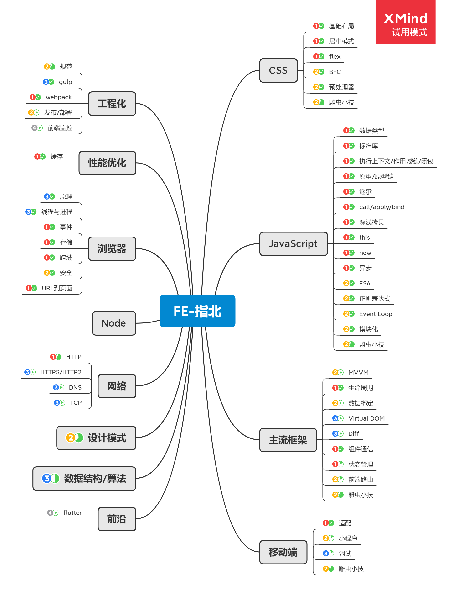

# 前端指北，记录及整理

> Traveling light

:heavy_exclamation_mark: ：待完成
:curly_loop: ：撰写中
:wavy_dash: ：持续更新
:100: ：已完成

### CSS

1. [常见布局](./css/layout.md) :100:
2. [居中方式](./css/center.md) :100:
4. [BFC](./css/BFC.md) :curly_loop:
3. [Flex](./css/BFC.md) :heavy_exclamation_mark:
5. [预处理器](./css/BFC.md) :heavy_exclamation_mark:
6. [雕虫小技](./css/BFC.md) :wavy_dash:

### JavaScript

1. [基础](./javascript/basic.md) :heavy_exclamation_mark:
   - 数据类型 :heavy_exclamation_mark:
   - 执行上下文/作用域链/闭包 :heavy_exclamation_mark:
   - 原型/原型链 :heavy_exclamation_mark:
   - 继承 :heavy_exclamation_mark:
   - call/apply/ind :heavy_exclamation_mark:
   - this :heavy_exclamation_mark:
   - new :heavy_exclamation_mark:
2. [进阶](./javascript/advance.md) :heavy_exclamation_mark:
   - 异步 :heavy_exclamation_mark:
   - Eventloop :heavy_exclamation_mark:
   - 模块化 :heavy_exclamation_mark:
   - 深浅拷贝 :heavy_exclamation_mark:
   - 正则表达式 :heavy_exclamation_mark:
3. [标准库](./javascript/stdlib.md) :heavy_exclamation_mark:
4. [ES6](./javascript/es6.md) :heavy_exclamation_mark:
5. [工具库](./javascript/es6.md) :heavy_exclamation_mark:
6. [雕虫小技](./javascript/es6.md) :heavy_exclamation_mark:

### 主流框架

1. [框架理念](./javascript/basic.md) :heavy_exclamation_mark:
   - MVVM :heavy_exclamation_mark:
   - 数据绑定 :heavy_exclamation_mark:
   - Virtual DOM :heavy_exclamation_mark:
   - Duff :heavy_exclamation_mark:
2. [Vue](./javascript/basic.md) :heavy_exclamation_mark:
   - 生命周期 :heavy_exclamation_mark:
   - 组件通信 :heavy_exclamation_mark:
   - 状态管理 :heavy_exclamation_mark:
   - 前端路由 :heavy_exclamation_mark:
3. [雕虫小技](./javascript/basic.md) :heavy_exclamation_mark:

### 移动端

1. [适配](./javascript/basic.md) :heavy_exclamation_mark:
   - rem :heavy_exclamation_mark:
   - vm/vh :heavy_exclamation_mark:
   - 1px :heavy_exclamation_mark:
2. [调试](./javascript/basic.md) :heavy_exclamation_mark:
3. [小程序](./javascript/basic.md) :heavy_exclamation_mark:
4. [雕虫小技](./engineering/webpack.md) :heavy_exclamation_mark:

### 浏览器

1. [浏览器](./javascript/basic.md) :heavy_exclamation_mark:
   - 线程/进程 :heavy_exclamation_mark:
   - 事件 :heavy_exclamation_mark:
   - 存储 :heavy_exclamation_mark:
   - 跨域 :heavy_exclamation_mark:
   - 安全 :heavy_exclamation_mark:
2. [URL 到页面](./javascript/basic.md) :heavy_exclamation_mark:

### 工程化

1. [规范](./engineering/standard.md) :heavy_exclamation_mark:
2. [gulp](./engineering/webpack.md) :heavy_exclamation_mark:
3. [webpack](./engineering/webpack.md) :heavy_exclamation_mark:
4. [发布/部署](./engineering/webpack.md) :heavy_exclamation_mark:
5. [前端监控](./engineering/webpack.md) :heavy_exclamation_mark:

### 性能

1. [缓存](./engineering/performance.md) :heavy_exclamation_mark:

### Node

1. [基础](./node/basic.md) :heavy_exclamation_mark:

### 网络

1. [网络](./engineering/performance.md) :heavy_exclamation_mark:
   - HTTP :heavy_exclamation_mark:
   - HTTPS :heavy_exclamation_mark:
   - HTTP2 :heavy_exclamation_mark:
   - DNS :heavy_exclamation_mark:
   - TCP :heavy_exclamation_mark:

### 设计模式

1. [设计模式](./engineering/performance.md) :heavy_exclamation_mark:

### 数据结构/算法

1. [数据结构/算法](./engineering/performance.md) :heavy_exclamation_mark:

### 前沿

1. [flutter](./node/basic.md) :heavy_exclamation_mark:

### 最佳实践

1. [工具方法集](https://github.com/liupeng1218/PPlus) :heavy_exclamation_mark:
2. [vue-webpack](https://github.com/liupeng1218/vue-template) :heavy_exclamation_mark:
3. [gulp-webpack](https://github.com/liupeng1218/gulp-template) :heavy_exclamation_mark:
4. [脚手架](https://github.com/liupeng1218/msimple-cli) :heavy_exclamation_mark:
5. [vue组件库](https://github.com/liupeng1218/mvui) :heavy_exclamation_mark:
