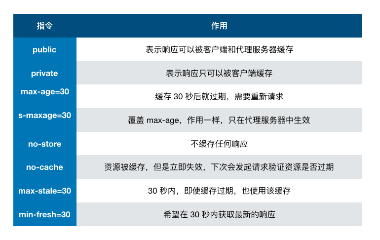

<!-- TOC -->

- [事件](#事件)
  - [触发阶段](#触发阶段)
    - [事件阻止](#事件阻止)
    - [事件代理](#事件代理)
  - [事件注册](#事件注册)
- [线程与进程](#线程与进程)
- [HTTP](#http)
  - [HTTP 报文结构](#http-报文结构)
  - [通用头部](#通用头部)
  - [请求/响应头部](#请求响应头部)
  - [请求/响应实体](#请求响应实体)
  - [cookie 优化](#cookie-优化)
  - [gzip 压缩](#gzip-压缩)
  - [长连接与短连接](#长连接与短连接)
  - [http 2.0](#http-20)
  - [HTTPS](#https)
- [跨域](#跨域)
  - [JSONP](#jsonp)
  - [CORS](#cors)
  - [document.domain](#documentdomain)
- [缓存](#缓存)
  - [缓存位置](#缓存位置)
  - [缓存策略](#缓存策略)
    - [强缓存](#强缓存)
    - [协商缓存](#协商缓存)
  - [场景应用](#场景应用)
    - [频繁变动的资源](#频繁变动的资源)
    - [代码文件](#代码文件)
- [存储](#存储)
- [安全](#安全)
  - [XSS](#xss)
    - [防范](#防范)
      - [转义字符](#转义字符)
      - [CSP](#csp)
  - [SRF](#srf)
    - [防范](#防范-1)
  - [点击劫持](#点击劫持)
    - [防范](#防范-2)
  - [中间人攻击](#中间人攻击)

<!-- /TOC -->

# 事件

## 触发阶段

事件触发有三个阶段：

1. window 往事件触发处传播，遇到注册的捕获事件会触发
1. 传播到事件触发处时触发注册的事件
1. 从事件触发处往 window 传播，遇到注册的冒泡事件会触发

**如果给一个 body 中的子节点同时注册冒泡和捕获事件，事件触发会按照注册的顺序执行。**

### 事件阻止

希望事件只触发在目标上，这时候可以使用 `event.stopPropagation();` 来阻止事件的进一步传播
如果在某些元素上绑定事件，触发事件时可能会触发该元素的默认行为，`event.preventDefault();` 可以阻止默认行为
`return false` 可以同时阻止事件冒泡和默认行为

### 事件代理

如果一个节点中的子节点是动态生成的，那么子节点需要注册事件的话应该注册在父节点上

事件代理的方式相较于直接给目标注册事件来说，有以下优点：

- 节省内存
- 不需要给子节点注销事件

## 事件注册

通常我们使用 `addEventListener` 注册事件，该函数的第三个参数可以是布尔值，也可以是对象。

对于布尔值 `useCapture` 参数来说，该参数默认值为 `false` ，`useCapture` 决定了注册的事件是捕获事件还是冒泡事件。
对于对象参数来说，可以使用以下几个属性

- capture：布尔值，和 useCapture 作用一样
- once：布尔值，值为 true 表示该回调只会调用一次，调用后会移除监听
- passive：布尔值，表示永远不会调用 preventDefault

# 线程与进程

本质上来说，两个名词都是 CPU 工作时间片的一个描述。

进程描述了 CPU 在运行指令及加载和保存上下文所需的时间，放在应用上来说就代表了一个程序。线程是进程中的更小单位，描述了执行一段指令所需的时间。

# HTTP

前后端交互时，http 报文作为信息的载体

## HTTP 报文结构

报文一般包括了：`通用头部`，`请求/响应头部`，`请求/响应体`

## 通用头部

- Request Url: 请求的 web 服务器地址
- Request Method: 请求方式（Get、POST、OPTIONS、PUT、HEAD、DELETE、CONNECT、TRACE）
- Status Code: 请求的返回状态码，如 200 代表成功
- Remote Address: 请求的远程服务器地址（会转为 IP）


## 请求/响应头部

常用的请求头部（部分）：

- Accept: 接收类型，表示浏览器支持的 MIME 类型（对标服务端返回的 Content-Type）
- Accept-Encoding：浏览器支持的压缩类型,如 gzip 等,超出类型不能接收
- Content-Type：客户端发送出去实体内容的类型
- Cache-Control: 指定请求和响应遵循的缓存机制，如 no-cache
- If-Modified-Since：对应服务端的 Last-Modified，用来匹配看文件是否变动，只能精确到 1s 之内，http1.0 中
- Expires：缓存控制，在这个时间内不会请求，直接使用缓存，http1.0，而且是服务端时间
- Max-age：代表资源在本地缓存多少秒，有效时间内不会请求，而是使用缓存，http1.1 中
- If-None-Match：对应服务端的 ETag，用来匹配文件内容是否改变（非常精确），http1.1 中
- Cookie: 有 cookie 并且同域访问时会自动带上
- Connection: 当浏览器与服务器通信时对于长连接如何进行处理,如 keep-alive
- Host：请求的服务器 URL
- Origin：最初的请求是从哪里发起的（只会精确到端口）,Origin 比 Referer 更尊重隐私
- Referer：该页面的来源 URL(适用于所有类型的请求，会精确到详细页面地址，csrf 拦截常用到这个字段)
- User-Agent：用户客户端的一些必要信息，如 UA 头部等

常用的响应头部（部分）：

- Access-Control-Allow-Headers: 服务器端允许的请求 Headers
- Access-Control-Allow-Methods: 服务器端允许的请求方法
- Access-Control-Allow-Origin: 服务器端允许的请求 Origin 头部（譬如为\*）
- Content-Type：服务端返回的实体内容的类型
- Date：数据从服务器发送的时间
- Cache-Control：告诉浏览器或其他客户，什么环境可以安全的缓存文档
- Last-Modified：请求资源的最后修改时间
- Expires：应该在什么时候认为文档已经过期,从而不再缓存它
- Max-age：客户端的本地资源应该缓存多少秒，开启了 Cache-Control 后有效
- ETag：请求变量的实体标签的当前值
- Set-Cookie：设置和页面关联的 cookie，服务器通过这个头部把 cookie 传给客户端
- Keep-Alive：如果客户端有 keep-alive，服务端也会有响应（如 timeout=38）
- Server：服务器的一些相关信息

## 请求/响应实体

http 请求时，除了头部，还有消息实体

请求实体中会将一些需要的参数都放入进入（用于 post 请求）。

譬如实体中可以放参数的序列化形式（a=1&b=2 这种），或者直接放表单对象（Form Data 对象，上传时可以夹杂参数以及文件），等等

响应实体中，就是放服务端需要传给客户端的内容

一般现在的接口请求时，实体中就是对于的信息的 json 格式，而像页面请求这种，里面就是直接放了一个 html 字符串，然后浏览器自己解析并渲染。

## cookie 优化

cookie 是浏览器的一种本地存储方式，一般用来帮助客户端和服务端通信的，常用来进行身份校验，结合服务端的 session 使用。

在同域名的资源请求时，浏览器会默认带上本地的 cookie，针对这种情况，在某些场景下是需要优化的。
如在请求静态资源或非验证页面时，cookie 的携带会造成浪费，也降低了访问速速
可以将静态资源分组，分别放到不同的域名下（如 static.base.com）

## gzip 压缩

明确 gzip 是一种压缩格式，需要浏览器支持才有效（不过一般现在浏览器都支持）， 而且 gzip 压缩效率很好（高达 70%左右）

gzip 一般是由 apache、tomcat 等 web 服务器开启

## 长连接与短连接

tcp/ip 层面的定义：

- 长连接：一个 tcp/ip 连接上可以连续发送多个数据包，在 tcp 连接保持期间，如果没有数据包发送，需要双方发检测包以维持此连接，一般需要自己做在线维持（类似于心跳包）
- 短连接：通信双方有数据交互时，就建立一个 tcp 连接，数据发送完成后，则断开此 tcp 连接

http 层面：

- http1.0 中，默认使用的是短连接，也就是说，浏览器没进行一次 http 操作，就建立一次连接，任务结束就中断连接，譬如每一个静态资源请求时都是一个单独的连接
- http1.1 起，默认使用长连接，使用长连接会有这一行 Connection: keep-alive，在长连接的情况下，当一个网页打开完成后，客户端和服务端之间用于传输 http 的 tcp 连接不会关闭，如果客户端再次访问这个服务器的页面，会继续使用这一条已经建立的连接

**注意： keep-alive 不会永远保持，它有一个持续时间，一般在服务器中配置（如 apache），另外长连接需要客户端和服务器都支持时才有效**

## http 2.0

http2.0 不是 https，它相当于是 http 的下一代规范（譬如 https 的请求可以是 http2.0 规范的）

- 多路复用（即一个 tcp/ip 连接可以请求多个资源）
- 首部压缩（http 头部压缩，减少体积）
- 二进制分帧（在应用层跟传送层之间增加了一个二进制分帧层，改进传输性能，实现低延迟和高吞吐量）
- 服务器端推送（服务端可以对客户端的一个请求发出多个响应，可以主动通知客户端）
- 请求优先级（如果流被赋予了优先级，它就会基于这个优先级来处理，由服务器决定需要多少资源来处理该请求。）

如果 http2.0 全面应用，很多 http1.1 中的优化方案就无需用到了（譬如打包成精灵图，静态资源多域名拆分等）

## HTTPS

https 就是安全版本的 http，譬如一些支付等操作基本都是基于 https 的，因为 http 请求的安全系数太低了。

简单来看，https 与 http 的区别就是： 在请求前，会建立 ssl 链接，确保接下来的通信都是加密的，无法被轻易截取分析

SSL/TLS 的握手流程

1. 浏览器请求建立 SSL 链接，并向服务端发送一个随机数–Client random 和客户端支持的加密方法，比如 RSA 加密，此时是明文传输。
2. 服务端从中选出一组加密算法与 Hash 算法，回复一个随机数–Server random，并将自己的身份信息以证书的形式发回给浏览器
   （证书里包含了网站地址，非对称加密的公钥，以及证书颁发机构等信息）
3. 浏览器收到服务端的证书后
   - 验证证书的合法性（颁发机构是否合法，证书中包含的网址是否和正在访问的一样），如果证书信任，则浏览器会显示一个小锁头，否则会有提示
   - 用户接收证书后（不管信不信任），浏览会生产新的随机数–Premaster secret，然后证书中的公钥以及指定的加密方法加密`Premaster secret`，发送给服务器。
   - 利用 Client random、Server random 和 Premaster secret 通过一定的算法生成 HTTP 链接数据传输的对称加密 key-`session key`
   - 使用约定好的 HASH 算法计算握手消息，并使用生成的`session key`对消息进行加密，最后将之前生成的所有信息发送给服务端。
4. 服务端收到浏览器的回复
   - 利用已知的加解密方式与自己的私钥进行解密，获取`Premaster secret`
   - 和浏览器相同规则生成`session key`
   - 使用`session key`解密浏览器发来的握手消息，并验证 Hash 是否与浏览器发来的一致
   - 使用`session key`加密一段握手消息，发送给浏览器
5. 浏览器解密并计算握手消息的 HASH，如果与服务端发来的 HASH 一致，此时握手过程结束

# 跨域

浏览器出于安全考虑，有同源策略限制。如果协议、域名或者端口有一个不同就是跨域，浏览器会拦截响应。

> 同源：如果两个页面的协议，端口（如果有指定）和主机都相同，则两个页面具有相同的源。

## JSONP

JSONP 的原理很简单，就是利用 `<script>` 标签没有跨域限制的漏洞。通过 `<script>` 标签指向一个需要访问的地址并提供一个回调函数来接收数据当需要通讯时。

```JS
<script src="http://domain/api?param1=a&param2=b&callback=jsonp"></script>
<script>
    function jsonp(data) {
    	console.log(data)
	}
</script>
```

JSONP 使用简单兼容性好，但是**只限于 get 请求**。

## CORS

跨域资源共享(CORS) 是一种机制，它使用额外的 HTTP 头来告诉浏览器 让运行在一个 origin (domain) 上的 Web 应用被准许访问来自不同源服务器上的指定的资源。

服务端设置 `Access-Control-Allow-Origin` 就可以开启 CORS。 该属性表示哪些域名可以访问资源，如果设置通配符则表示所有网站都可以访问资源。

## document.domain

该方式只能用于二级域名相同的情况下，比如 `a.test.com` 和 `b.test.com` 适用于该方式。

只需要给页面添加 `document.domain = 'test.com'` 表示二级域名都相同就可以实现跨域

# 缓存

缓存可以说是性能优化中简单高效的一种优化方式了，它可以显著减少网络传输所带来的损耗。

对于一个数据请求来说，可以分为发起网络请求、后端处理、浏览器响应三个步骤。
浏览器缓存可以帮助我们在第一和第三步骤中优化性能。比如说直接使用缓存而不发起请求，或者发起了请求但后端存储的数据和前端一致，那么就没有必要再将数据回传回来，这样就减少了响应数据。

## 缓存位置

从缓存位置上来说分为四种，并且各自有优先级，当依次查找缓存且都没有命中的时候，才会去请求网络

- Service Worker
- Memory Cache
- Disk Cache
- Push Cache
- 网络请求

1. Memory Cache
   Memory Cache 也就是内存中的缓存，读取内存中的数据肯定比磁盘快。但是内存缓存虽然读取高效，可是缓存持续性很短，会随着进程的释放而释放。 一旦我们关闭 Tab 页面，内存中的缓存也就被释放了。

2. Disk Cache
   Disk Cache 也就是存储在硬盘中的缓存，读取速度慢点，但是什么都能存储到磁盘中，比之 Memory Cache 胜在容量和存储时效性上。
   在所有浏览器缓存中，Disk Cache 覆盖面基本是最大的。它会根据 HTTP Herder 中的字段判断哪些资源需要缓存，哪些资源可以不请求直接使用，哪些资源已经过期需要重新请求。并且即使在跨站点的情况下，相同地址的资源一旦被硬盘缓存下来，就不会再次去请求数据。
3. 网络请求

如果所有缓存都没有命中的话，那么只能发起请求来获取资源了。

## 缓存策略

通常浏览器缓存策略分为两种：强缓存和协商缓存，并且缓存策略都是通过设置 `HTTP Header` 来实现的。

### 强缓存

强缓存可以通过设置两种 `HTTP Header` 实现：`Expires`和 `Cache-Control` 。强缓存表示在缓存期间不需要请求，`state code` 为 200。

1. Expires

`Expires: Wed, 22 Oct 2018 08:41:00 GMT`

`Expires` 是 `HTTP/1` 的产物，表示资源会在 `Wed, 22 Oct 2018 08:41:00 GMT` 后过期，需要再次请求。并且 `Expires` 受限于本地时间，如果修改了本地时间，可能会造成缓存失效。

2. Cache-control

`Cache-control: max-age=30`

`Cache-Control` 出现于 `HTTP/1.1`，优先级高于 `Expires` 。该属性值表示资源会在 30 秒后过期，需要再次请求。



### 协商缓存

如果缓存过期了，就需要发起请求验证资源是否有更新。协商缓存可以通过设置两种 `HTTP Header` 实现：`Last-Modified`和 `ETag` 。

当浏览器发起请求验证资源时，如果资源没有做改变，那么服务端就会返回 304 状态码，并且更新浏览器缓存有效期。

1. Last-Modified 和 If-Modified-Since

`Last-Modified` 表示本地文件最后修改日期，`If-Modified-Since` 会将 `Last-Modified` 的值发送给服务器，询问服务器在该日期后资源是否有更新，有更新的话就会将新的资源发送回来，否则返回 304 状态码。

**Last-Modified 存在一些弊端**：

如果本地打开缓存文件，即使没有对文件进行修改，但还是会造成 Last-Modified 被修改，服务端不能命中缓存导致发送相同的资源
因为 Last-Modified 只能以秒计时，如果在不可感知的时间内修改完成文件，那么服务端会认为资源还是命中了，不会返回正确的资源

2. ETag 和 If-None-Match

`ETag` 类似于文件指纹，`If-None-Match` 会将当前 `ETag` 发送给服务器，询问该资源 `ETag` 是否变动，有变动的话就将新的资源发送回来。并且 `ETag` 优先级比 `Last-Modified` 高。

3. 默认策略

浏览器会采用一个启发式的算法，通常会取响应头中的 Date 减去 Last-Modified 值的 10% 作为缓存时间。

## 场景应用

### 频繁变动的资源

对于频繁变动的资源，首先需要使用 Cache-Control: no-cache 使浏览器每次都请求服务器，然后配合 ETag 或者 Last-Modified 来验证资源是否有效。这样的做法虽然不能节省请求数量，但是能显著减少响应数据大小。

### 代码文件

这里特指除了 HTML 外的代码文件，因为 HTML 文件一般不缓存或者缓存时间很短。

一般来说，现在都会使用工具来打包代码，那么我们就可以对文件名进行哈希处理，只有当代码修改后才会生成新的文件名。基于此，我们就可以给代码文件设置缓存有效期一年 Cache-Control: max-age=31536000，这样只有当 HTML 文件中引入的文件名发生了改变才会去下载最新的代码文件，否则就一直使用缓存。

# 存储

浏览器存储方式主要有 `cookie`，`localStorage`，`sessionStorage`，`indexDB`

| 特性         | cookie                                     | localStorage             | sessionStorage | indexDB                  |
| ------------ | ------------------------------------------ | ------------------------ | -------------- | ------------------------ |
| 数据生命周期 | 一般由服务器生成，可以设置过期时间         | 除非被清理，否则一直存在 | 页面关闭就清理 | 除非被清理，否则一直存在 |
| 数据存储大小 | 4K                                         | 5M                       | 5M             | 无限                     |
| 与服务端通信 | 每次都会携带在 header 中，对于请求性能影响 | 不参与                   | 不参与         | 不参与                   |

# 安全

## XSS

XSS 简单点来说，就是攻击者想尽一切办法将可以执行的代码注入到网页中。

XSS 可以分为多种类型，总体上分为两类：持久型和非持久型。

**持久型**

持久型也就是攻击的代码被服务端写入进数据库中，这种攻击危害性很大，因为如果网站访问量很大的话，就会导致大量正常访问页面的用户都受到攻击。

**非持久性**
非持久型相比于前者危害就小的多了，一般通过修改 URL 参数的方式加入攻击代码，诱导用户访问链接从而进行攻击。

### 防范

#### 转义字符

首先，对于用户的输入应该是永远不信任的。最普遍的做法就是转义输入输出的内容，对于引号、尖括号、斜杠进行转义

#### CSP

CSP 本质上就是建立白名单，开发者明确告诉浏览器哪些外部资源可以加载和执行。我们只需要配置规则，如何拦截是由浏览器自己实现的。我们可以通过这种方式来尽量减少 XSS 攻击。

通常可以通过两种方式来开启 CSP：

- 设置 `HTTP Header` 中的 `Content-Security-Policy`
- 设置 `meta` 标签的方式 `<meta http-equiv="Content-Security-Policy">`

## SRF

CSRF 中文名为跨站请求伪造。原理就是攻击者构造出一个后端请求地址，诱导用户点击或者通过某些途径自动发起请求。如果用户是在登录状态下的话，后端就以为是用户在操作，从而进行相应的逻辑。

举个例子，假设网站中有一个通过 GET 请求提交用户评论的接口，那么攻击者就可以在钓鱼网站中加入一个图片，图片的地址就是评论接口

### 防范

防范 CSRF 攻击可以遵循以下几种规则：

- Get 请求不对数据进行修改
- 不让第三方网站访问到用户 Cookie
- 阻止第三方网站请求接口
- 请求时附带验证信息，比如验证码或者 Token

## 点击劫持

点击劫持是一种视觉欺骗的攻击手段。攻击者将需要攻击的网站通过 iframe 嵌套的方式嵌入自己的网页中，并将 iframe 设置为透明，在页面中透出一个按钮诱导用户点击。

### 防范

`X-FRAME-OPTIONS` 是一个 `HTTP` 响应头，在现代浏览器有一个很好的支持。这个 `HTTP` 响应头 就是为了防御用 `iframe` 嵌套的点击劫持攻击。

该响应头有三个值可选，分别是

- DENY，表示页面不允许通过 iframe 的方式展示
- SAMEORIGIN，表示页面可以在相同域名下通过 iframe 的方式展示
- ALLOW-FROM，表示页面可以在指定来源的 iframe 中展示

## 中间人攻击

中间人攻击是攻击方同时与服务端和客户端建立起了连接，并让对方认为连接是安全的，但是实际上整个通信过程都被攻击者控制了。攻击者不仅能获得双方的通信信息，还能修改通信信息。

通常来说不建议使用公共的 `Wi-Fi`，因为很可能就会发生中间人攻击的情况。如果你在通信的过程中涉及到了某些敏感信息，就完全暴露给攻击方了。

当然防御中间人攻击其实并不难，只需要增加一个安全通道来传输信息。HTTPS 就可以用来防御中间人攻击，但是并不是说使用了 HTTPS 就可以高枕无忧了，因为如果你没有完全关闭 HTTP 访问的话，攻击方可以通过某些方式将 HTTPS 降级为 HTTP 从而实现中间人攻击。
