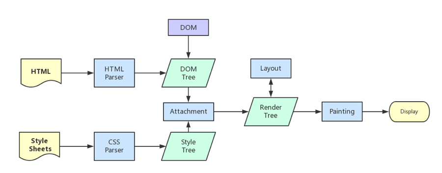

<!-- TOC -->

- [URL 到页面](#url-到页面)
  - [从浏览器接收 url 到开启网络请求线程](#从浏览器接收-url-到开启网络请求线程)
    - [多进程](#多进程)
    - [多线程](#多线程)
    - [解析 URL](#解析-url)
  - [开启网络线程到发出一个完整的 http 请求](#开启网络线程到发出一个完整的-http-请求)
    - [DNS 解析](#dns-解析)
    - [tcp/ip 请求](#tcpip-请求)
      - [并发限制](#并发限制)
    - [五层因特网协议栈](#五层因特网协议栈)
  - [服务器接收到请求](#服务器接收到请求)
    - [负载均衡](#负载均衡)
    - [后台处理](#后台处理)
  - [浏览器接收到 http 数据包后的解析流程](#浏览器接收到-http-数据包后的解析流程)
    - [解析 HTML，构建 DOM 树](#解析-html构建-dom-树)
    - [解析 CSS，生成 CSS 规则树](#解析-css生成-css-规则树)
    - [生成 render 树](#生成-render-树)
    - [渲染](#渲染)
    - [重绘&&回流](#重绘回流)
      - [引起回流的情况](#引起回流的情况)
      - [减少重绘和回流](#减少重绘和回流)
    - [外链资源](#外链资源)
      - [CSS 样式资源](#css-样式资源)
      - [JS 脚本资源](#js-脚本资源)
      - [img 图片类资源](#img-图片类资源)
    - [loaded 和 domcontentloaded](#loaded-和-domcontentloaded)

<!-- /TOC -->

# URL 到页面

> [URL 到页面](http://www.dailichun.com/2018/03/12/whenyouenteraurl.html)

1. 从浏览器接收 url ，解析 url 为 http 协议开启网络请求线程
2. 开启网络线程后，通过 dns 解析到域名，通过 tcp 三次握手，发出一个完整的 http 请求
3. 服务器接收到请求到对应后台接收到请求，后台处理请求返回响应结果
4. 浏览器接收到 http 数据包后的解析流程

## 从浏览器接收 url 到开启网络请求线程

### 多进程

浏览器是多进程的，有一个主控进程，以及每一个 tab 页面都会新开一个进程。进程可能包括主控进程，插件进程，GPU，tab 页等等。

- Browser 进程：浏览器的主进程（负责协调、主控），只有一个
- 第三方插件进程：每种类型的插件对应一个进程，仅当使用该插件时才创建
- GPU 进程：最多一个，用于 3D 绘制
- 浏览器渲染进程（内核）：默认每个 Tab 页面一个进程，互不影响，控制页面渲染，脚本执行，事件处理等（有时候会优化，如多个空白 tab 会合并成一个进程）

### 多线程

每一个 tab 页面可以看作是浏览器内核进程，然后这个进程是多线程的，它有几大类子线程

- GUI 线程
- JS 引擎线程
- 事件触发线程
- 定时器线程
- 网络请求线程

### 解析 URL

输入 URL 后，会进行解析（URL 的本质就是统一资源定位符）

- protocol，协议头，譬如有 http，ftp 等
- host，主机域名或 IP 地址
- port，端口号
- path，目录路径
- query，即查询参数
- fragment，即#后的 hash 值，一般用来定位到某个位置

每次网络请求时都需要开辟单独的线程进行，譬如如果 URL 解析到 http 协议，就会新建一个网络线程去处理资源下载

## 开启网络线程到发出一个完整的 http 请求

### DNS 解析

输入的是域名，需要进行 dns 解析成 IP

- 如果浏览器有缓存，直接使用浏览器缓存，否则使用本机缓存，再没有的话就是用 host
- 如果本地没有，就向 dns 域名服务器查询，查询到对应的 IP

### tcp/ip 请求

http 的本质就是 tcp/ip 请求

tcp 将 http 长报文划分为短报文，通过三次握手与服务端建立连接，进行可靠传输

三次握手的步骤：

1. 客户端：hello，你是 server 么？
2. 服务端：hello，我是 server，你是 client 么
3. 客户端：yes，我是 client

建立连接成功后，接下来就正式传输数据

待到断开连接时，需要进行四次挥手（因为是全双工的，所以需要四次挥手）

1. 主动方：我已经关闭了向你那边的主动通道了，只能被动接收了
2. 被动方：收到通道关闭的信息
3. 被动方：那我也告诉你，我这边向你的主动通道也关闭了
4. 主动方：最后收到数据，之后双方无法通信

#### 并发限制

浏览器对同一域名下并发的 tcp 连接是有限制的（2-10 个不等）
而且在 http1.0 中往往一个资源下载就需要对应一个 tcp/ip 请求

### 五层因特网协议栈

五层因特网协议栈： 从客户端发出 http 请求到服务器接收，中间会经过一系列的流程。

从应用层的发送 http 请求，到传输层通过三次握手建立 tcp/ip 连接，再到网络层的 ip 寻址，再到数据链路层的封装成帧，最后到物理层的利用物理介质传输。

1. 应用层(dns,http) DNS 解析成 IP 并发送 http 请求
2. 传输层(tcp,udp) 建立 tcp 连接（三次握手）
3. 网络层(IP,ARP) IP 寻址
4. 数据链路层(PPP) 封装成帧
5. 物理层(利用物理介质传输比特流) 物理传输（然后传输的时候通过双绞线，电磁波等各种介质）

## 服务器接收到请求

服务端在接收到请求时，内部会进行很多的处理，如果启用了负载均衡会先通过代理服务器进行调度

### 负载均衡

对于大型的项目，由于并发访问量很大，所以往往一台服务器是吃不消的，所以一般会有若干台服务器组成一个集群，然后配合反向代理实现负载均衡

用户发起的请求都指向调度服务器（反向代理服务器，譬如安装了 nginx 控制负载均衡），然后调度服务器根据实际的调度算法，分配不同的请求给对应集群中的服务器执行，然后调度器等待实际服务器的 HTTP 响应，并将它反馈给用户

### 后台处理

一般后台都是部署到容器中的，所以一般为：

1. 容器接受到请求（如 tomcat 容器）
1. 容器中的后台程序接收到请求（如 java 程序）
1. 就是后台会有自己的统一处理，处理完后响应响应结果

## 浏览器接收到 http 数据包后的解析流程

浏览器内核拿到内容后，渲染步骤大致可以分为以下几步：

1. 解析 HTML，构建 DOM 树
2. 解析 CSS，生成 CSS 规则树
3. 合并 DOM 树和 CSS 规则，生成 render 树
4. 布局 render 树（Layout/reflow），负责各元素尺寸、位置的计算
5. 绘制 render 树（paint），绘制页面像素信息
6. 浏览器会将各层的信息发送给 GPU，GPU 会将各层合成（composite），显示在屏幕上

### 解析 HTML，构建 DOM 树

在网络中传输的内容其实都是 0 和 1 这些字节数据。
当浏览器接收到这些字节数据以后，它会将这些字节数据转换为字符串。
当数据转换为字符串以后，浏览器会先将这些字符串通过词法分析转换为标记（token），这一过程在词法分析中叫做标记化（tokenization）。
当结束标记化后，这些标记会紧接着转换为 Node，最后这些 Node 会根据不同 Node 之前的联系构建为一颗 DOM 树。
`Bytes → characters → tokens → nodes → DOM`

### 解析 CSS，生成 CSS 规则树

转换 CSS 到 CSSOM 树的过程和解析 HTML 过程是极其类似的
浏览器会确定下每一个节点的样式到底是什么，并且这一过程其实是很消耗资源的。因为样式你可以自行设置给某个节点，也可以通过继承获得。在这一过程中，浏览器得递归 CSSOM 树，然后确定具体的元素到底是什么样式。

### 生成 render 树

当我们生成 DOM 树和 CSSOM 树以后，就需要将这两棵树组合为渲染树。

### 渲染

有了 render 树，接下来就是开始渲染，基本流程如下：

1. 计算 CSS 样式
2. 构建渲染树
3. 布局，主要定位坐标和大小，是否换行，各种 position overflow z-index 属性
4. 绘制，将图像绘制出来

### 重绘&&回流

重绘和回流会在我们设置节点样式时频繁出现，同时也会很大程度上影响性能。

- 重绘是当节点需要更改外观而不会影响布局的，比如改变 color 就叫称为重绘
- 回流是布局或者几何属性需要改变就称为回流。

**回流必定会发生重绘，重绘不一定会引发回流**。回流所需的成本比重绘高的多，改变父节点里的子节点很可能会导致父节点的一系列回流。

#### 引起回流的情况

1. 页面渲染初始化
2. DOM 结构改变，比如删除了某个节点
3. render 树变化，比如减少了 padding
4. 窗口 resize
5. 最复杂的一种：获取某些属性，引发回流，

#### 减少重绘和回流

- 使用 transform 替代 top
- 使用 visibility 替换 display: none ，因为前者只会引起重绘，后者会引发回流（改变了布局）
- 不要把节点的属性值放在一个循环里当成循环里的变量
- 动画实现的速度的选择，动画速度越快，回流次数越多，也可以选择使用 requestAnimationFrame
- CSS 选择符从右往左匹配查找，避免节点层级过多
- 将频繁重绘或者回流的节点设置为图层，图层能够阻止该节点的渲染行为影响别的节点。比如对于 video 标签来说，浏览器会自动将该节点变为图层。

### 外链资源

解析 html 时，遇到资源连接会单独开启一个下载线程去下载资源（http1.1 中是每一个资源的下载都要开启一个 http 请求，对应一个 tcp/ip 链接）

#### CSS 样式资源

CSS 资源的处理有几个特点：

- CSS 下载时异步，不会阻塞浏览器构建 DOM 树
- 但是会阻塞渲染，也就是在构建 render 时，会等到 css 下载解析完毕后才进行（这点与浏览器优化有关，防止 css 规则不断改变，避免了重复的构建）
- 有例外，media query 声明的 CSS 是不会阻塞渲染的

#### JS 脚本资源

JS 脚本资源的处理有几个特点：

- 阻塞浏览器的解析，也就是说发现一个外链脚本时，需等待脚本下载完成并执行后才会继续解析 HTML
- 浏览器的优化，一般现代浏览器有优化，在脚本阻塞时，也会继续下载其它资源（当然有并发上限），但是虽然脚本可以并行下载，解析过程仍然是阻塞的，也就是说必须这个脚本执行完毕后才会接下来的解析，并行下载只是一种优化而已
- defer 与 async，普通的脚本是会阻塞浏览器解析的，但是可以加上 defer 或 async 属性，这样脚本就变成异步了，可以等到解析完毕后再执行

#### img 图片类资源

遇到图片等资源时，直接就是异步下载，不会阻塞解析，下载完毕后直接用图片替换原有 src 的地方

### loaded 和 domcontentloaded

- DOMContentLoaded 事件触发时，仅当 DOM 加载完成，不包括样式表，图片(譬如如果有 async 加载的脚本就不一定完成)
- load 事件触发时，页面上所有的 DOM，样式表，脚本，图片都已经加载完成了
