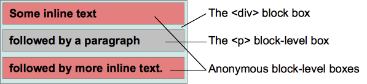

<!-- TOC -->

- [1. 什么是 BFC](#1-什么是-bfc)
- [2. 视觉格式化模型](#2-视觉格式化模型)
  - [2.1. 块盒（block box）](#21-块盒block-box)
  - [2.2. 行内盒（inline box）](#22-行内盒inline-box)
  - [2.3. 匿名盒（anonymous box）](#23-匿名盒anonymous-box)
- [3. 定位方案](#3-定位方案)
  - [3.1. 常规流(Normal flow)](#31-常规流normal-flow)
  - [3.2. 浮动定位](#32-浮动定位)
  - [3.3. 绝对定位(Absolute positioning)](#33-绝对定位absolute-positioning)
- [4. 格式化上下文](#4-格式化上下文)
  - [4.1. BFC 创建方法](#41-bfc-创建方法)
  - [4.2. BFC 范围](#42-bfc-范围)
  - [4.3. BFC 影响](#43-bfc-影响)
  - [4.4. BFC 作用](#44-bfc-作用)
    - [4.4.1. 包含浮动元素](#441-包含浮动元素)
    - [4.4.2. 阻止元素的 margin 合并](#442-阻止元素的-margin-合并)
- [5. 层叠上下文](#5-层叠上下文)
- [6. 层叠等级](#6-层叠等级)
- [7. 如何产生层叠上下文](#7-如何产生层叠上下文)
- [8. 层叠顺序](#8-层叠顺序)

<!-- /TOC -->

> 参考网易考拉前端团的[学习 BFC](https://juejin.im/post/59b73d5bf265da064618731d)  
> 文章参考 [彻底搞懂 CSS 层叠上下文、层叠等级、层叠顺序、z-index](https://juejin.im/post/5b876f86518825431079ddd6)

# 1. 什么是 BFC

BFC 全称是 Block Formatting Context，即块格式化上下文。它是 CSS2.1 规范定义的，关于 CSS 渲染定位的一个概念。要明白 BFC 到底是什么，首先来看看什么是视觉格式化模型。

# 2. 视觉格式化模型

视觉格式化模型(visual formatting model)是用来**处理文档并将它显示在视觉媒体上的机制**，它也是 CSS 中的一个概念。视觉格式化模型定义了盒（Box）的生成，盒主要包括了块盒、行内盒、匿名盒（没有名字不能被选择器选中的盒）以及一些实验性的盒（未来可能添加到规范中）。盒的类型由 `display` 属性决定。

## 2.1. 块盒（block box）

块盒有以下特性：

- 当元素的 CSS 属性 `display` 为 `block`，`list-item` 或 `table` 时，它是块级元素 block-level；
- 视觉上呈现为块，竖直排列；
- 块级盒参与(块格式化上下文)；
- 每个块级元素至少生成一个块级盒，称为主要块级盒(principal block-level box)。一些元素，比如`<li>`，生成额外的盒来放置项目符号，不过多数元素只生成一个主要块级盒。

## 2.2. 行内盒（inline box）

行内盒有以下特性：

- 当元素的 CSS 属性 `display` 的计算值为 `inline`，`inline-block` 或 `inline-table` 时，称它为行内级元素；
- 视觉上它将内容与其它行内级元素排列为多行；典型的如段落内容，有文本(可以有多种格式譬如着重)，或图片，都是行内级元素；
- 行内级元素生成行内级盒(inline-level boxes)，参与行内格式化上下文(inline formatting context)。同时参与生成行内格式化上下文的行内级盒称为行内盒(inline boxes)。所有 display:inline 的非替换+ 元素生成的盒是行内盒；
- 不参与生成行内格式化上下文的行内级盒称为原子行内级盒(atomic inline-level boxes)。这些盒由可替换行内元素，或 display 值为 inline-block 或 inline-table 的元素生成，不能拆分成多个盒；

## 2.3. 匿名盒（anonymous box）

匿名盒也有份匿名块盒与匿名行内盒，因为匿名盒没有名字，不能利用选择器来选择它们，所以它们的所有属性都为 inherit 或初始默认值；

如下面例子，会创键匿名块盒来包含毗邻的行内级盒：

```HTML
<div>
    Some inline text
    <p>followed by a paragraph</p>
    followed by more inline text.
</div>
```



# 3. 定位方案

在定位的时候，浏览器就会根据元素的盒类型和上下文对这些元素进行定位，可以说盒就是定位的基本单位。定位时，有三种定位方案，分别是常规流，浮动定位和绝对定位。

## 3.1. 常规流(Normal flow)

- 在常规流中，盒一个接着一个排列;
- 在块级格式化上下文里面， 它们竖着排列；
- 在行内格式化上下文里面， 它们横着排列;
- 当 `position` 为 `static` 或 `relative`，并且 `float` 为 `none` 时会触发常规流；
- 对于静态定位，`position`: `static`，盒的位置是常规流布局里的位置；
- 对于相对定位，`position`: `relative`，盒偏移位置由这些属性定义 `top`，`bottom`，`left`，`right`。即使有偏移，仍然保留原有的位置，其它常规流不能占用这个位置。

## 3.2. 浮动定位

- 盒称为浮动盒(floating boxes)；
- 它位于当前行的开头或末尾；
- 这导致常规流环绕在它的周边，除非设置 `clear` 属性；

## 3.3. 绝对定位(Absolute positioning)

- 绝对定位方案，盒从常规流中被移除，不影响常规流的布局；
- 它的定位相对于它的包含块，相关 CSS 属性：`top`，`bottom`，`left` 及 `right`；
- 如果元素的属性 `position` 为 `absolute` 或 `fixed`，它是绝对定位元素；
- 对于 `position`: `absolute`，元素定位将相对于最近的一个 `relative`、`fixed` 或 `absolute` 的父元素，如果没有则相对于 `body`；

# 4. 格式化上下文

块格式上下文是页面 CSS 视觉渲染的一部分，用于决定块盒子的布局及浮动相互影响范围的一个区域。

## 4.1. BFC 创建方法

- 根元素或其它包含它的元素；
- 浮动 (元素的 float 不为 none)；
- 绝对定位元素 (元素的 position 为 absolute 或 fixed)；
- overflow 的值不为 visible 的元素；
- 行内块 inline-blocks(元素的 display: inline-block)；
- 表格单元格(元素的 display: table-cell，HTML 表格单元格默认属性)；
- 弹性盒 flex boxes (元素的 display: flex 或 inline-flex)；

但其中，最常见的就是**overflow:hidden、float:left/right、position:absolute**。

## 4.2. BFC 范围

一个 BFC 包含创建该上下文元素的所有子元素，但不包括创建了新 BFC 的子元素的内部元素。

```HTML
<div id='div_1' class='BFC'>
    <div id='div_2'>
        <div id='div_3'></div>
        <div id='div_4'></div>
    </div>
    <div id='div_5' class='BFC'>
        <div id='div_6'></div>
        <div id='div_7'></div>
    </div>
</div>
```

`class` 名为`.BFC`代表创建了新的块格式化： `#div_1`创建了一个块格式上下文，这个上下文包括了`#div_2`、`#div_3`、`#div_4`、`#div_5`。即`#div_2`中的子元素也属于`#div_1`所创建的 BFC。但由于`#div_5`创建了新的 BFC，所以`#div_6`和`#div_7`就被排除在外层的 BFC 之外。

**一个元素不能同时存在于两个 BFC 中**

## 4.3. BFC 影响

BFC 的一个最重要的效果是，让处于 BFC 内部的元素与外部的元素相互隔离，使内外元素的定位不会相互影响。

BFC 的特性：

1. 内部的盒会在垂直方向一个接一个排列（可以看作 BFC 中有一个的常规流）；
2. 处于同一个 BFC 中的元素相互影响，可能会发生 margin collapse；
3. 每个元素的 margin box 的左边，与容器块 border box 的左边相接触(对于从左往右的格式化，否则相反)。即使存在浮动也是如此；
4. BFC 就是页面上的一个隔离的独立容器，容器里面的子元素不会影响到外面的元素，反之亦然；
5. 计算 BFC 的高度时，考虑 BFC 所包含的所有元素，连浮动元素也参与计算；
6. 浮动盒区域不叠加到 BFC 上（浮动产生的 BFC 不会与其他内容重叠）；

## 4.4. BFC 作用

### 4.4.1. 包含浮动元素

利用特性 5**计算 BFC 的高度时，考虑 BFC 所包含的所有元素，连浮动元素也参与计算**，通过改变包含浮动子元素的父盒子的属性值，触发 BFC，以此来包含子元素的浮动盒子。

### 4.4.2. 阻止元素的 margin 合并

利用特性 4**BFC 就是页面上的一个隔离的独立容器，容器里面的子元素不会影响到外面的元素**，处理外边距合并的情况

# 5. 层叠上下文

 层叠上下文(stacking context)，是 HTML 中一个三维的概念。在 CSS2.1 规范中，每个盒模型的位置是三维的，分别是平面画布上的 X 轴，Y 轴以及表示层叠的 Z 轴。一般情况下，元素在页面上沿 X 轴 Y 轴平铺，我们察觉不到它们在 Z 轴上的层叠关系。而一旦元素发生堆叠，这时就能发现某个元素可能覆盖了另一个元素或者被另一个元素覆盖。如果一个元素含有层叠上下文，(也就是说它是层叠上下文元素)，我们可以理解为这个元素在 Z 轴上就“高人一等”，最终表现就是它离屏幕观察者更近。

# 6. 层叠等级

层叠等级指的又是什么？

1. 在同一个层叠上下文中，它描述定义的是该层叠上下文中的层叠上下文元素在 Z 轴上的上下顺序。
2. 在其他普通元素中，它描述定义的是这些普通元素在 Z 轴上的上下顺序。
3. 普通元素的层叠等级优先由其所在的层叠上下文决定。
4. 层叠等级的比较只有在当前层叠上下文元素中才有意义。不同层叠上下文中比较层叠等级是没有意义的。

# 7. 如何产生层叠上下文

1. HTML 中的根元素`html`本身就具有层叠上下文，称为“根层叠上下文”。
2. 普通元素设置 `position` 属性为非 `static` 值并设置 `z-index` 属性为**具体数值**，产生层叠上下文。
3. CSS3 中的新属性也可以产生层叠上下文。
   - 父元素的 display 属性值为 flex|inline-flex，子元素 z-index 属性值不为 auto 的时候，子元素为层叠上下文元素；
   - 元素的 opacity 属性值不是 1；
   - 元素的 transform 属性值不是 none；
   - 元素 mix-blend-mode 属性值不是 normal`；
   - 元素的 filter 属性值不是 none；
   - 元素的 isolation 属性值是 isolate；
   - 元素的 will-change 指定的属性值为上面任意一个；
   - 元素的-webkit-overflow-scrolling 属性值设置为 touch。

# 8. 层叠顺序


在不考虑 CSS3 的情况下，当元素发生层叠时，层叠顺讯遵循上面途中的规则

1. 如果元素不处于同一层叠上下文，比较所处层叠上下文的顺序
2. 如果元素是处于同一层叠上下文中，比较层叠顺序
3. 如果元素处于同一层叠上下文，且层叠顺序一样，后面的元素覆盖前面的元素
