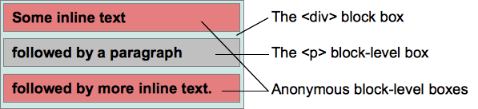

<!-- TOC -->

- [什么是 BFC](#什么是-bfc)
- [视觉格式化模型](#视觉格式化模型)
  - [块盒（block box）](#块盒block-box)
  - [行内盒（inline box）](#行内盒inline-box)
  - [匿名盒（anonymous box）](#匿名盒anonymous-box)
- [定位方案](#定位方案)
  - [常规流(Normal flow)](#常规流normal-flow)
  - [浮动定位](#浮动定位)
  - [绝对定位(Absolute positioning)](#绝对定位absolute-positioning)
- [格式化上下文](#格式化上下文)
  - [BFC 创建方法](#bfc-创建方法)
  - [BFC 范围](#bfc-范围)
  - [BFC 影响](#bfc-影响)
  - [BFC 作用](#bfc-作用)
    - [阻止元素被浮动元素覆盖](#阻止元素被浮动元素覆盖)
    - [包含浮动元素](#包含浮动元素)
    - [阻止元素的margin合并](#阻止元素的margin合并)

<!-- /TOC -->

> 参考网易考拉前端团的[学习 BFC](https://juejin.im/post/59b73d5bf265da064618731d)

# 什么是 BFC

BFC 全称是 Block Formatting Context，即块格式化上下文。它是 CSS2.1 规范定义的，关于 CSS 渲染定位的一个概念。要明白 BFC 到底是什么，首先来看看什么是视觉格式化模型。

# 视觉格式化模型

视觉格式化模型(visual formatting model)是用来处理文档并将它显示在视觉媒体上的机制，它也是 CSS 中的一个概念。
视觉格式化模型定义了盒（Box）的生成，盒主要包括了块盒、行内盒、匿名盒（没有名字不能被选择器选中的盒）以及一些实验性的盒（未来可能添加到规范中）。盒的类型由 display 属性决定。

## 块盒（block box）

块盒有以下特性：

- 当元素的 CSS 属性 display 为 block，list-item 或 table 时，它是块级元素 block-level；
- 视觉上呈现为块，竖直排列；
- 块级盒参与(块格式化上下文)；
- 每个块级元素至少生成一个块级盒，称为主要块级盒(principal block-level box)。一些元素，比如`<li>`，生成额外的盒来放置项目符号，不过多数元素只生成一个主要块级盒。

## 行内盒（inline box）

行内盒有以下特性：

- 当元素的 CSS 属性 display 的计算值为 inline，inline-block 或 inline-table 时，称它为行内级元素；
- 视觉上它将内容与其它行内级元素排列为多行；典型的如段落内容，有文本(可以有多种格式譬如着重)，或图片，都是行内级元素；
- 行内级元素生成行内级盒(inline-level boxes)，参与行内格式化上下文(inline formatting context)。同时参与生成行内格式化上下文的行内级盒称为行内盒(inline boxes)。所有 display:inline 的非替换+ 元素生成的盒是行内盒；
- 不参与生成行内格式化上下文的行内级盒称为原子行内级盒(atomic inline-level boxes)。这些盒由可替换行内元素，或 display 值为 inline-block 或 inline-table 的元素生成，不能拆分成多个盒；

## 匿名盒（anonymous box）

匿名盒也有份匿名块盒与匿名行内盒，因为匿名盒没有名字，不能利用选择器来选择它们，所以它们的所有属性都为 inherit 或初始默认值；

如下面例子，会创键匿名块盒来包含毗邻的行内级盒：

```HTML
<div>
    Some inline text
    <p>followed by a paragraph</p>
    followed by more inline text.
</div>
```



# 定位方案

在定位的时候，浏览器就会根据元素的盒类型和上下文对这些元素进行定位，可以说盒就是定位的基本单位。定位时，有三种定位方案，分别是常规流，浮动定位和绝对定位。

## 常规流(Normal flow)

- 在常规流中，盒一个接着一个排列;
- 在块级格式化上下文里面， 它们竖着排列；
- 在行内格式化上下文里面， 它们横着排列;
- 当 position 为 static 或 relative，并且 float 为 none 时会触发常规流；
- 对于静态定位(static positioning)，position: static，盒的位置是常规流布局里的位置；
- 对于相对定位(relative positioning)，position: relative，盒偏移位置由这些属性定义 top，bottom，leftandright。即使有偏移，仍然保留原有的位置，其它常规流不能占用这个位置。

## 浮动定位

- 盒称为浮动盒(floating boxes)；
- 它位于当前行的开头或末尾；
- 这导致常规流环绕在它的周边，除非设置 clear 属性；

## 绝对定位(Absolute positioning)

- 绝对定位方案，盒从常规流中被移除，不影响常规流的布局；
- 它的定位相对于它的包含块，相关 CSS 属性：top，bottom，left 及 right；
- 如果元素的属性 position 为 absolute 或 fixed，它是绝对定位元素；
- 对于 position: absolute，元素定位将相对于最近的一个 relative、fixed 或 absolute 的父元素，如果没有则相对于 body；

# 格式化上下文

块格式上下文是页面 CSS 视觉渲染的一部分，用于决定块盒子的布局及浮动相互影响范围的一个区域。

## BFC 创建方法

- 根元素或其它包含它的元素；
- 浮动 (元素的 float 不为 none)；
- 绝对定位元素 (元素的 position 为 absolute 或 fixed)；
- overflow 的值不为 visible 的元素；
- 行内块 inline-blocks(元素的 display: inline-block)；
- 表格单元格(元素的 display: table-cell，HTML 表格单元格默认属性)；
- 弹性盒 flex boxes (元素的 display: flex 或 inline-flex)；

但其中，最常见的就是**overflow:hidden、float:left/right、position:absolute**。

## BFC 范围

> A block formatting context contains everything inside of the element creating it that is not also inside a descendant element that creates a new block formatting context.

一个 BFC 包含创建该上下文元素的所有子元素，但不包括创建了新 BFC 的子元素的内部元素。

```HTML
<div id='div_1' class='BFC'>
    <div id='div_2'>
        <div id='div_3'></div>
        <div id='div_4'></div>
    </div>
    <div id='div_5' class='BFC'>
        <div id='div_6'></div>
        <div id='div_7'></div>
    </div>
</div>
```

class 名为`.BFC`代表创建了新的块格式化：
`#div_1`创建了一个块格式上下文，这个上下文包括了`#div_2`、`#div_3`、`#div_4`、`#div_5`。即`#div_2`中的子元素也属于`#div_1`所创建的 BFC。但由于`#div_5`创建了新的 BFC，所以`#div_6`和`#div_7`就被排除在外层的 BFC 之外。

**一个元素不能同时存在于两个 BFC 中**

## BFC 影响

BFC 的一个最重要的效果是，让处于 BFC 内部的元素与外部的元素相互隔离，使内外元素的定位不会相互影响。

BFC 的特性：

1. 内部的盒会在垂直方向一个接一个排列（可以看作 BFC 中有一个的常规流）；
2. 处于同一个 BFC 中的元素相互影响，可能会发生 margin collapse；
3. 每个元素的 margin box 的左边，与容器块 border box 的左边相接触(对于从左往右的格式化，否则相反)。即使存在浮动也是如此；
4. BFC 就是页面上的一个隔离的独立容器，容器里面的子元素不会影响到外面的元素，反之亦然；
5. 计算 BFC 的高度时，考虑 BFC 所包含的所有元素，连浮动元素也参与计算；
6. 浮动盒区域不叠加到 BFC 上；

## BFC 作用

### 阻止元素被浮动元素覆盖

利用特性6**浮动盒区域不叠加到 BFC 上**，因此可以设置一个元素触发BFC，以阻止被浮动盒子覆盖。

### 包含浮动元素

利用特性5**计算 BFC 的高度时，考虑 BFC 所包含的所有元素，连浮动元素也参与计算**，通过改变包含浮动子元素的父盒子的属性值，触发BFC，以此来包含子元素的浮动盒子。

### 阻止元素的margin合并

利用特性4**BFC 就是页面上的一个隔离的独立容器，容器里面的子元素不会影响到外面的元素**，处理外边距合并的情况
