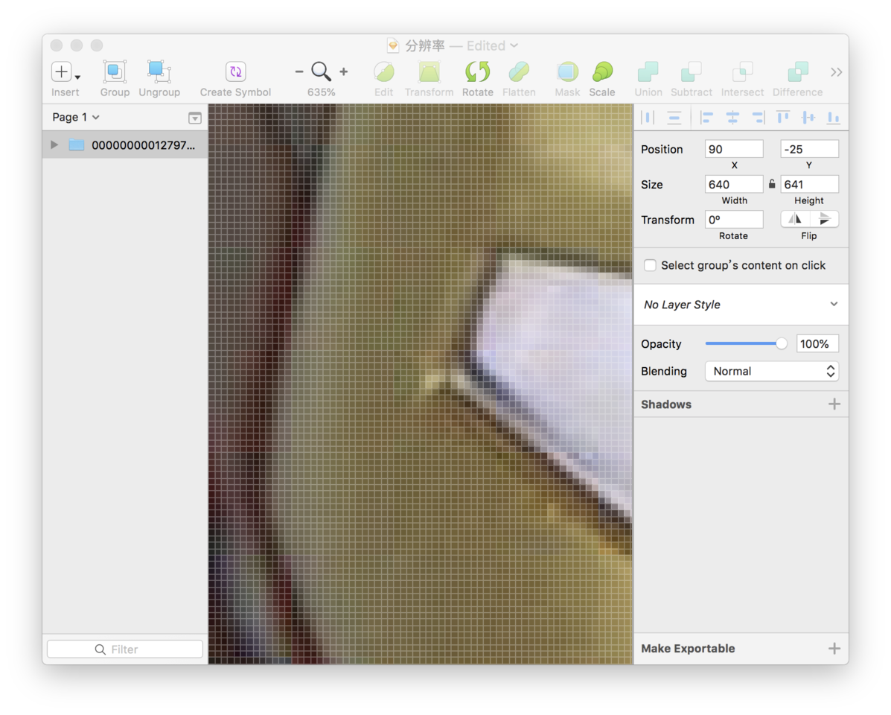
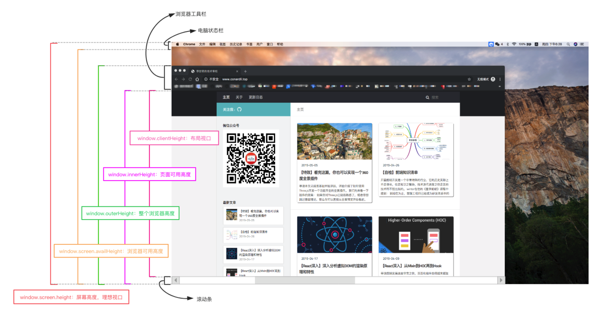

<!-- TOC -->

- [概念](#%e6%a6%82%e5%bf%b5)
  - [英寸](#%e8%8b%b1%e5%af%b8)
  - [分辨率](#%e5%88%86%e8%be%a8%e7%8e%87)
  - [设备独立像素](#%e8%ae%be%e5%a4%87%e7%8b%ac%e7%ab%8b%e5%83%8f%e7%b4%a0)
  - [视口](#%e8%a7%86%e5%8f%a3)
- [适配方案](#%e9%80%82%e9%85%8d%e6%96%b9%e6%a1%88)
  - [flexble](#flexble)
  - [vh、vw](#vhvw)
- [1px 问题](#1px-%e9%97%ae%e9%a2%98)
  - [border-image](#border-image)
  - [background-image](#background-image)
  - [伪类 + transform](#%e4%bc%aa%e7%b1%bb--transform)
  - [SVG](#svg)
- [图片模糊](#%e5%9b%be%e7%89%87%e6%a8%a1%e7%b3%8a)
  - [media](#media)
  - [image-set](#image-set)
  - [srcset](#srcset)
  - [SVG](#svg-1)
- [全面屏适配](#%e5%85%a8%e9%9d%a2%e5%b1%8f%e9%80%82%e9%85%8d)
  - [viewport-fit](#viewport-fit)
  - [env、constant](#envconstant)
- [横屏适配](#%e6%a8%aa%e5%b1%8f%e9%80%82%e9%85%8d)
  - [JavaScript 检测](#javascript-%e6%a3%80%e6%b5%8b)
  - [CSS 检测](#css-%e6%a3%80%e6%b5%8b)

<!-- /TOC -->

> 参考 ConardLi 老师的 

# 概念

## 英寸

一般用英寸描述屏幕的物理大小，如电脑显示器的 17、22，手机显示器的 4.8、5.7 等使用的单位都是英寸。
英寸和厘米的换算：`1英寸 = 2.54 厘米`

## 分辨率

1. 像素

像素是一个小方块，有特定的位置和颜色。像素是屏幕的最小组成单位，屏幕是由无数个像素拼接而成。


2. 屏幕分辨率

屏幕分辨率指一个屏幕具体由多少个像素点组成

3. 图像分辨率

我们通常说的图片分辨率其实是指图片含有的像素数，比如一张图片的分辨率为 800 x 400。这表示图片分别在垂直和水平上所具有的像素点数为 800 和 400。

4. PPI

PPI(Pixel Per Inch)：每英寸包括的像素数。

PPI 可以用于描述屏幕的清晰度以及一张图片的质量。

使用 PPI 描述图片时，PPI 越高，图片质量越高，使用 PPI 描述屏幕时，PPI 越高，屏幕越清晰。

5. DPI

DPI(Dot Per Inch)：即每英寸包括的点数。
这里的点是一个抽象的单位，它可以是屏幕像素点、图片像素点也可以是打印机的墨点。
平时你可能会看到使用 DPI 来描述图片和屏幕，这时的 DPI 应该和 PPI 是等价的，DPI 最常用的是用于描述打印机，表示打印机每英寸可以打印的点数。
一张图片在屏幕上显示时，它的像素点数是规则排列的，每个像素点都有特定的位置和颜色。
当使用打印机进行打印时，打印机可能不会规则的将这些点打印出来，而是使用一个个打印点来呈现这张图像，这些打印点之间会有一定的空隙，这就是 DPI 所描述的：打印点的密度。

## 设备独立像素

上述描述的分辨率都是物理像素，即设备的真是物理单元。
在高分辨率屏幕和 Retina Display 出现后，为了避免适应高分屏的显示，需要告诉不同分辨率的手机，在界面上显示元素的大小，这个单位就是设备独立像素(Device Independent Pixels)简称 DIP 或 DP

1. 设备像素比

设备像素比 device pixel ratio 简称 dpr，即物理像素和设备独立像素的比值。
在 web 中，浏览器为我们提供了`window.devicePixelRatio`来帮助我们获取 dpr。
在 css 中，可以使用媒体查询`min-device-pixel-ratio`，区分 dpr：

```CSS
@media (-webkit-min-device-pixel-ratio: 2),(min-device-pixel-ratio: 2){ }
```

2. WEB
   在写 CSS 时，我们用到最多的单位是 px，即 CSS 像素，当页面缩放比例为 100%时，一个 CSS 像素等于一个设备独立像素。
   但是 CSS 像素是很容易被改变的，当用户对浏览器进行了放大，CSS 像素会被放大，这时一个 CSS 像素会跨越更多的物理像素。
   `页面的缩放系数 = CSS像素 / 设备独立像素`。

## 视口

视口（viewport）代表当前可见的计算机图形区域，在浏览器中，通常与浏览器的窗口相同，但不包含浏览器的菜单栏等原生 UI。

1. 布局视口

布局视口(layout viewport)：当我们以百分比来指定一个元素的大小时，它的计算值是由这个元素的包含块计算而来的。当这个元素是最顶级的元素时，它就是基于布局视口来计算的。
所以，布局视口是网页布局的基准窗口，在 PC 浏览器上，布局视口就等于当前浏览器的窗口大小（不包括 borders 、margins、滚动条）。
在移动端，布局视口被赋予一个默认值，大部分为 980px，这保证 PC 的网页可以在手机浏览器上呈现，但是非常小，用户可以手动对网页进行放大。
我们可以通过调用 `document.documentElement.clientWidth / clientHeight` 来获取布局视口大小。

2. 视觉视口

视觉视口(visual viewport)：用户通过屏幕真实看到的区域。
视觉视口默认等于当前浏览器的窗口大小（包括滚动条宽度）。
当用户对浏览器进行缩放时，不会改变布局视口的大小，所以页面布局是不变的，但是缩放会改变视觉视口的大小。
例如：用户将浏览器窗口放大了 200%，这时浏览器窗口中的 CSS 像素会随着视觉视口的放大而放大，这时一个 CSS 像素会跨越更多的物理像素。
所以，布局视口会限制你的 CSS 布局而视觉视口决定用户具体能看到什么。
我们可以通过调用 `window.innerWidth / innerHeight` 来获取视觉视口大小。

3. 理想视口

布局视口在移动端展示的效果并不是一个理想的效果，所以理想视口(ideal viewport)就诞生了：网站页面在移动端展示的理想大小。
在浏览器调试移动端时页面上给定的像素大小就是理想视口大小，它的单位正是设备独立像素。
页面的缩放系数 = CSS 像素 / 设备独立像素，实际上说页面的缩放系数 = 理想视口宽度 / 视觉视口宽度更为准确。
所以，当页面缩放比例为 100%时，CSS 像素 = 设备独立像素，理想视口 = 视觉视口。
我们可以通过调用`screen.width / heigh`t 来获取理想视口大小。

4. meta viewport

我们可以借助`<meta>`元素的`viewport`来帮助我们设置视口、缩放等，从而让移动端得到更好的展示效果。

```HTML
<meta name="viewport" content="width=device-width; initial-scale=1; maximum-scale=1; minimum-scale=1; user-scalable=no;">
```

| 属性          | 值                        | 描述                                                    |
| ------------- | ------------------------- | ------------------------------------------------------- |
| width         | 正整数或 device-width     | 以 pixels（像素）为单位， 定义布局视口的宽度。          |
| height        | 正整数或 device-height    | 以 pixels（像素）为单位， 定义布局视口的高度。          |
| initial-scale | 0.0 - 10.0                | 定义页面初始缩放比率。                                  |
| minimum-scale | 0.0 - 10.0                | 定义缩放的最小值；必须小于或等于 maximum-scale 的值。   |
| maximum-scale | 0.0 - 10.0                | 定义缩放的最大值；必须大于或等于 minimum-scale 的值。   |
| user-scalable | 一个布尔值（yes 或者 no） | 如果设置为 no，用户将不能放大或缩小网页。默认值为 yes。 |

为了在移动端让页面获得更好的显示效果，我们必须让布局视口、视觉视口都尽可能等于理想视口。
`device-width`就等于理想视口的宽度，所以设置`width=device-width`就相当于让布局视口等于理想视口。
由于`initial-scale = 理想视口宽度 / 视觉视口宽度`，所以我们设置`initial-scale=1;`就相当于让视觉视口等于理想视口。
这时，1 个 CSS 像素就等于 1 个设备独立像素，而且我们也是基于理想视口来进行布局的，所以呈现出来的页面布局在各种设备上都能大致相似。

5. 缩放

上面提到`width`可以决定布局视口的宽度，实际上它并不是布局视口的唯一决定性因素，设置`initial-scale`也有可能影响到布局视口，因为布局视口宽度取的是`width`和视觉视口宽度的**最大值**。
例如：若手机的理想视口宽度为 400px，设置 width=device-width，initial-scale=2，此时视觉视口宽度 = 理想视口宽度 / initial-scale 即 200px，布局视口取两者最大值即 device-width 400px。
若设置 width=device-width，initial-scale=0.5，此时视觉视口宽度 = 理想视口宽度 / initial-scale 即 800px，布局视口取两者最大值即 800px。

6. 浏览器大小



- window.innerHeight：获取浏览器视觉视口高度（包括垂直滚动条）。
- window.outerHeight：获取浏览器窗口外部的高度。表示整个浏览器窗口的高度，包括侧边栏、窗口镶边和调正窗口大小的边框。
- window.screen.Height：获取获屏幕取理想视口高度，这个数值是固定的，设备的分辨率/设备像素比
- window.screen.availHeight：浏览器窗口可用的高度。
- document.documentElement.clientHeight：获取浏览器布局视口高度，包括内边距，但不包括垂直滚动条、边框和外边距。
- document.documentElement.offsetHeight：包括内边距、滚动条、边框和外边距。
- document.documentElement.scrollHeight：在不使用滚动条的情况下适合视口中的所有内容所需的最小宽度。测量方式与 clientHeight 相同：它包含元素的内边距，但不包括边框，外边距或垂直滚动条。

# 适配方案

## flexble

flexible 方案是阿里早期开源的一个移动端适配解决方案，引用 flexible 后，我们在页面上统一使用 rem 来布局。

核心内容

```JS
// set 1rem = viewWidth / 10
function setRemUnit () {
    var rem = docEl.clientWidth / 10
    docEl.style.fontSize = rem + 'px'
}
setRemUnit();

```

`rem` 是相对于 html 节点的 font-size 来做计算的。
我们通过设置 `document.documentElement.style.fontSize` 就可以统一整个页面的布局标准。
上面的代码中，将 `html` 节点的 `font-size` 设置为页面 `clientWidth` (布局视口)的 1/10，即`1rem`就等于页面布局视口的 1/10，这就意味着我们后面使用的`rem`都是按照页面比例来计算的。

这时，我们只需要将 UI 出的图转换为`rem`即可。
以 iPhone6 为例：布局视口为`375px`，则`1rem = 37.5px`，这时 UI 给定一个元素的宽为 75px（设备独立像素），我们只需要将它设置为`75 / 37.5 = 2rem`。
当然，每个布局都要计算非常繁琐，我们可以借助 PostCSS 的 px2rem 插件来帮助我们完成这个过程。

下面的代码可以保证在页面大小变化时，布局可以自适应，当触发了`window`的`resize`和`pageShow`事件之后自动调整`html`的`fontSize`大小。

```JS
  // reset rem unit on page resize
window.addEventListener('resize', setRemUnit)window.addEventListener('pageshow', function (e) {
    if (e.persisted) {
      setRemUnit()
    }
})

```

## vh、vw

`viewport`单位得到众多浏览器的兼容，`vh、vw`开始为更主流的适配方案

`vh、vw`方案即将视觉视口宽度 `window.innerWidth`和视觉视口高度 `window.innerHeight` 等分为 `100` 份。

- vw(Viewport's width)：1vw 等于视觉视口的 1%
- vh(Viewport's height) :1vh 为视觉视口高度的 1%
- vmin : vw 和 vh 中的较小值
- vmax : 选取 vw 和 vh 中的较大值

如果视觉视口为 375px，那么 1vw = 3.75px，这时 UI 给定一个元素的宽为 75px（设备独立像素），我们只需要将它设置为 75 / 3.75 = 20vw。
这里的比例关系我们也不用自己换算，我们可以使用 PostCSS 的 postcss-px-to-viewport 插件帮我们完成这个过程。写代码时，我们只需要根据 UI 给的设计图写 px 单位即可。

**缺点**

- px 转换成 vw 不一定能完全整除，因此有一定的像素差。
- 比如当容器使用 vw，margin 采用 px 时，很容易造成整体宽度超过 100vw，从而影响布局效果。当然我们也是可以避免的，例如使用 padding 代替 margin，结合 calc()函数使用等等

# 1px 问题

在设备像素比大于 1 的屏幕上，我们写的 1px 实际上是被多个物理像素渲染，这就会出现 1px 在有些屏幕上看起来很粗的现象。

## border-image

基于 media 查询判断不同的设备像素比给定不同的 border-image：

```CSS
       .border_1px{
          border-bottom: 1px solid #000;
        }
        @media only screen and (-webkit-min-device-pixel-ratio:2){
            .border_1px{
                border-bottom: none;
                border-width: 0 0 1px 0;
                border-image: url(../img/1pxline.png) 0 0 2 0 stretch;
            }
        }

```

## background-image

和 border-image 类似，准备一张符合条件的边框背景图，模拟在背景上。

```CSS
       .border_1px{
          border-bottom: 1px solid #000;
        }
        @media only screen and (-webkit-min-device-pixel-ratio:2){
            .border_1px{
                background: url(../img/1pxline.png) repeat-x left bottom;
                background-size: 100% 1px;
            }
        }

```

## 伪类 + transform

基于 media 查询判断不同的设备像素比对线条进行缩放

```css
.border_1px:before {
  content: '';
  position: absolute;
  top: 0;
  height: 1px;
  width: 100%;
  background-color: #000;
  transform-origin: 50% 0%;
}
@media only screen and (-webkit-min-device-pixel-ratio: 2) {
  .border_1px:before {
    transform: scaleY(0.5);
  }
}
@media only screen and (-webkit-min-device-pixel-ratio: 3) {
  .border_1px:before {
    transform: scaleY(0.33);
  }
}
```

## SVG

`border-imag`e 和`background-image`都可以模拟 1px 边框，但是使用的都是位图，还需要外部引入。
借助`PostCSS`的`postcss-write-svg`我们能直接使用`border-image`和`background-image`创建`svg`的`1px`边框：

```CSS
@svg border_1px {
  height: 2px;
  @rect {
    fill: var(--color, black);
    width: 100%;
    height: 50%;
    }
  }
.example { border: 1px solid transparent; border-image: svg(border_1px param(--color #00b1ff)) 2 2 stretch; }

```

编译后

```CSS
.example { border: 1px solid transparent; border-image: url("data:image/svg+xml;charset=utf-8,%3Csvg xmlns='http://www.w3.org/2000/svg' height='2px'%3E%3Crect fill='%2300b1ff' width='100%25' height='50%25'/%3E%3C/svg%3E") 2 2 stretch; }

```

# 图片模糊

我们平时使用的图片大多数都属于位图（png、jpg...），位图由一个个像素点构成的，每个像素都具有特定的位置和颜色值。

理论上，位图的每个像素对应在屏幕上使用一个物理像素来渲染，才能达到最佳的显示效果。

而在`dpr >`1 的屏幕上，位图的一个像素可能由多个物理像素来渲染，然而这些物理像素点并不能被准确的分配上对应位图像素的颜色，只能取近似值，所以相同的图片在`dpr > 1`的屏幕上就会模糊

为了保证图片质量，我们应该尽可能让一个屏幕像素来渲染一个图片像素，所以，针对不同 DPR 的屏幕，我们需要展示不同分辨率的图片。

如：在`dpr=2`的屏幕上展示两倍图`(@2x)`，在`dpr=3`的屏幕上展示三倍图`(@3x)`。

## media

使用 media 查询判断不同的设备像素比来显示不同精度的图片：

```CSS
       .avatar{
            background-image: url(conardLi_1x.png);
        }
        @media only screen and (-webkit-min-device-pixel-ratio:2){
            .avatar{
                background-image: url(conardLi_2x.png);
            }
        }
        @media only screen and (-webkit-min-device-pixel-ratio:3){
            .avatar{
                background-image: url(conardLi_3x.png);
            }
        }

```

## image-set

```css
.avatar {
    background-image: -webkit-image-set( "conardLi_1x.png" 1x, "conardLi_2x.png" 2x );
}
```

**media和image-set只适用于设置背景图**

## srcset
使用img标签的srcset属性，浏览器会自动根据像素密度匹配最佳显示图片：
```HTML

```
## SVG

SVG的全称是可缩放矢量图（Scalable Vector Graphics）。不同于位图的基于像素，SVG 则是属于对图像的形状描述，所以它本质上是文本文件，体积较小，且不管放大多少倍都不会失真

```HTML


.avatar {
  background: url(conardLi.svg);
}

```

# 全面屏适配

全面屏手机目前都在顶部有一定的改观改动效果。为了适配这些手机，安全区域这个概念变诞生了：安全区域就是一个不受上面三个效果的可视窗口范围。
为了保证页面的显示效果，我们必须把页面限制在安全范围内，但是不影响整体效果。

## viewport-fit

`viewport-fit`是专门为了适配`iPhoneX`而诞生的一个属性，它用于限制网页如何在安全区域内进行展示。

- contain: 可视窗口完全包含网页内容
- cover：网页内容完全覆盖可视窗口

默认情况下或者设置为 `auto` 和 `contain` 效果相同。

## env、constant

我们需要将顶部和底部合理的摆放在安全区域内，iOS11 新增了两个 CSS 函数 env、constant，用于设定安全区域与边界的距离。

函数内部可以是四个常量：

- safe-area-inset-left：安全区域距离左边边界距离
- safe-area-inset-right：安全区域距离右边边界距离
- safe-area-inset-top：安全区域距离顶部边界距离
- safe-area-inset-bottom：安全区域距离底部边界距离

**我们必须指定 viweport-fit 后才能使用这两个函数：**

`constant` 在 iOS < 11.2 的版本中生效， `env` 在 iOS >= 11.2 的版本中生效，这意味着我们往往要同时设置他们，将页面限制在安全区域内：

```CSS
body {
  padding-bottom: constant(safe-area-inset-bottom);
  padding-bottom: env(safe-area-inset-bottom);
}

```

当使用底部固定导航栏时，我们要为他们设置 padding 值：

```CSS
{
  padding-bottom: constant(safe-area-inset-bottom);
  padding-bottom: env(safe-area-inset-bottom);
}

```

# 横屏适配

很多视口我们要对横屏和竖屏显示不同的布局，所以我们需要检测在不同的场景下给定不同的样式：

## JavaScript 检测

window.orientation:获取屏幕旋转方向

```JS
window.addEventListener("resize", ()=>{
    if (window.orientation === 180 || window.orientation === 0) {
      // 正常方向或屏幕旋转180度
        console.log('竖屏');
    };
    if (window.orientation === 90 || window.orientation === -90 ){
       // 屏幕顺时钟旋转90度或屏幕逆时针旋转90度
        console.log('横屏');
    }
});

```

## CSS 检测

```CSS
@media screen and (orientation: portrait) {
  /*竖屏...*/
}
@media screen and (orientation: landscape) {
  /*横屏...*/
}

```
