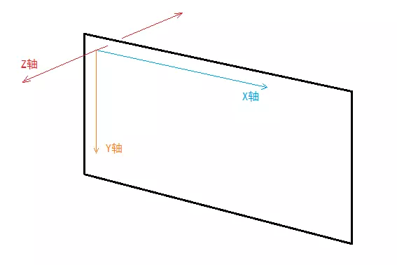
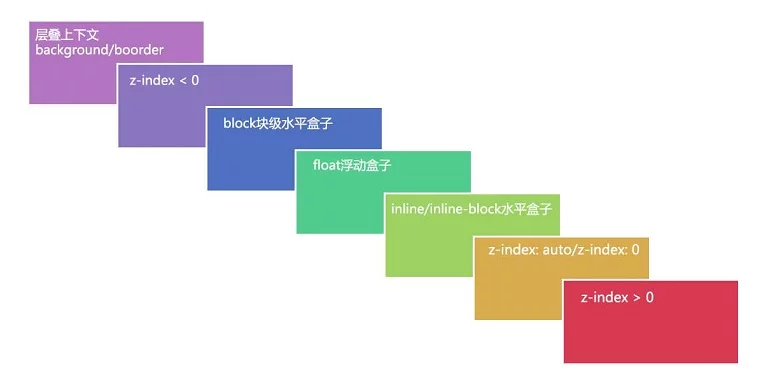

<!-- TOC -->

- [1. 层叠上下文](#1-%e5%b1%82%e5%8f%a0%e4%b8%8a%e4%b8%8b%e6%96%87)
- [2. 层叠等级](#2-%e5%b1%82%e5%8f%a0%e7%ad%89%e7%ba%a7)
- [3. 如何产生层叠上下文](#3-%e5%a6%82%e4%bd%95%e4%ba%a7%e7%94%9f%e5%b1%82%e5%8f%a0%e4%b8%8a%e4%b8%8b%e6%96%87)
- [4. 层叠顺序](#4-%e5%b1%82%e5%8f%a0%e9%a1%ba%e5%ba%8f)

<!-- /TOC -->

> 文章参考 [彻底搞懂 CSS 层叠上下文、层叠等级、层叠顺序、z-index](https://juejin.im/post/5b876f86518825431079ddd6)

# 1. 层叠上下文

层叠上下文(stacking context)，是 HTML 中一个三维的概念。在 CSS2.1 规范中，每个盒模型的位置是三维的，分别是平面画布上的 X 轴，Y 轴以及表示层叠的 Z 轴。一般情况下，元素在页面上沿 X 轴 Y 轴平铺，我们察觉不到它们在 Z 轴上的层叠关系。而一旦元素发生堆叠，这时就能发现某个元素可能覆盖了另一个元素或者被另一个元素覆盖。
如果一个元素含有层叠上下文，(也就是说它是层叠上下文元素)，我们可以理解为这个元素在 Z 轴上就“高人一等”，最终表现就是它离屏幕观察者更近。

# 2. 层叠等级

层叠等级指的又是什么？

1. 在同一个层叠上下文中，它描述定义的是该层叠上下文中的层叠上下文元素在 Z 轴上的上下顺序。
2. 在其他普通元素中，它描述定义的是这些普通元素在 Z 轴上的上下顺序。
3. 普通元素的层叠等级优先由其所在的层叠上下文决定。
4. 层叠等级的比较只有在当前层叠上下文元素中才有意义。不同层叠上下文中比较层叠等级是没有意义的。

# 3. 如何产生层叠上下文

1. HTML 中的根元素`html`本身就具有层叠上下文，称为“根层叠上下文”。
2. 普通元素设置 `position` 属性为非 `static` 值并设置 `z-index` 属性为**具体数值**，产生层叠上下文。
3. CSS3 中的新属性也可以产生层叠上下文。
   - 父元素的 display 属性值为 flex|inline-flex，子元素 z-index 属性值不为 auto 的时候，子元素为层叠上下文元素；
   - 元素的 opacity 属性值不是 1；
   - 元素的 transform 属性值不是 none；
   - 元素 mix-blend-mode 属性值不是 normal`；
   - 元素的 filter 属性值不是 none；
   - 元素的 isolation 属性值是 isolate；
   - 元素的 will-change 指定的属性值为上面任意一个；
   - 元素的-webkit-overflow-scrolling 属性值设置为 touch。

# 4. 层叠顺序

在不考虑 CSS3 的情况下，当元素发生层叠时，层叠顺讯遵循上面途中的规则

1. 如果元素不处于同一层叠上下文，比较所处层叠上下文的顺序
2. 如果元素是处于同一层叠上下文中，比较层叠顺序
3. 如果元素处于同一层叠上下文，且层叠顺序一样，后面的元素覆盖前面的元素
