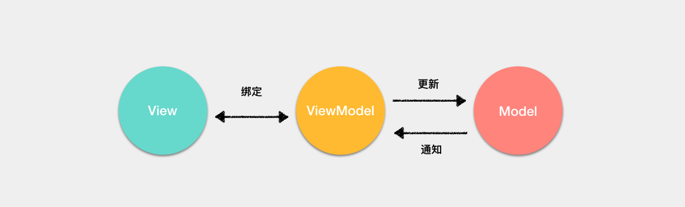

<!-- TOC -->

- [MVVM](#mvvm)
- [响应式原理](#响应式原理)
- [Virtual DOM](#virtual-dom)

<!-- /TOC -->

# MVVM

传统的 `MVC` 架构通常是使用控制器更新模型，视图从模型中获取数据去渲染。当用户有输入时，会通过控制器去更新模型，并且通知视图进行更新。


在 `MVVM` 架构中，引入了 `ViewModel` 的概念。ViewModel 只关心数据和业务的处理，不关心 `View` 如何处理数据，在这种情况下，`View` 和 `Model` 都可以独立出来，任何一方改变了也不一定需要改变另一方，并且可以将一些可复用的逻辑放在一个 `ViewModel` 中，让多个 View 复用这个 `ViewModel`。
对于 MVVM 来说，最重要的并不是通过双向绑定或者其他的方式将 View 与 ViewModel 绑定起来，而是通过 ViewModel 将视图中的状态和用户的行为分离出一个抽象，这才是 MVVM 的精髓。



以 Vue 框架来举例，ViewModel 就是组件的实例。View 就是模板，Model 的话在引入 Vuex 的情况下是完全可以和组件分离的。

# 响应式原理

> [响应式原理](https://juejin.im/post/5abdd6f6f265da23793c4458)

Vue 是采用**数据劫持**结合**发布订阅模式**，通过`Object.defineProperty()`来劫持各个属性的 `getter`,`setter`, 在数据变动时发布消息给订阅者，触发相应的回调函数，从而实现数据双向绑定

Vue 主要通过以下 4 个步骤来实现数据双向绑定的：

1. 实现一个监听器 `Observer` ：对数据对象进行遍历，包括子属性对象的属性，利用 `Object.defineProperty()` 对属性都加上 `setter` 和 `getter`。这样的话，给这个对象的某个值赋值，就会触发 `setter`，那么就能监听到了数据变化。
2. 实现一个解析器 `Compile` ：解析 Vue 模板指令，将模板中的变量都替换成数据，然后初始化渲染页面视图，并将每个指令对应的节点绑定更新函数，添加监听数据的订阅者，一旦数据有变动，收到通知，调用更新函数进行数据更新。
3. 实现一个订阅者 `Watcher` ：`Watcher` 订阅者是 `Observer` 和 `Compile` 之间通信的桥梁 ，主要的任务是订阅 `Observer` 中的属性值变化的消息，当收到属性值变化的消息时，触发解析器 `Compile` 中对应的更新函数。
4. 实现一个订阅器 `Dep` ：订阅器采用 发布-订阅 设计模式，用来收集订阅者 `Watcher`，对监听器 `Observer` 和 订阅者 `Watcher` 进行统一管理。

```JS
var data = { name: 'yck' }
observe(data)
let name = data.name // -> get value
data.name = 'yyy' // -> change value

function observe(obj) {
  // 判断类型
  if (!obj || typeof obj !== 'object') {
    return
  }
  Object.keys(obj).forEach(key => {
    defineReactive(obj, key, obj[key])
  })
}

function defineReactive(obj, key, val) {
  // 递归子属性
  observe(val)
  let dp = new Dep()
  Object.defineProperty(obj, key, {
    enumerable: true,
    configurable: true,
    get: function reactiveGetter() {
      console.log('get value')
      // 将 Watcher 添加到订阅
      if (Dep.target) {
        dp.addSub(Dep.target)
      }
      return val
    },
    set: function reactiveSetter(newVal) {
      console.log('change value')
      val = newVal
      // 执行 watcher 的 update 方法
      dp.notify()
    }
  })
}

// 实现一个 Dep 类，用于解耦属性的依赖收集和派发更新操作。
// 通过 Dep 解耦属性的依赖和更新操作
class Dep {
  constructor() {
    this.subs = []
  }
  // 添加依赖
  addSub(sub) {
    this.subs.push(sub)
  }
  // 更新
  notify() {
    this.subs.forEach(sub => {
      sub.update()
    })
  }
}
// 全局属性，通过该属性配置 Watcher
Dep.target = null

// 在组件挂载时，会先对所有需要的属性调用 Object.defineProperty()，然后实例化 Watcher，传入组件更新的回调。在实例化过程中，会对模板中的属性进行求值，触发依赖收集。
class Watcher {
  constructor(obj, key, cb) {
    // 将 Dep.target 指向自己
    // 然后触发属性的 getter 添加监听
    // 最后将 Dep.target 置空
    Dep.target = this
    this.cb = cb
    this.obj = obj
    this.key = key
    this.value = obj[key]
    Dep.target = null
  }
  update() {
    // 获得新值
    this.value = this.obj[this.key]
    // 调用 update 方法更新 Dom
    this.cb(this.value)
  }
}
```

# Virtual DOM

> [虚拟 DOM](https://juejin.im/post/5d36cc575188257aea108a74#heading-14)

提升 DOM 操作效率,推动数据驱动开发,采用了 `Virtual DOM` 思路

虚拟 DOM 的实现原理主要包括以下 3 部分：

- 用 JavaScript 对象模拟真实 DOM 树，对真实 DOM 进行抽象；
- diff 算法 — 比较两棵虚拟 DOM 树的差异；
- pach 算法 — 将两个虚拟 DOM 对象的差异应用到真正的 DOM 树。

**优点**

- 保证性能下限： 框架的虚拟 DOM 需要适配任何上层 API 可能产生的操作，它的一些 DOM 操作的实现必须是普适的，所以它的性能并不是最优的；但是比起粗暴的 DOM 操作性能要好很多，因此框架的虚拟 DOM 至少可以保证在你不需要手动优化的情况下，依然可以提供还不错的性能，即保证性能的下限；
- 无需手动操作 DOM： 我们不再需要手动去操作 DOM，只需要写好 View-Model 的代码逻辑，框架会根据虚拟 DOM 和 数据双向绑定，帮我们以可预期的方式更新视图，极大提高我们的开发效率；
- 跨平台： 虚拟 DOM 本质上是 JavaScript 对象,而 DOM 与平台强相关，相比之下虚拟 DOM 可以进行更方便地跨平台操作，例如服务器渲染、weex 开发等等。

**缺点**

无法进行极致优化： 虽然虚拟 DOM + 合理的优化，足以应对绝大部分应用的性能需求，但在一些性能要求极高的应用中虚拟 DOM 无法进行针对性的极致优化。


