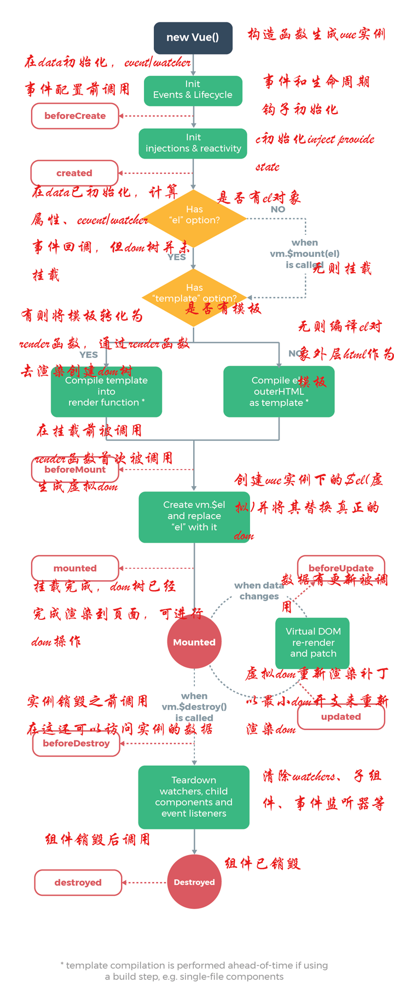

<!-- TOC -->

- [运行机制](#运行机制)
  - [初始化流程](#初始化流程)
  - [响应式流程](#响应式流程)
- [编译过程](#编译过程)
- [Object.defineProperty/proxy](#objectdefinepropertyproxy)
  - [Object.defineProperty 的缺陷](#objectdefineproperty-的缺陷)
  - [proxy](#proxy)
- [Route](#route)
  - [Hash 模式](#hash-模式)
  - [History 模式](#history-模式)
  - [对比](#对比)
- [生命周期](#生命周期)
- [组件通信](#组件通信)
  - [父子通信](#父子通信)
  - [兄弟通信](#兄弟通信)
  - [跨多层通信](#跨多层通信)
  - [Event Bus](#event-bus)
  - [Vuex](#vuex)
- [最佳实践](#最佳实践)
  - [computed 和 watch](#computed-和-watch)
  - [key](#key)
  - [keep-alive](#keep-alive)
  - [v-show 与 v-if](#v-show-与-v-if)
  - [组件中 data 使用函数](#组件中-data-使用函数)
  - [nextTick](#nexttick)
- [3.0](#30)

<!-- /TOC -->

# 运行机制

> [MVVM](../assets/images/frame-mvvm.jpg)

## 初始化流程

1. 创建 `Vue` 实例对象
2. `init` 过程会初始化生命周期，初始化事件中心，初始化渲染、执行`beforeCreate`周期函数、初始化 `data`、`props`、`computed`、`watche`r、执行`created`周期函数等。
3. 初始化后，调用`$mount`方法对`Vue`实例进行挂载（挂载的核心过程包括模板编译、渲染以及更新三个过程）。
4. 如果没有在 Vue 实例上定义`render`方法而是定义了`template`，那么需要经历编译阶段。需要先将`template`字符串编译成 `render function`，`template` 字符串编译步骤如下 ：
   1. `parse` 正则解析 `template` 字符串形成 `AST`（抽象语法树，是源代码的抽象语法结构的树状表现形式）
   2. `optimize` 标记静态节点跳过`diff`算法（`diff`算法是逐层进行比对，只有同层级的节点进行比对，因此时间的复杂度只有`O(n)`。如果对于时间复杂度不是很清晰的，可以查看我写的文章
   3. `generate`将`AST`转化成`render function`字符串
5. 编译成`render function` 后，调用`$mount`的`mountComponen`t 方法，先执行`beforeMount`钩子函数，然后核心是实例化一个渲染`Watcher`，在它的回调函数（初始化的时候执行，以及组件实例中监测到数据发生变化时执行）中调用`updateComponent`方法（此方法调用`render`方法生成虚拟`Node`，最终调用`update`方法更新`DOM`）。
6. 调用`render`方法将`render function`渲染成虚拟的`Node`（真正的 `DOM` 元素是非常庞大的，因为浏览器的标准就把 `DOM` 设计的非常复杂。如果频繁的去做 `DOM` 更新，会产生一定的性能问题，而 Virtual `DOM` 就是用一个原生的 `JavaScript` 对象去描述一个 `DOM` 节点，所以它比创建一个 `DOM` 的代价要小很多，而且修改属性也很轻松，还可以做到跨平台兼容），`render`方法的第一个参数是 createElement(或者说是 h 函数)，这个在官方文档也有说明。
7. 生成虚拟`DOM`树后，需要将虚拟`DOM`树转化成真实的`DOM`节点，此时需要调用`update`方法，`update`方法又会调用 `pacth` 方法把虚拟`DOM`转换成真正的`DOM`节点。需要注意在图中忽略了新建真实`DOM`的情况（如果没有旧的虚拟`Node`，那么可以直接通过 `createElm` 创建真实`DOM`节点），这里重点分析在已有虚拟`Node`的情况下，会通过 `sameVnode` 判断当前需要更新的`Node`节点是否和旧的`Node`节点相同（例如我们设置的 key 属性发生了变化，那么节点显然不同），如果节点不同那么将旧节点采用新节点替换即可，如果相同且存在子节点，需要调用 `patchVNode` 方法执行 `diff` 算法更新`DOM`，从而提升`DOM`操作的性能。

> 需要注意在初始化阶段，没有详细描述数据的响应式过程，这个在响应式流程里做说明。

## 响应式流程

1. 在 `init` 的时候会利用 `Object.defineProperty` 方法（不兼容 IE8）监听 `Vue` 实例的响应式数据的变化从而实现数据劫持能力（利用了 `JavaScript` 对象的访问器属性 `get` 和 `set`，在未来的 `Vue3` 中会使用 `ES6` 的 `Proxy` 来优化响应式原理）。在初始化流程中的编译阶段，当 `render function` 被渲染的时候，会读取 Vue 实例中和视图相关的响应式数据，此时会触发 `getter` 函数进行依赖收集（将观察者 `Watcher` 对象存放到当前闭包的订阅者 `Dep` 的 `subs` 中），此时的数据劫持功能和观察者模式就实现了一个 `MVVM` 模式中的 `Binder`，之后就是正常的渲染和更新流程。
2. 当数据发生变化或者视图导致的数据发生了变化时，会触发数据劫持的 `setter` 函数，`setter` 会通知初始化依赖收集中的 `Dep` 中的和视图相应的 `Watcher`，告知需要重新渲染视图，`Wather` 就会再次通过 `update` 方法来更新视图。

可以发现只要视图中添加监听事件，自动变更对应的数据变化时，就可以实现数据和视图的双向绑定了。

# 编译过程

Vue 会通过编译器将模板通过几个阶段最终编译为 `render` 函数，然后通过执行 `render` 函数生成 `Virtual DOM` 最终映射为真实 `DOM`。
这个过程其中又分为三个阶段，分别为：

- 将模板解析为 AST
- 优化 AST
- 将 AST 转换为 render 函数

在第一个阶段中，最主要的事情还是通过各种各样的正则表达式去匹配模板中的内容，然后将内容提取出来做各种逻辑操作，接下来会生成一个最基本的 AST 对象

```JS
{
    // 类型
    type: 1,
    // 标签
    tag,
    // 属性列表
    attrsList: attrs,
    // 属性映射
    attrsMap: makeAttrsMap(attrs),
    // 父节点
    parent,
    // 子节点
    children: []
}
```

然后会根据这个最基本的 AST 对象中的属性，进一步扩展 AST。

当然在这一阶段中，还会进行其他的一些判断逻辑。比如说对比前后开闭标签是否一致，判断根组件是否只存在一个，判断是否符合 `HTML5 Content Model` 规范等等问题。

接下来就是优化 AST 的阶段。在当前版本下，Vue 进行的优化内容其实还是不多的。只是对节点进行了静态内容提取，也就是将永远不会变动的节点提取了出来，实现复用 Virtual DOM，跳过对比算法的功能。在下一个大版本中，Vue 会在优化 AST 的阶段继续发力，实现更多的优化功能，尽可能的在编译阶段压榨更多的性能，比如说提取静态的属性等等优化行为。

最后一个阶段就是通过 AST 生成 render 函数了。其实这一阶段虽然分支有很多，但是最主要的目的就是遍历整个 AST，根据不同的条件生成不同的代码罢了。

# Object.defineProperty/proxy

## Object.defineProperty 的缺陷

如果通过下标方式修改数组数据或者给对象新增属性并不会触发组件的重新渲染，因为 `Object.defineProperty`不能拦截到这些操作，更精确的来说，对于数组而言，大部分操作都是拦截不到的，只是 Vue 内部通过重写函数的方式解决了这个问题。

## proxy

`Proxy` 和 `Object.defineProperty` 的使用方法看似很相似，其实 `Proxy` 是在 「更高维度」 上去拦截属性的修改的

- Proxy 可以直接监听对象而非属性；
- Proxy 可以直接监听数组的变化；
- Proxy 有多达 13 种拦截方法,不限于 `apply` 、 `ownKeys` 、 `deleteProperty` 、`has` 等等是 `Object.defineProperty` 不具备的；
- Proxy 返回的是一个新对象,我们可以只操作新的对象达到目的,而 `Object.defineProperty` 只能遍历对象属性直接修改；
- Proxy 作为新标准将受到浏览器厂商重点持续的性能优化，也就是传说中的新标准的性能红利；


# Route

前端路由实现起来其实很简单，本质就是监听 URL 的变化，然后匹配路由规则，显示相应的页面，并且无须刷新页面。目前前端使用的路由就只有两种实现方式

- Hash 模式
- History 模式

## Hash 模式

`www.test.com/#/` 就是 `Hash URL`，当`#`后面的哈希值发生变化时，可以通过 `hashchange` 事件来监听到 URL 的变化，从而进行跳转页面，并且无论哈希值如何变化，服务端接收到的 `URL` 请求永远是 `www.test.com`。

## History 模式

`History` 模式是 HTML5 新推出的功能，主要使用 `history.pushState` 和 `history.replaceState` 改变 `URL`。

通过 `History` 模式改变 `URL` 同样不会引起页面的刷新，只会更新浏览器的历史记录。

```JS
// 新增历史记录
history.pushState(stateObject, title, URL)
// 替换当前历史记录
history.replaceState(stateObject, title, URL)
```

## 对比

- Hash 模式只可以更改 # 后面的内容，History 模式可以通过 API 设置任意的同源 URL
- History 模式可以通过 API 添加任意类型的数据到历史记录中，Hash 模式只能更改哈希值，也就是字符串
- Hash 模式无需后端配置，并且兼容性好。History 模式在用户手动输入地址或者刷新页面的时候会发起 URL 请求，后端需要配置 index.html 页面用于匹配不到静态资源的时候

# 生命周期

每个 Vue 实例在被创建时都要经过一系列的初始化过程——例如，需要设置数据监听、编译模板、将实例挂载到 DOM 并在数据变化时更新 DOM 等。同时在这个过程中也会运行一些叫做生命周期钩子的函数，这给了用户在不同阶段添加自己的代码的机会。



| 阶段          | 描述                                                                                                                                  |
| ------------- | ------------------------------------------------------------------------------------------------------------------------------------- |
| beforeCreate  | 组件实例刚被创建，获取不到 props 或者 data 中的数据                                                                                   |
| created       | 组件实例创建完成，属性已经绑定，可以访问到数据， 组件还没被挂载，DOM 没有生成                                                         |
| beforeMount   | 开始创建 VDOM                                                                                                                         |
| mounted       | 将 VDOM 渲染为真实 DOM 并且渲染数据。组件中如果有子组件的话，会递归挂载子组件，只有当所有子组件全部挂载完毕，才会执行根组件的挂载钩子 |
| beforeUpdate  | 数据更新前                                                                                                                            |
| updated       | 数据更新后                                                                                                                            |
| beforeDestroy | 组件销毁前，移除事件、定时器等                                                                                                        |
| activated     | keep-alive 组件被激活                                                                                                                 |
| deactivated   | keep-alive 组件被移除                                                                                                                 |

# 组件通信

组件通信一般分为以下几种情况：

- 父子组件通信
- 兄弟组件通信
- 跨多层级组件通信
- 任意组件

## 父子通信

父组件通过 `props` 传递数据给子组件，子组件通过 `emit` 发送事件传递数据给父组件，这种方式是最常用的父子通信实现办法。

`.sync` 属性是个语法糖，可以很简单的实现子组件与父组件通信

```html
<!--父组件中-->
<input :value.sync="value" />
<!--以上写法等同于-->
<input :value="value" @update:value="v => value = v"></comp>
<!--子组件中-->
<script>
  this.$emit('update:value', 1)
</script>
```

## 兄弟通信

通过查找父组件中的子组件实现，也就是 `this.$parent.$children`，在 `$children` 中可以通过组件 `name` 查询到需要的组件实例，然后进行通信。

## 跨多层通信

使用 `provide / inject` 为后代组件注入

```JS
// 父组件 A
export default {
  provide: {
    data: 1
  }
}
// 子组件 B
export default {
  inject: ['data'],
  mounted() {
    // 无论跨几层都能获得父组件的 data 属性
    console.log(this.data) // => 1
  }
}
```

## Event Bus

小型项目可以通过`Event Bus`解决

首先初始化事件总线

```JS
// event-bus.js
import Vue from 'vue'
export const EventBus = new Vue()

// 也可以直接在 main 中初始化EventBus
// main.js
Vue.prototype.$EventBus = new Vue()
```

在需要使用通信的组件引入并触发/监听对应事件

```JS
// child a
import Bus from 'event-bus.js';
methods: {
   addCart(event) {
   Bus.$emit('getTarget', event.target);
   }
}
// child b
import Bus from 'event-bus.js';

created() {
    Bus.$on('getTarget', target => {
        console.log(target);
    });
}
```

## Vuex

`Vuex` 可以完美处理数据管理等需求，在中大型项目中可以引入

# 最佳实践

## computed 和 watch

computed 是计算属性，依赖其他属性计算值，并且 computed 的值有缓存，只有当计算值变化才会返回内容。

watch 监听到值的变化就会执行回调，在回调中可以进行一些逻辑操作。

所以一般来说需要依赖别的属性来动态获得值的时候可以使用 computed，对于监听到值的变化需要做一些复杂业务逻辑的情况可以使用 watch。

## key

`key` 是给每一个 `vnode` 的唯一 `id`,依靠 `key`,我们的 `diff` 操作可以更准确、更快速 (对于简单列表页渲染来说 `diff` 节点也更快,但会产生一些隐藏的副作用,比如可能不会产生过渡效果,或者在某些节点有绑定数据（表单）状态，会出现状态错位。)

## keep-alive

keep-alive 是 Vue 内置的一个组件，可以使被包含的组件保留状态，避免重新渲染 ，其有以下特性：

一般结合路由和动态组件一起使用，用于缓存组件；
提供 include 和 exclude 属性，两者都支持字符串或正则表达式， include 表示只有名称匹配的组件会被缓存，exclude 表示任何名称匹配的组件都不会被缓存 ，其中 exclude 的优先级比 include 高；
对应两个钩子函数 activated 和 deactivated ，当组件被激活时，触发钩子函数 activated，当组件被移除时，触发钩子函数 deactivated。

## v-show 与 v-if

v-show 只是在 `display: none` 和 `display: block` 之间切换。无论初始条件是什么都会被渲染出来，后面只需要切换 CSS，DOM 还是一直保留着的。所以总的来说 v-show 在初始渲染时有更高的开销，但是切换开销很小，更适合于频繁切换的场景。

v-if 当属性初始为 false 时，组件就不会被渲染，直到条件为 true，并且切换条件时会触发销毁 / 挂载组件，所以总的来说在切换时开销更高，更适合不经常切换的场景。

## 组件中 data 使用函数

组件复用时所有组件实例都会共享 data，如果 data 是对象的话，就会造成一个组件修改 data 以后会**影响到其他所有组件**，所以需要将 data 写成函数，每次用到就调用一次函数获得新的数据。

## nextTick

`Vue` 在更新 DOM 时是异步执行的。只要侦听到数据变化，`Vue` 将开启一个队列，并缓冲在同一事件循环中发生的所有数据变更。
如果同一个 `watcher` 被多次触发，只会被推入到队列中一次。这种在缓冲时去除重复数据对于避免不必要的计算和 DOM 操作是非常重要的。
`nextTick` 会在 DOM 更新完毕后出发

vue 的 `nextTick` 方法的实现原理:

- vue 用异步队列的方式来控制 DOM 更新和 `nextTick` 回调先后执行
- microtask 因为其高优先级特性，能确保队列中的微任务在一次事件循环前被执行完毕
- 考虑兼容问题,vue 做了 microtask 向 macrotask 的降级方案

# 3.0