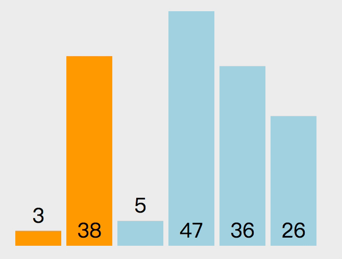
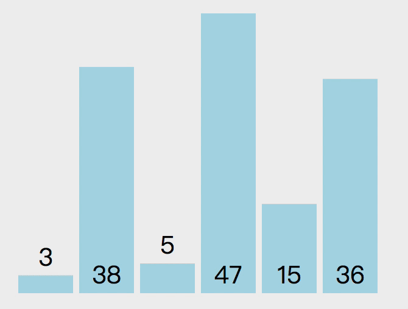

<!-- TOC -->

- [排序](#排序)
  - [冒泡排序](#冒泡排序)
  - [插入排序](#插入排序)
  - [选择排序](#选择排序)
  - [归并排序](#归并排序)
  - [快排](#快排)
  - [堆排序](#堆排序)
  - [系统自带排序实现](#系统自带排序实现)
  - [应用](#应用)
- [动态规划](#动态规划)
  - [斐波那契数列](#斐波那契数列)

<!-- /TOC -->

# 排序

```JS
function checkArray(array) {
    return Array.isArray(array)
}
function swap(array, left, right) {
    let rightValue = array[right]
    array[right] = array[left]
    array[left] = rightValue
}
```

## 冒泡排序

冒泡排序的原理如下，从第一个元素开始，把当前元素和下一个索引元素进行比较。如果当前元素大，那么就交换位置，重复操作直到比较到最后一个元素，那么此时最后一个元素就是该数组中最大的数。下一轮重复以上操作，但是此时最后一个元素已经是最大数了，所以不需要再比较最后一个元素，只需要比较到 length - 2 的位置。


```JS
function bubble(array) {
  checkArray(array);
  for (let i = array.length - 1; i > 0; i--) {
    // 从 0 到 `length - 1` 遍历
    for (let j = 0; j < i; j++) {
      if (array[j] > array[j + 1]) swap(array, j, j + 1)
    }
  }
  return array;
}
```

## 插入排序

插入排序的原理如下。第一个元素默认是已排序元素，取出下一个元素和当前元素比较，如果当前元素大就交换位置。那么此时第一个元素就是当前的最小数，所以下次取出操作从第三个元素开始，向前对比，重复之前的操作



```JS
function insertion(array) {
  if (!checkArray(array)) return
  for (let i = 1; i < array.length; i++) {
    for (let j = i - 1; j >= 0 && array[j] > array[j + 1]; j--)
      swap(array, j, j + 1);
  }
  return array;
}
```

## 选择排序

选择排序的原理如下。遍历数组，设置最小值的索引为 0，如果取出的值比当前最小值小，就替换最小值索引，遍历完成后，将第一个元素和最小值索引上的值交换。如上操作后，第一个元素就是数组中的最小值，下次遍历就可以从索引 1 开始重复上述操作。



```JS
function selection(array) {
  if (!checkArray(array)) return
  for (let i = 0; i < array.length - 1; i++) {
    let minIndex = i;
    for (let j = i + 1; j < array.length; j++) {
      minIndex = array[j] < array[minIndex] ? j : minIndex;
    }
    swap(array, i, minIndex);
  }
  return array;
}
```

## 归并排序

归并排序的原理如下。递归的将数组两两分开直到最多包含两个元素，然后将数组排序合并，最终合并为排序好的数组。假设我有一组数组 [3, 1, 2, 8, 9, 7, 6]，中间数索引是 3，先排序数组 [3, 1, 2, 8] 。在这个左边数组上，继续拆分直到变成数组包含两个元素（如果数组长度是奇数的话，会有一个拆分数组只包含一个元素）。然后排序数组 [3, 1] 和 [2, 8] ，然后再排序数组 [1, 3, 2, 8] ，这样左边数组就排序完成，然后按照以上思路排序右边数组，最后将数组 [1, 2, 3, 8] 和 [6, 7, 9] 排序。


```JS
function sort(array) {
  if (!checkArray(array)) return
  mergeSort(array, 0, array.length - 1);
  return array;
}

function mergeSort(array, left, right) {
  // 左右索引相同说明已经只有一个数
  if (left === right) return;
  // 等同于 `left + (right - left) / 2`
  // 相比 `(left + right) / 2` 来说更加安全，不会溢出
  // 使用位运算是因为位运算比四则运算快
  let mid = parseInt(left + ((right - left) >> 1));
  mergeSort(array, left, mid);
  mergeSort(array, mid + 1, right);

  let help = [];
  let i = 0;
  let p1 = left;
  let p2 = mid + 1;
  while (p1 <= mid && p2 <= right) {
    help[i++] = array[p1] < array[p2] ? array[p1++] : array[p2++];
  }
  while (p1 <= mid) {
    help[i++] = array[p1++];
  }
  while (p2 <= right) {
    help[i++] = array[p2++];
  }
  for (let i = 0; i < help.length; i++) {
    array[left + i] = help[i];
  }
  return array;
}
```

以上算法使用了递归的思想。递归的本质就是压栈，每递归执行一次函数，就将该函数的信息（比如参数，内部的变量，执行到的行数）压栈，直到遇到终止条件，然后出栈并继续执行函数。对于以上递归函数的调用轨迹如下

```js
mergeSort(data, 0, 6) // mid = 3
mergeSort(data, 0, 3) // mid = 1
mergeSort(data, 0, 1) // mid = 0
mergeSort(data, 0, 0) // 遇到终止，回退到上一步
mergeSort(data, 1, 1) // 遇到终止，回退到上一步
// 排序 p1 = 0, p2 = mid + 1 = 1
// 回退到 `mergeSort(data, 0, 3)` 执行下一个递归
mergeSort(2, 3) // mid = 2
mergeSort(3, 3) // 遇到终止，回退到上一步
// 排序 p1 = 2, p2 = mid + 1 = 3
// 回退到 `mergeSort(data, 0, 3)` 执行合并逻辑
// 排序 p1 = 0, p2 = mid + 1 = 2
// 执行完毕回退
// 左边数组排序完毕，右边也是如上轨迹
```

## 快排

快排的原理如下。随机选取一个数组中的值作为基准值，从左至右取值与基准值对比大小。比基准值小的放数组左边，大的放右边，对比完成后将基准值和第一个比基准值大的值交换位置。然后将数组以基准值的位置分为两部分，继续递归以上操作。


```JS
function sort(array) {
  if (!checkArray(array)) return
  quickSort(array, 0, array.length - 1);
  return array;
}

function quickSort(array, left, right) {
  if (left < right) {
    swap(array, , right)
    // 随机取值，然后和末尾交换，这样做比固定取一个位置的复杂度略低
    let indexs = part(array, parseInt(Math.random() * (right - left + 1)) + left, right);
    quickSort(array, left, indexs[0]);
    quickSort(array, indexs[1] + 1, right);
  }
}
function part(array, left, right) {
  let less = left - 1;
  let more = right;
  while (left < more) {
    if (array[left] < array[right]) {
      // 当前值比基准值小，`less` 和 `left` 都加一
	   ++less;
       ++left;
    } else if (array[left] > array[right]) {
      // 当前值比基准值大，将当前值和右边的值交换
      // 并且不改变 `left`，因为当前换过来的值还没有判断过大小
      swap(array, --more, left);
    } else {
      // 和基准值相同，只移动下标
      left++;
    }
  }
  // 将基准值和比基准值大的第一个值交换位置
  // 这样数组就变成 `[比基准值小, 基准值, 比基准值大]`
  swap(array, right, more);
  return [less, more];
}
```

## 堆排序

堆排序利用了二叉堆的特性来做，二叉堆通常用数组表示，并且二叉堆是一颗完全二叉树（所有叶节点（最底层的节点）都是从左往右顺序排序，并且其他层的节点都是满的）。二叉堆又分为大根堆与小根堆。

- 大根堆是某个节点的所有子节点的值都比他小
- 小根堆是某个节点的所有子节点的值都比他大

堆排序的原理就是组成一个大根堆或者小根堆。以小根堆为例，某个节点的左边子节点索引是 i _ 2 + 1，右边是 i _ 2 + 2，父节点是 (i - 1) /2。

- 首先遍历数组，判断该节点的父节点是否比他小，如果小就交换位置并继续判断，直到他的父节点比他大
- 重新以上操作 1，直到数组首位是最大值
- 然后将首位和末尾交换位置并将数组长度减一，表示数组末尾已是最大值，不需要再比较大小
- 对比左右节点哪个大，然后记住大的节点的索引并且和父节点对比大小，如果子节点大就交换位置
- 重复以上操作 3 - 4 直到整个数组都是大根堆。


```JS
function heap(array) {
  if (!checkArray(array)) return
  // 将最大值交换到首位
  for (let i = 0; i < array.length; i++) {
    heapInsert(array, i);
  }
  let size = array.length;
  // 交换首位和末尾
  swap(array, 0, --size);
  while (size > 0) {
    heapify(array, 0, size);
    swap(array, 0, --size);
  }
  return array;
}

function heapInsert(array, index) {
  // 如果当前节点比父节点大，就交换
  while (array[index] > array[parseInt((index - 1) / 2)]) {
    swap(array, index, parseInt((index - 1) / 2));
    // 将索引变成父节点
    index = parseInt((index - 1) / 2);
  }
}
function heapify(array, index, size) {
  let left = index * 2 + 1;
  while (left < size) {
    // 判断左右节点大小
    let largest =
      left + 1 < size && array[left] < array[left + 1] ? left + 1 : left;
    // 判断子节点和父节点大小
    largest = array[index] < array[largest] ? largest : index;
    if (largest === index) break;
    swap(array, index, largest);
    index = largest;
    left = index * 2 + 1;
  }
}
```

## 系统自带排序实现

每个语言的排序内部实现都是不同的。

对于 JS 来说，数组长度大于 10 会采用快排，否则使用插入排序 源码实现 。选择插入排序是因为虽然时间复杂度很差，但是在数据量很小的情况下和 O(N \* logN)相差无几，然而插入排序需要的常数时间很小，所以相对别的排序来说更快。

## 应用

将 [2,0,2,1,1,0] 排序成 [0,0,1,1,2,2] ，这个问题就可以使用三路快排的思想。

```JS
var sortColors = function(nums) {
  let left = -1;
  let right = nums.length;
  let i = 0;
  // 下标如果遇到 right，说明已经排序完成
  while (i < right) {
    if (nums[i] == 0) {
      swap(nums, i++, ++left);
    } else if (nums[i] == 1) {
      i++;
    } else {
      swap(nums, i, --right);
    }
  }
};
```

需要找出数组中第 K 大的元素，这问题也可以使用快排的思路。并且因为是找出第 K 大元素，所以在分离数组的过程中，可以找出需要的元素在哪边，然后只需要排序相应的一边数组就好。

```JS
var findKthLargest = function(nums, k) {
  let l = 0
  let r = nums.length - 1
  // 得出第 K 大元素的索引位置
  k = nums.length - k
  while (l < r) {
    // 分离数组后获得比基准树大的第一个元素索引
    let index = part(nums, l, r)
    // 判断该索引和 k 的大小
    if (index < k) {
      l = index + 1
    } else if (index > k) {
      r = index - 1
    } else {
      break
    }
  }
  return nums[k]
};
function part(array, left, right) {
  let less = left - 1;
  let more = right;
  while (left < more) {
    if (array[left] < array[right]) {
	   ++less;
       ++left;
    } else if (array[left] > array[right]) {
      swap(array, --more, left);
    } else {
      left++;
    }
  }
  swap(array, right, more);
  return more;
}
```

# 动态规划

动态规划背后的基本思想非常简单。就是将一个问题拆分为子问题，一般来说这些子问题都是非常相似的，那么我们可以通过只解决一次每个子问题来达到减少计算量的目的。

一旦得出每个子问题的解，就存储该结果以便下次使用。

## 斐波那契数列

斐波那契数列就是从 0 和 1 开始，后面的数都是前两个数之和

0，1，1，2，3，5，8，13，21，34，55，89....

递归

```js
function fib(n) {
  if (n < 2 && n >= 0) return n
  return fib(n - 1) + fib(n - 2)
}
fib(10)
```

解法却存在很严重的性能问题，当 n 越大的时候，需要的时间是指数增长的，这时候就可以通过动态规划来解决这个问题。

动态规划的本质其实就是两点

- 自底向上分解子问题
- 通过变量存储已经计算过的解

根据上面两点，我们的斐波那契数列的动态规划思路也就出来了

- 斐波那契数列从 0 和 1 开始，那么这就是这个子问题的最底层
- 通过数组来存储每一位所对应的斐波那契数列的值

```JS
function fib(n) {
  let array = new Array(n + 1).fill(null)
  array[0] = 0
  array[1] = 1
  for (let i = 2; i <= n; i++) {
    array[i] = array[i - 1] + array[i - 2]
  }
  return array[n]
}
fib(10)
```