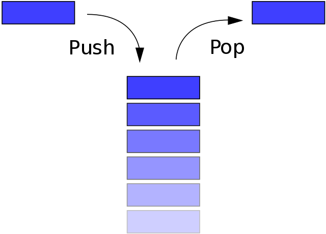
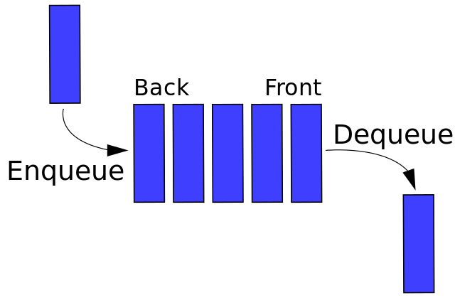
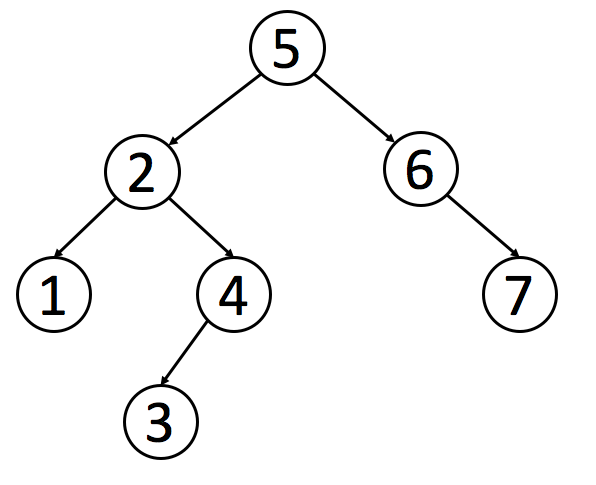
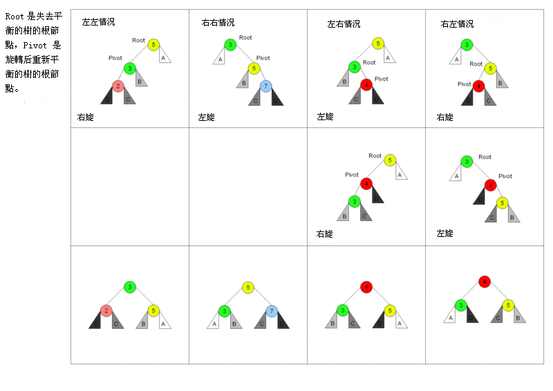
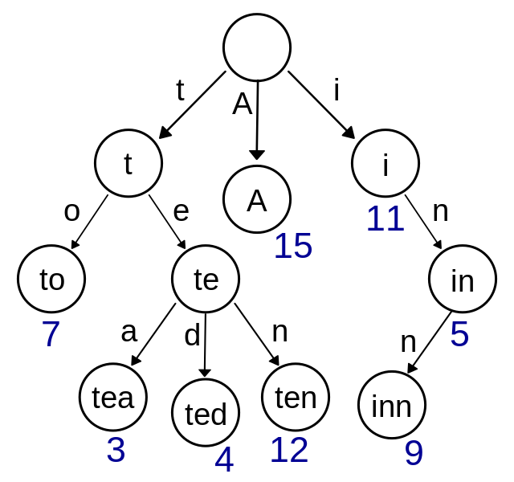
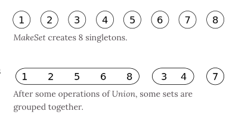
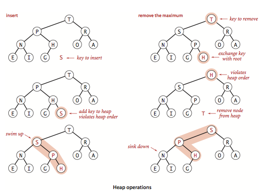

<!-- TOC -->

- [时间复杂度](#时间复杂度)
- [栈](#栈)
  - [实现](#实现)
  - [应用](#应用)
- [队列](#队列)
  - [实现](#实现-1)
    - [单链队列](#单链队列)
    - [循环队列](#循环队列)
- [链表](#链表)
  - [实现](#实现-2)
- [树](#树)
  - [二叉树](#二叉树)
  - [二分搜索树](#二分搜索树)
    - [实现](#实现-3)
- [AVL 树](#avl-树)
  - [实现](#实现-4)
- [Trie](#trie)
  - [实现](#实现-5)
- [并查集](#并查集)
  - [实现](#实现-6)
- [堆](#堆)
  - [实现大根堆](#实现大根堆)

<!-- /TOC -->

# 时间复杂度

通常使用最差的时间复杂度来衡量一个算法的好坏。

常数时间 O(1) 代表这个操作和数据量没关系，是一个固定时间的操作，比如说四则运算。

对于一个算法来说，可能会计算出操作次数为 aN + 1，N 代表数据量。那么该算法的时间复杂度就是 O(N)。因为我们在计算时间复杂度的时候，数据量通常是非常大的，这时候低阶项和常数项可以忽略不计。

当然可能会出现两个算法都是 O(N) 的时间复杂度，那么对比两个算法的好坏就要通过对比低阶项和常数项了。

# 栈

栈是一个线性结构，在计算机中是一个相当常见的数据结构。

栈的特点是只能在某一端添加或删除数据，遵循先进后出的原则



## 实现

其实可以把栈看成是数组的一个子集，所以这里使用数组来实现

```JS
class Stack {
  constructor() {
    this.stack = []
  }
  push(item) {
    this.stack.push(item)
  }
  pop() {
    this.stack.pop()
  }
  peek() {
    return this.stack[this.getCount() - 1]
  }
  getCount() {
    return this.stack.length
  }
  isEmpty() {
    return this.getCount() === 0
  }
}
```

## 应用

匹配括号，可以通过栈的特性来完成这道题目

```JS
var isValid = function (s) {
  let map = {
    '(': -1,
    ')': 1,
    '[': -2,
    ']': 2,
    '{': -3,
    '}': 3
  }
  let stack = []
  for (let i = 0; i < s.length; i++) {
    if (map[s[i]] < 0) {
      stack.push(s[i])
    } else {
      let last = stack.pop()
      if (map[last] + map[s[i]] != 0) return false
    }
  }
  if (stack.length > 0) return false
  return true
};
```

# 队列

队列是一个线性结构，特点是在某一端添加数据，在另一端删除数据，遵循先进先出的原则。



## 实现

### 单链队列

```JS
class Queue {
  constructor() {
    this.queue = []
  }
  enQueue(item) {
    this.queue.push(item)
  }
  deQueue() {
    return this.queue.shift()
  }
  getHeader() {
    return this.queue[0]
  }
  getLength() {
    return this.queue.length
  }
  isEmpty() {
    return this.getLength() === 0
  }
}
```

因为单链队列在出队操作的时候需要 O(n) 的时间复杂度，所以引入了循环队列。循环队列的出队操作平均是 O(1) 的时间复杂度。

### 循环队列

```JS
class SqQueue {
  constructor(length) {
    this.queue = new Array(length + 1)
    // 队头
    this.first = 0
    // 队尾
    this.last = 0
    // 当前队列大小
    this.size = 0
  }
  enQueue(item) {
    // 判断队尾 + 1 是否为队头
    // 如果是就代表需要扩容数组
    // % this.queue.length 是为了防止数组越界
    if (this.first === (this.last + 1) % this.queue.length) {
      this.resize(this.getLength() * 2 + 1)
    }
    this.queue[this.last] = item
    this.size++
    this.last = (this.last + 1) % this.queue.length
  }
  deQueue() {
    if (this.isEmpty()) {
      throw Error('Queue is empty')
    }
    let r = this.queue[this.first]
    this.queue[this.first] = null
    this.first = (this.first + 1) % this.queue.length
    this.size--
    // 判断当前队列大小是否过小
    // 为了保证不浪费空间，在队列空间等于总长度四分之一时
    // 且不为 2 时缩小总长度为当前的一半
    if (this.size === this.getLength() / 4 && this.getLength() / 2 !== 0) {
      this.resize(this.getLength() / 2)
    }
    return r
  }
  getHeader() {
    if (this.isEmpty()) {
      throw Error('Queue is empty')
    }
    return this.queue[this.first]
  }
  getLength() {
    return this.queue.length - 1
  }
  isEmpty() {
    return this.first === this.last
  }
  resize(length) {
    let q = new Array(length)
    for (let i = 0; i < length; i++) {
      q[i] = this.queue[(i + this.first) % this.queue.length]
    }
    this.queue = q
    this.first = 0
    this.last = this.size
  }
}
```

# 链表

链表是一个线性结构，同时也是一个天然的递归结构。链表结构可以充分利用计算机内存空间，实现灵活的内存动态管理。但是链表失去了数组随机读取的优点，同时链表由于增加了结点的指针域，空间开销比较大。


## 实现

单向链表

```JS
class Node {
  constructor(v, next) {
    this.value = v
    this.next = next
  }
}
class LinkList {
  constructor() {
    // 链表长度
    this.size = 0
    // 虚拟头部
    this.dummyNode = new Node(null, null)
  }
  find(header, index, currentIndex) {
    if (index === currentIndex) return header
    return this.find(header.next, index, currentIndex + 1)
  }
  addNode(v, index) {
    this.checkIndex(index)
    // 当往链表末尾插入时，prev.next 为空
    // 其他情况时，因为要插入节点，所以插入的节点
    // 的 next 应该是 prev.next
    // 然后设置 prev.next 为插入的节点
    let prev = this.find(this.dummyNode, index, 0)
    prev.next = new Node(v, prev.next)
    this.size++
    return prev.next
  }
  insertNode(v, index) {
    return this.addNode(v, index)
  }
  addToFirst(v) {
    return this.addNode(v, 0)
  }
  addToLast(v) {
    return this.addNode(v, this.size)
  }
  removeNode(index, isLast) {
    this.checkIndex(index)
    index = isLast ? index - 1 : index
    let prev = this.find(this.dummyNode, index, 0)
    let node = prev.next
    prev.next = node.next
    node.next = null
    this.size--
    return node
  }
  removeFirstNode() {
    return this.removeNode(0)
  }
  removeLastNode() {
    return this.removeNode(this.size, true)
  }
  checkIndex(index) {
    if (index < 0 || index > this.size) throw Error('Index error')
  }
  getNode(index) {
    this.checkIndex(index)
    if (this.isEmpty()) return
    return this.find(this.dummyNode, index, 0).next
  }
  isEmpty() {
    return this.size === 0
  }
  getSize() {
    return this.size
  }
}
```

# 树

## 二叉树

树拥有很多种结构，二叉树是树中最常用的结构，同时也是一个天然的递归结构。
二叉树拥有一个根节点，每个节点至多拥有两个子节点，分别为：左节点和右节点。树的最底部节点称之为叶节点，当一颗树的叶数量数量为满时，该树可以称之为满二叉树。


## 二分搜索树

二分搜索树也是二叉树，拥有二叉树的特性。但是区别在于二分搜索树每个节点的值都比他的左子树的值大，比右子树的值小。

这种存储方式很适合于数据搜索。如下图所示，当需要查找 6 的时候，因为需要查找的值比根节点的值大，所以只需要在根节点的右子树上寻找，大大提高了搜索效率。



### 实现

```JS
class Node {
  constructor(value) {
    this.value = value
    this.left = null
    this.right = null
  }
}
class BST {
  constructor() {
    this.root = null
    this.size = 0
  }
  getSize() {
    return this.size
  }
  isEmpty() {
    return this.size === 0
  }
  addNode(v) {
    this.root = this._addChild(this.root, v)
  }
  // 添加节点时，需要比较添加的节点值和当前
  // 节点值的大小
  _addChild(node, v) {
    if (!node) {
      this.size++
      return new Node(v)
    }
    if (node.value > v) {
      node.left = this._addChild(node.left, v)
    } else if (node.value < v) {
      node.right = this._addChild(node.right, v)
    }
    return node
  }
}
```

以上是最基本的二分搜索树实现，接下来实现树的遍历。

对于树的遍历来说，有三种遍历方法，分别是先序遍历、中序遍历、后序遍历。三种遍历的区别在于何时访问节点。在遍历树的过程中，每个节点都会遍历三次，分别是遍历到自己，遍历左子树和遍历右子树。如果需要实现先序遍历，那么只需要第一次遍历到节点时进行操作即可。

```JS
// 先序遍历可用于打印树的结构
// 先序遍历先访问根节点，然后访问左节点，最后访问右节点。
preTraversal() {
  this._pre(this.root)
}
_pre(node) {
  if (node) {
    console.log(node.value)
    this._pre(node.left)
    this._pre(node.right)
  }
}
// 中序遍历可用于排序
// 对于 BST 来说，中序遍历可以实现一次遍历就
// 得到有序的值
// 中序遍历表示先访问左节点，然后访问根节点，最后访问右节点。
midTraversal() {
  this._mid(this.root)
}
_mid(node) {
  if (node) {
    this._mid(node.left)
    console.log(node.value)
    this._mid(node.right)
  }
}
// 后序遍历可用于先操作子节点
// 再操作父节点的场景
// 后序遍历表示先访问左节点，然后访问右节点，最后访问根节点。
backTraversal() {
  this._back(this.root)
}
_back(node) {
  if (node) {
    this._back(node.left)
    this._back(node.right)
    console.log(node.value)
  }
}
```

以上的这几种遍历都可以称之为深度遍历，对应的还有种遍历叫做广度遍历，也就是一层层地遍历树。对于广度遍历来说，我们需要利用之前讲过的队列结构来完成。

```JS
breadthTraversal() {
  if (!this.root) return null
  let q = new Queue()
  // 将根节点入队
  q.enQueue(this.root)
  // 循环判断队列是否为空，为空
  // 代表树遍历完毕
  while (!q.isEmpty()) {
    // 将队首出队，判断是否有左右子树
    // 有的话，就先左后右入队
    let n = q.deQueue()
    console.log(n.value)
    if (n.left) q.enQueue(n.left)
    if (n.right) q.enQueue(n.right)
  }
}
```

接下来先介绍如何在树中寻找最小值或最大数。因为二分搜索树的特性，所以最小值一定在根节点的最左边，最大值相反

```JS
getMin() {
  return this._getMin(this.root).value
}
_getMin(node) {
  if (!node.left) return node
  return this._getMin(node.left)
}
getMax() {
  return this._getMax(this.root).value
}
_getMax(node) {
  if (!node.right) return node
  return this._getMin(node.right)
}
```

向上取整和向下取整，这两个操作是相反的，所以代码也是类似的，这里只介绍如何向下取整。既然是向下取整，那么根据二分搜索树的特性，值一定在根节点的左侧。只需要一直遍历左子树直到当前节点的值不再大于等于需要的值，然后判断节点是否还拥有右子树。如果有的话，继续上面的递归判断。

```JS
floor(v) {
  let node = this._floor(this.root, v)
  return node ? node.value : null
}
_floor(node, v) {
  if (!node) return null
  if (node.value === v) return v
  // 如果当前节点值还比需要的值大，就继续递归
  if (node.value > v) {
    return this._floor(node.left, v)
  }
  // 判断当前节点是否拥有右子树
  let right = this._floor(node.right, v)
  if (right) return right
  return node
}
```

排名，这是用于获取给定值的排名或者排名第几的节点的值，这两个操作也是相反的，所以这个只介绍如何获取排名第几的节点的值。对于这个操作而言，我们需要略微的改造点代码，让每个节点拥有一个 size 属性。该属性表示该节点下有多少子节点（包含自身）。

```JS
class Node {
  constructor(value) {
    this.value = value
    this.left = null
    this.right = null
    // 修改代码
    this.size = 1
  }
}
// 新增代码
_getSize(node) {
  return node ? node.size : 0
}
_addChild(node, v) {
  if (!node) {
    return new Node(v)
  }
  if (node.value > v) {
    // 修改代码
    node.size++
    node.left = this._addChild(node.left, v)
  } else if (node.value < v) {
    // 修改代码
    node.size++
    node.right = this._addChild(node.right, v)
  }
  return node
}
select(k) {
  let node = this._select(this.root, k)
  return node ? node.value : null
}
_select(node, k) {
  if (!node) return null
  // 先获取左子树下有几个节点
  let size = node.left ? node.left.size : 0
  // 判断 size 是否大于 k
  // 如果大于 k，代表所需要的节点在左节点
  if (size > k) return this._select(node.left, k)
  // 如果小于 k，代表所需要的节点在右节点
  // 注意这里需要重新计算 k，减去根节点除了右子树的节点数量
  if (size < k) return this._select(node.right, k - size - 1)
  return node
}
```

接下来讲解的是二分搜索树中最难实现的部分：删除节点。因为对于删除节点来说，会存在以下几种情况

- 需要删除的节点没有子树
- 需要删除的节点只有一条子树
- 需要删除的节点有左右两条树

对于前两种情况很好解决，但是第三种情况就有难度了，所以先来实现相对简单的操作：删除最小节点，对于删除最小节点来说，是不存在第三种情况的，删除最大节点操作是和删除最小节点相反的，所以这里也就不再赘述。

```js
delectMin() {
this.root = this.\_delectMin(this.root)
console.log(this.root)
}
\_delectMin(node) {
// 一直递归左子树
// 如果左子树为空，就判断节点是否拥有右子树
// 有右子树的话就把需要删除的节点替换为右子树
if ((node != null) & !node.left) return node.right
node.left = this.\_delectMin(node.left)
// 最后需要重新维护下节点的 `size`
node.size = this.\_getSize(node.left) + this.\_getSize(node.right) + 1
return node
}
```

最后讲解的就是如何删除任意节点了。对于这个操作，T.Hibbard 在 1962 年提出了解决这个难题的办法，也就是如何解决第三种情况。

当遇到这种情况时，需要取出当前节点的后继节点（也就是当前节点右子树的最小节点）来替换需要删除的节点。然后将需要删除节点的左子树赋值给后继结点，右子树删除后继结点后赋值给他。

你如果对于这个解决办法有疑问的话，可以这样考虑。因为二分搜索树的特性，父节点一定比所有左子节点大，比所有右子节点小。那么当需要删除父节点时，势必需要拿出一个比父节点大的节点来替换父节点。这个节点肯定不存在于左子树，必然存在于右子树。然后又需要保持父节点都是比右子节点小的，那么就可以取出右子树中最小的那个节点来替换父节点。

```js
delect(v) {
this.root = this.\_delect(this.root, v)
}
\_delect(node, v) {
if (!node) return null
// 寻找的节点比当前节点小，去左子树找
if (node.value < v) {
node.right = this.\_delect(node.right, v)
} else if (node.value > v) {
// 寻找的节点比当前节点大，去右子树找
node.left = this.\_delect(node.left, v)
} else {
// 进入这个条件说明已经找到节点
// 先判断节点是否拥有拥有左右子树中的一个
// 是的话，将子树返回出去，这里和 `_delectMin` 的操作一样
if (!node.left) return node.right
if (!node.right) return node.left
// 进入这里，代表节点拥有左右子树
// 先取出当前节点的后继结点，也就是取当前节点右子树的最小值
let min = this.\_getMin(node.right)
// 取出最小值后，删除最小值
// 然后把删除节点后的子树赋值给最小值节点
min.right = this.\_delectMin(node.right)
// 左子树不动
min.left = node.left
node = min
}
// 维护 size
node.size = this.\_getSize(node.left) + this.\_getSize(node.right) + 1
return node
}
```

# AVL 树

二分搜索树实际在业务中是受到限制的，因为并不是严格的 O(logN)，在极端情况下会退化成链表，比如加入一组升序的数字就会造成这种情况。

AVL 树改进了二分搜索树，在 AVL 树中任意节点的左右子树的高度差都不大于 1，这样保证了时间复杂度是严格的 O(logN)。基于此，对 AVL 树增加或删除节点时可能需要旋转树来达到高度的平衡。

## 实现

因为 AVL 树是改进了二分搜索树，所以部分代码是于二分搜索树重复的，对于重复内容不作再次解析。

对于 AVL 树来说，添加节点会有四种情况



对于左左情况来说，新增加的节点位于节点 2 的左侧，这时树已经不平衡，需要旋转。因为搜索树的特性，节点比左节点大，比右节点小，所以旋转以后也要实现这个特性。

旋转之前：new < 2 < C < 3 < B < 5 < A，右旋之后节点 3 为根节点，这时候需要将节点 3 的右节点加到节点 5 的左边，最后还需要更新节点的高度。

对于右右情况来说，相反于左左情况，所以不再赘述。

对于左右情况来说，新增加的节点位于节点 4 的右侧。对于这种情况，需要通过两次旋转来达到目的。

首先对节点的左节点左旋，这时树满足左左的情况，再对节点进行一次右旋就可以达到目的。

```JS
class Node {
  constructor(value) {
    this.value = value
    this.left = null
    this.right = null
    this.height = 1
  }
}

class AVL {
  constructor() {
    this.root = null
  }
  addNode(v) {
    this.root = this._addChild(this.root, v)
  }
  _addChild(node, v) {
    if (!node) {
      return new Node(v)
    }
    if (node.value > v) {
      node.left = this._addChild(node.left, v)
    } else if (node.value < v) {
      node.right = this._addChild(node.right, v)
    } else {
      node.value = v
    }
    node.height =
      1 + Math.max(this._getHeight(node.left), this._getHeight(node.right))
    let factor = this._getBalanceFactor(node)
    // 当需要右旋时，根节点的左树一定比右树高度高
    if (factor > 1 && this._getBalanceFactor(node.left) >= 0) {
      return this._rightRotate(node)
    }
    // 当需要左旋时，根节点的左树一定比右树高度矮
    if (factor < -1 && this._getBalanceFactor(node.right) <= 0) {
      return this._leftRotate(node)
    }
    // 左右情况
    // 节点的左树比右树高，且节点的左树的右树比节点的左树的左树高
    if (factor > 1 && this._getBalanceFactor(node.left) < 0) {
      node.left = this._leftRotate(node.left)
      return this._rightRotate(node)
    }
    // 右左情况
    // 节点的左树比右树矮，且节点的右树的右树比节点的右树的左树矮
    if (factor < -1 && this._getBalanceFactor(node.right) > 0) {
      node.right = this._rightRotate(node.right)
      return this._leftRotate(node)
    }

    return node
  }
  _getHeight(node) {
    if (!node) return 0
    return node.height
  }
  _getBalanceFactor(node) {
    return this._getHeight(node.left) - this._getHeight(node.right)
  }
  // 节点右旋
  //           5                    2
  //         /   \                /   \
  //        2     6   ==>       1      5
  //       /  \               /       /  \
  //      1    3             new     3    6
  //     /
  //    new
  _rightRotate(node) {
    // 旋转后新根节点
    let newRoot = node.left
    // 需要移动的节点
    let moveNode = newRoot.right
    // 节点 2 的右节点改为节点 5
    newRoot.right = node
    // 节点 5 左节点改为节点 3
    node.left = moveNode
    // 更新树的高度
    node.height =
      1 + Math.max(this._getHeight(node.left), this._getHeight(node.right))
    newRoot.height =
      1 +
      Math.max(this._getHeight(newRoot.left), this._getHeight(newRoot.right))

    return newRoot
  }
  // 节点左旋
  //           4                    6
  //         /   \                /   \
  //        2     6   ==>       4      7
  //             /  \         /   \      \
  //            5     7      2     5      new
  //                   \
  //                    new
  _leftRotate(node) {
    // 旋转后新根节点
    let newRoot = node.right
    // 需要移动的节点
    let moveNode = newRoot.left
    // 节点 6 的左节点改为节点 4
    newRoot.left = node
    // 节点 4 右节点改为节点 5
    node.right = moveNode
    // 更新树的高度
    node.height =
      1 + Math.max(this._getHeight(node.left), this._getHeight(node.right))
    newRoot.height =
      1 +
      Math.max(this._getHeight(newRoot.left), this._getHeight(newRoot.right))

    return newRoot
  }
}
```

# Trie

在计算机科学，trie，又称前缀树或字典树，是一种有序树，用于保存关联数组，其中的键通常是字符串。

简单点来说，这个结构的作用大多是为了方便搜索字符串，该树有以下几个特点

- 根节点代表空字符串，每个节点都有 N（假如搜索英文字符，就有 26 条） 条链接，每条链接代表一个字符
- 节点不存储字符，只有路径才存储，这点和其他的树结构不同
- 从根节点开始到任意一个节点，将沿途经过的字符连接起来就是该节点对应的字符串



## 实现

Trie 的实现相比别的树结构来说简单的很多，实现就以搜索英文字符为例。

```JS
class TrieNode {
  constructor() {
    // 代表每个字符经过节点的次数
    this.path = 0
    // 代表到该节点的字符串有几个
    this.end = 0
    // 链接
    this.next = new Array(26).fill(null)
  }
}
class Trie {
  constructor() {
    // 根节点，代表空字符
    this.root = new TrieNode()
  }
  // 插入字符串
  insert(str) {
    if (!str) return
    let node = this.root
    for (let i = 0; i < str.length; i++) {
      // 获得字符先对应的索引
      let index = str[i].charCodeAt() - 'a'.charCodeAt()
      // 如果索引对应没有值，就创建
      if (!node.next[index]) {
        node.next[index] = new TrieNode()
      }
      node.path += 1
      node = node.next[index]
    }
    node.end += 1
  }
  // 搜索字符串出现的次数
  search(str) {
    if (!str) return
    let node = this.root
    for (let i = 0; i < str.length; i++) {
      let index = str[i].charCodeAt() - 'a'.charCodeAt()
      // 如果索引对应没有值，代表没有需要搜素的字符串
      if (!node.next[index]) {
        return 0
      }
      node = node.next[index]
    }
    return node.end
  }
  // 删除字符串
  delete(str) {
    if (!this.search(str)) return
    let node = this.root
    for (let i = 0; i < str.length; i++) {
      let index = str[i].charCodeAt() - 'a'.charCodeAt()
      // 如果索引对应的节点的 Path 为 0，代表经过该节点的字符串
      // 已经一个，直接删除即可
      if (--node.next[index].path == 0) {
        node.next[index] = null
        return
      }
      node = node.next[index]
    }
    node.end -= 1
  }
}
```

# 并查集

并查集是一种特殊的树结构，用于处理一些不交集的合并及查询问题。该结构中每个节点都有一个父节点，如果只有当前一个节点，那么该节点的父节点指向自己。

这个结构中有两个重要的操作，分别是：

- Find：确定元素属于哪一个子集。它可以被用来确定两个元素是否属于同一子集。
- Union：将两个子集合并成同一个集合。



## 实现

```JS
class DisjointSet {
  // 初始化样本
  constructor(count) {
    // 初始化时，每个节点的父节点都是自己
    this.parent = new Array(count)
    // 用于记录树的深度，优化搜索复杂度
    this.rank = new Array(count)
    for (let i = 0; i < count; i++) {
      this.parent[i] = i
      this.rank[i] = 1
    }
  }
  find(p) {
    // 寻找当前节点的父节点是否为自己，不是的话表示还没找到
    // 开始进行路径压缩优化
    // 假设当前节点父节点为 A
    // 将当前节点挂载到 A 节点的父节点上，达到压缩深度的目的
    while (p != this.parent[p]) {
      this.parent[p] = this.parent[this.parent[p]]
      p = this.parent[p]
    }
    return p
  }
  isConnected(p, q) {
    return this.find(p) === this.find(q)
  }
  // 合并
  union(p, q) {
    // 找到两个数字的父节点
    let i = this.find(p)
    let j = this.find(q)
    if (i === j) return
    // 判断两棵树的深度，深度小的加到深度大的树下面
    // 如果两棵树深度相等，那就无所谓怎么加
    if (this.rank[i] < this.rank[j]) {
      this.parent[i] = j
    } else if (this.rank[i] > this.rank[j]) {
      this.parent[j] = i
    } else {
      this.parent[i] = j
      this.rank[j] += 1
    }
  }
}
```

# 堆

堆通常是一个可以被看做一棵树的数组对象。

堆的实现通过构造二叉堆，实为二叉树的一种。这种数据结构具有以下性质。

- 任意节点小于（或大于）它的所有子节点
- 堆总是一棵完全树。即除了最底层，其他层的节点都被元素填满，且最底层从左到右填入。

将根节点最大的堆叫做最大堆或大根堆，根节点最小的堆叫做最小堆或小根堆。

优先队列也完全可以用堆来实现，操作是一模一样的。

## 实现大根堆

堆的每个节点的左边子节点索引是 i _ 2 + 1，右边是 i _ 2 + 2，父节点是 (i - 1) /2。

堆有两个核心的操作，分别是 shiftUp 和 shiftDown 。前者用于添加元素，后者用于删除根节点。

shiftUp 的核心思路是一路将节点与父节点对比大小，如果比父节点大，就和父节点交换位置。

shiftDown 的核心思路是先将根节点和末尾交换位置，然后移除末尾元素。接下来循环判断父节点和两个子节点的大小，如果子节点大，就把最大的子节点和父节点交换。



```JS
class MaxHeap {
  constructor() {
    this.heap = []
  }
  size() {
    return this.heap.length
  }
  empty() {
    return this.size() == 0
  }
  add(item) {
    this.heap.push(item)
    this._shiftUp(this.size() - 1)
  }
  removeMax() {
    this._shiftDown(0)
  }
  getParentIndex(k) {
    return parseInt((k - 1) / 2)
  }
  getLeftIndex(k) {
    return k * 2 + 1
  }
  _shiftUp(k) {
    // 如果当前节点比父节点大，就交换
    while (this.heap[k] > this.heap[this.getParentIndex(k)]) {
      this._swap(k, this.getParentIndex(k))
      // 将索引变成父节点
      k = this.getParentIndex(k)
    }
  }
  _shiftDown(k) {
    // 交换首位并删除末尾
    this._swap(k, this.size() - 1)
    this.heap.splice(this.size() - 1, 1)
    // 判断节点是否有左孩子，因为二叉堆的特性，有右必有左
    while (this.getLeftIndex(k) < this.size()) {
      let j = this.getLeftIndex(k)
      // 判断是否有右孩子，并且右孩子是否大于左孩子
      if (j + 1 < this.size() && this.heap[j + 1] > this.heap[j]) j++
      // 判断父节点是否已经比子节点都大
      if (this.heap[k] >= this.heap[j]) break
      this._swap(k, j)
      k = j
    }
  }
  _swap(left, right) {
    let rightValue = this.heap[right]
    this.heap[right] = this.heap[left]
    this.heap[left] = rightValue
  }
}
```
