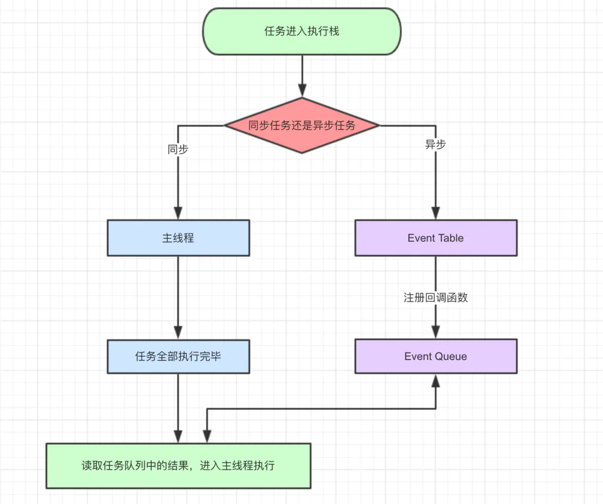
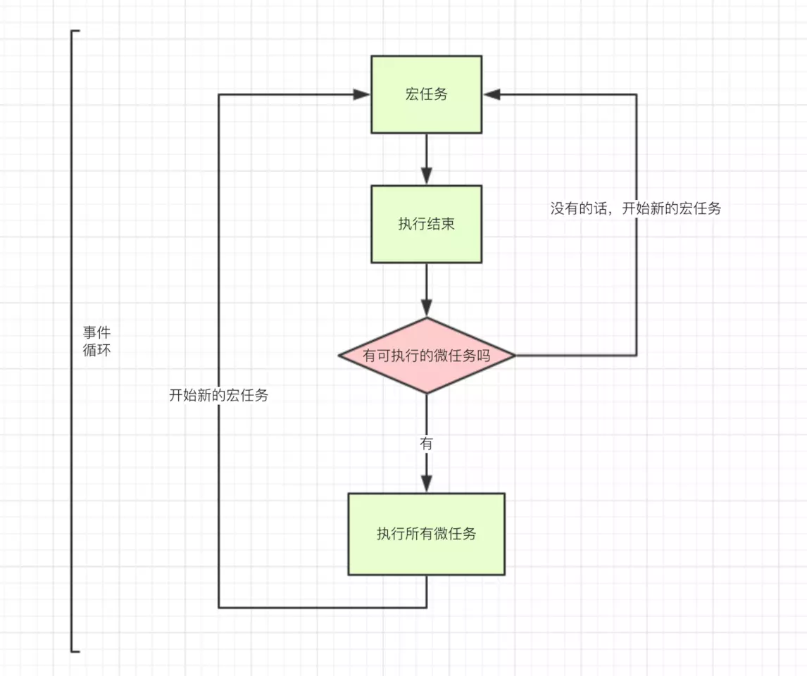

<!-- TOC -->

- [1. 深浅拷贝](#1-%e6%b7%b1%e6%b5%85%e6%8b%b7%e8%b4%9d)
  - [1.1. 浅拷贝](#11-%e6%b5%85%e6%8b%b7%e8%b4%9d)
  - [1.2. 深拷贝](#12-%e6%b7%b1%e6%8b%b7%e8%b4%9d)
    - [1.2.1. JSON](#121-json)
    - [1.2.2. 手动实现](#122-%e6%89%8b%e5%8a%a8%e5%ae%9e%e7%8e%b0)
- [2. JSON 实现](#2-json-%e5%ae%9e%e7%8e%b0)
  - [2.1. JSON.stringify](#21-jsonstringify)
  - [2.2. JSON.parse](#22-jsonparse)
- [3. Premise](#3-premise)
  - [3.1. 手工打造](#31-%e6%89%8b%e5%b7%a5%e6%89%93%e9%80%a0)
- [4. async](#4-async)
- [5. 定时器](#5-%e5%ae%9a%e6%97%b6%e5%99%a8)
  - [5.1. setTimeout](#51-settimeout)
  - [5.2. setInterval](#52-setinterval)
  - [5.3. requestAnimationFrame](#53-requestanimationframe)
- [6. 浏览器的 Event Loop](#6-%e6%b5%8f%e8%a7%88%e5%99%a8%e7%9a%84-event-loop)
- [7. 模块化](#7-%e6%a8%a1%e5%9d%97%e5%8c%96)
  - [7.1. 立即执行函数](#71-%e7%ab%8b%e5%8d%b3%e6%89%a7%e8%a1%8c%e5%87%bd%e6%95%b0)
  - [7.2. CMD,AMD](#72-cmdamd)
  - [7.3. COMMONJS](#73-commonjs)
  - [7.4. ES Module](#74-es-module)

<!-- /TOC -->

# 1. 深浅拷贝

当我们在复制引用类型的时候，复制的是其指针地址，修改副本时会同时修改原有内容

## 1.1. 浅拷贝

浅拷贝可以"真实"复制引用类型的数据，使其互相独立

1. Object.assign
2. 展开运算符`...`
3. slice 拷贝数组
4. concat 拷贝数组
5. 手动实现

```JS
const shallowClone = (target) => {
  if (typeof target === 'object' && target !== null) {
    const cloneTarget = Array.isArray(target) ? []: {};
    for (let prop in target) {
      if (target.hasOwnProperty(prop)) {
          cloneTarget[prop] = target[prop];
      }
    }
    return cloneTarget;
  } else {
    return target;
  }
}

```

**问题**
当拷贝的数据只有一层属性时，浅拷贝可以解决问题，如果数据有多层引用类型嵌套，浅拷贝又会遇到引用指针的问题

## 1.2. 深拷贝

深拷贝就是解决浅拷贝不能拷贝引用嵌套数据，实现真正的拷贝

### 1.2.1. JSON

`JSON.parse(JSON.stringify())` 可以解决大部分场景

**问题**

- 会忽略 `undefined`
- 会忽略 `symbol`
- 不能序列化函数
- 无法拷贝一些特殊的对象，诸如 RegExp, Date, Set, Map 等。
- 不能解决循环引用的对象

### 1.2.2. 手动实现

深拷贝是对数据中引用类型数据进行递归浅拷贝，还需要考虑好多种边界情况，比如原型链如何处理、DOM 如何处理，特殊对象如何拷贝等等

简易版

```JS
function deepClone(obj) {
  function isObject(o) {
    return (typeof o === 'object' || typeof o === 'function') && o !== null
  }

  if (!isObject(obj)) {
    throw new Error('非对象')
  }

  let isArray = Array.isArray(obj)
  let newObj = isArray ? [...obj] : { ...obj }
  Reflect.ownKeys(newObj).forEach(key => {
    newObj[key] = isObject(obj[key]) ? deepClone(obj[key]) : obj[key]
  })

  return newObj
}
let obj = {
  a: [1, 2, 3],
  b: {
    c: 2,
    d: 3
  }
}
let newObj = deepClone(obj)
newObj.b.c = 1
console.log(obj.b.c) // 2
```

复杂版

```JS
const getType = obj => Object.prototype.toString.call(obj);

const isObject = (target) => (typeof target === 'object' || typeof target === 'function') && target !== null;

const canTraverse = {
  '[object Map]': true,
  '[object Set]': true,
  '[object Array]': true,
  '[object Object]': true,
  '[object Arguments]': true,
};
const mapTag = '[object Map]';
const setTag = '[object Set]';
const boolTag = '[object Boolean]';
const numberTag = '[object Number]';
const stringTag = '[object String]';
const symbolTag = '[object Symbol]';
const dateTag = '[object Date]';
const errorTag = '[object Error]';
const regexpTag = '[object RegExp]';
const funcTag = '[object Function]';

const handleRegExp = (target) => {
  const { source, flags } = target;
  return new target.constructor(source, flags);
}

const handleFunc = (func) => {
  // 箭头函数直接返回自身
  if(!func.prototype) return func;
  const bodyReg = /(?<={)(.|\n)+(?=})/m;
  const paramReg = /(?<=\().+(?=\)\s+{)/;
  const funcString = func.toString();
  // 分别匹配 函数参数 和 函数体
  const param = paramReg.exec(funcString);
  const body = bodyReg.exec(funcString);
  if(!body) return null;
  if (param) {
    const paramArr = param[0].split(',');
    return new Function(...paramArr, body[0]);
  } else {
    return new Function(body[0]);
  }
}

const handleNotTraverse = (target, tag) => {
  const Ctor = target.constructor;
  switch(tag) {
    case boolTag:
      return new Object(Boolean.prototype.valueOf.call(target));
    case numberTag:
      return new Object(Number.prototype.valueOf.call(target));
    case stringTag:
      return new Object(String.prototype.valueOf.call(target));
    case symbolTag:
      return new Object(Symbol.prototype.valueOf.call(target));
    case errorTag:
    case dateTag:
      return new Ctor(target);
    case regexpTag:
      return handleRegExp(target);
    case funcTag:
      return handleFunc(target);
    default:
      return new Ctor(target);
  }
}

const deepClone = (target, map = new WeakMap()) => {
  if(!isObject(target))
    return target;
  let type = getType(target);
  let cloneTarget;
  if(!canTraverse[type]) {
    // 处理不能遍历的对象
    return handleNotTraverse(target, type);
  }else {
    // 这波操作相当关键，可以保证对象的原型不丢失！
    let ctor = target.constructor;
    cloneTarget = new ctor();
  }

  if(map.get(target))
    return target;
  map.set(target, true);

  if(type === mapTag) {
    //处理Map
    target.forEach((item, key) => {
      cloneTarget.set(deepClone(key, map), deepClone(item, map));
    })
  }

  if(type === setTag) {
    //处理Set
    target.forEach(item => {
      cloneTarget.add(deepClone(item, map));
    })
  }

  // 处理数组和对象
  for (let prop in target) {
    if (target.hasOwnProperty(prop)) {
        cloneTarget[prop] = deepClone(target[prop], map);
    }
  }
  return cloneTarget;
}

```

# 2. JSON 实现

## 2.1. JSON.stringify

- Boolean | Number| String 类型会自动转换成对应的原始值。
- undefined、任意函数以及 symbol，会被忽略（出现在非数组对象的属性值中时），或者被转换成 null（出现在数组中时）。
- 不可枚举的属性会被忽略
- 如果一个对象的属性值通过某种间接的方式指回该对象本身，即循环引用，属性也会被忽略。

```JS
function jsonStringify(obj) {
    let type = typeof obj;
    if (type !== "object") {
        if (/string|undefined|function/.test(type)) {
            obj = '"' + obj + '"';
        }
        return String(obj);
    } else {
        let json = []
        let arr = Array.isArray(obj)
        for (let k in obj) {
            let v = obj[k];
            let type = typeof v;
            if (/string|undefined|function/.test(type)) {
                v = '"' + v + '"';
            } else if (type === "object") {
                v = jsonStringify(v);
            }
            json.push((arr ? "" : '"' + k + '":') + String(v));
        }
        return (arr ? "[" : "{") + String(json) + (arr ? "]" : "}")
    }
}
jsonStringify({x : 5}) // "{"x":5}"
jsonStringify([1, "false", false]) // "[1,"false",false]"
jsonStringify({b: undefined}) // "{"b":"undefined"}"

```

## 2.2. JSON.parse

用来解析 JSON 字符串，构造由字符串描述的 JavaScript 值或对象。提供可选的 reviver 函数用以在返回之前对所得到的对象执行变换(操作)。

```js
function jsonParse(opt) {
  return eval('(' + opt + ')')
}
jsonParse(jsonStringify({ x: 5 }))
// Object { x: 5}
jsonParse(jsonStringify([1, 'false', false]))
// [1, "false", falsr]
jsonParse(jsonStringify({ b: undefined }))
// Object { b: "undefined"}
```

# 3. Premise

`Promise` 是异步编程的一种解决方案，所谓`Promise`，简单说就是一个容器，里面保存着某个未来才会结束的事件（通常是一个异步操作）的结果。
从语法上说，`Promise` 是一个对象，从它可以获取异步操作的消息。`Promise` 提供统一的 API，各种异步操作都可以用同样的方法进行处理。

- 对象的状态不受外界影响。`Promise`对象代表一个异步操作，有三种状态：pending（进行中）、fulfilled（已成功）和 rejected（已失败）。只有异步操作的结果，可以决定当前是哪一种状态，任何其他操作都无法改变这个状态。
- 一旦状态改变，就不会再变，任何时候都可以得到这个结果。`Pomise`对象的状态改变，只有两种可能：从 pending 变为 fulfilled 和从 pending 变为 rejected。只要这两种情况发生，状态就凝固了，不会再变了，会一直保持这个结果，这时就称为 resolved（已定型）

```JS
new Promise((resolve, reject) => {
  resolve('success')
  // 无效
  reject('reject')
})

```

- 当我们在构造 Promise 的时候，构造函数内部的代码是立即执行的

```js
new Promise((resolve, reject) => {
  console.log('new Promise')
  resolve('success')
})
console.log('finifsh')
// new Promise -> finifsh
```

- `Promise` 实现了链式调用，也就是说每次调用 then 之后返回的都是一个 `Promise`，并且是一个全新的 `Promise`，原因也是因为状态不可变。如果你在 `then` 中 使用了 `return` ，那么 `return` 的值会被 `Promise.resolve()` 包装

```js
Promise.resolve(1)
  .then((res) => {
    console.log(res) // => 1
    return 2 // 包装成 Promise.resolve(2)
  })
  .then((res) => {
    console.log(res) // => 2
  })
```

**问题**

- 无法取消`Promise`，一旦新建它就会立即执行，无法中途取消。
- 如果不设置回调函数，`Promise`内部抛出的错误，不会反应到外部。
- 当处于 pending 状态时，无法得知目前进展到哪一个阶段（刚刚开始还是即将完成）。

## 3.1. 手工打造

简易版本

```JS
const PENDING = 'pending'
const RESOLVED = 'resolved'
const REJECTED = 'rejected'

function MyPromise(fn) {
  const that = this
  that.state = PENDING
  that.value = null
  that.resolvedCallbacks = []
  that.rejectedCallbacks = []


  // 首先我们创建了三个常量用于表示状态，对于经常使用的一些值都应该通过常量来管理，便于开发及后期维护
  // 在函数体内部首先创建了常量 that，因为代码可能会异步执行，用于获取正确的 this 对象
  // 一开始 Promise 的状态应该是 pending
  // value 变量用于保存 resolve 或者 reject 中传入的值
  // resolvedCallbacks 和 rejectedCallbacks 用于保存 then 中的回调，因为当执行完 Promise 时状态可能还是等待中，这时候应该把 then 中的回调保存起来用于状态改变时使用

  function resolve(value) {
    if (that.state === PENDING) {
      that.state = RESOLVED
      that.value = value
      that.resolvedCallbacks.map(cb => cb(that.value))
    }
  }

  function reject(value) {
    if (that.state === PENDING) {
      that.state = REJECTED
      that.value = value
      that.rejectedCallbacks.map(cb => cb(that.value))
    }
  }


  // 首先两个函数都得判断当前状态是否为等待中，因为规范规定只有等待态才可以改变状态
  // 将当前状态更改为对应状态，并且将传入的值赋值给 value
  // 遍历回调数组并执行


  try {
    fn(resolve, reject)
  } catch (e) {
    reject(e)
  }
}

MyPromise.prototype.then = function(onFulfilled, onRejected) {
  const that = this
  onFulfilled = typeof onFulfilled === 'function' ? onFulfilled : v => v
  onRejected =
    typeof onRejected === 'function'
      ? onRejected
      : r => {
          throw r
        }
  if (that.state === PENDING) {
    that.resolvedCallbacks.push(onFulfilled)
    that.rejectedCallbacks.push(onRejected)
  }
  if (that.state === RESOLVED) {
    onFulfilled(that.value)
  }
  if (that.state === REJECTED) {
    onRejected(that.value)
  }
}


//  首先判断两个参数是否为函数类型，因为这两个参数是可选参数
//  当参数不是函数类型时，需要创建一个函数赋值给对应的参数，同时也实现了透传
//  接下来就是一系列判断状态的逻辑，当状态不是等待态时，就去执行相对应的函数。如果状态是等待态的话，就往回调函数中 push 函数
```

# 4. async

`async` 函数返回一个 `Promise` 对象，可以使用 `then` 方法添加回调函数。当函数执行的时候，一旦遇到 `await` 就会先返回，等到异步操作完成，再接着执行函数体内后面的语句。

```js
async function getStockPriceByName(name) {
  const symbol = await getStockSymbol(name)
  const stockPrice = await getStockPrice(symbol)
  return stockPrice
}

getStockPriceByName('goog').then(function (result) {
  console.log(result)
})
```

# 5. 定时器

常见的定时器函数有 `setTimeout` 、 `setInterval` 、 `requestAnimationFrame`

## 5.1. setTimeout

很多人认为 `setTimeout` 是延时多久，那就应该是多久后执行。

其实这个观点是错误的，因为 JS 是单线程执行的，如果前面的代码影响了性能，就会导致 `setTimeout` 不会按期执行。当然了，我们可以通过代码去修正 `setTimeout`，从而使定时器相对准确

## 5.2. setInterval

接下来我们来看 `setInterval`，其实这个函数作用和 `setTimeout` 基本一致，只是该函数是每隔一段时间执行一次回调函数。

通常来说不建议使用 `setInterval`。第一，它和 `setTimeout` 一样，不能保证在预期的时间执行任务。第二，它存在执行累积的问题，请看以下伪代码

## 5.3. requestAnimationFrame

首先 `requestAnimationFrame` 自带函数节流功能，基本可以保证在 16.6 毫秒内只执行一次（不掉帧的情况下），并且该函数的延时效果是精确的，没有其他定时器时间不准的问题，当然你也可以通过该函数来实现 setTimeout。

```JS
function setInterval(callback, interval) {
  let timer
  const now = Date.now
  let startTime = now()
  let endTime = startTime
  const loop = () => {
    timer = window.requestAnimationFrame(loop)
    endTime = now()
    if (endTime - startTime >= interval) {
      startTime = endTime = now()
      callback(timer)
    }
  }
  timer = window.requestAnimationFrame(loop)
  return timer
}

let a = 0
setInterval(timer => {
  console.log(1)
  a++
  if (a === 3) cancelAnimationFrame(timer)
}, 1000)
```

# 6. 浏览器的 Event Loop

`javascript` 是一门单线程语言，在最新的 HTML5 中提出了 `Web-Worker`，但 `javascript` 是单线程这一核心仍未改变。所以一切 `javascript` 版的"多线程"都是用单线程模拟出来的，一切 `javascript` 多线程都是纸老 虎！

当我们执行 JS 代码的时候其实就是往执行栈中放入函数，当遇到异步的代码时，会被挂起并在需要执行的时候加入到 `Task`（有多种 Task） 队列中。js 引擎存在 `monitoring process` 进程，会持续不断的检查主线程执行栈是否为空，一旦执行栈为空，`Event Loop` 就会从 `Task` 队列中拿出需要执行的代码并放入执行栈中执行。


1. 同步和异步任务分别进入不同的执行"场所"，同步的进入主线程，异步的进入 Event Table 并注册函数。
1. 当指定的事情完成时，Event Table 会将这个函数移入 Event Queue。
1. 主线程内的任务执行完毕为空，会去 Event Queue 读取对应的函数，进入主线程执行。
1. 上述过程会不断重复，也就是常说的 Event Loop(事件循环)。

不同的任务源会被分配到不同的 `Task` 队列中，任务源可以分为 微任务（microtask） 和 宏任务（macrotask）。在 `ES6` 规范中，`microtask` 称为 `jobs`，`macrotask` 称为 `task`。

macro-task(宏任务)：包括整体代码 `script`，`setTimeout`，`setInterval`
micro-task(微任务)：`Promise`，`process.nextTick`


1. 首先执行同步代码，这属于宏任务
2. 当执行完所有同步代码后，执行栈为空，查询是否有异步代码需要执行
3. 执行所有微任务
4. 当执行完所有微任务后，如有必要会渲染页面
5. 然后开始下一轮 Event Loop，执行宏任务中的异步代码，也就是 setTimeout 中的回调函数

```JS

console.log('script start')

async function async1() {
  await async2() // chrome 73 版本前 每个 await，会新产生一个promise,但这个过程本身是异步的，所以该await后面不会立即调用。73 后对 await进行优化，不再产生额外的 promise
  console.log('async1 end')
}
async function async2() {
  console.log('async2 end')
}
async1()

setTimeout(function() {
  console.log('setTimeout')
}, 0)

new Promise(resolve => {
  console.log('Promise')
  resolve()
})
  .then(function() {
    console.log('promise1')
  })
  .then(function() {
    console.log('promise2')
  })

console.log('script end')
// script start =>  async2 end => Promise => script end => async1 end => promise1 => promise2 =>  setTimeout

```

**await**

```JS
async function f() {
  await p
  console.log('ok')
}
// === //

function f() {
  return RESOLVE(p).then(() => {
    console.log('ok')
  })
}


```

# 7. 模块化

- 解决命名冲突
- 提高代码复用性
- 提高代码可维护性

## 7.1. 立即执行函数

在早期，使用立即执行函数实现模块化是常见的手段，通过函数作用域解决了命名冲突、污染全局作用域的问题

```JS
(function(globalVariable){
   globalVariable.test = function() {}
   // ... 声明各种变量、函数都不会污染全局作用域
})(globalVariable)
```

## 7.2. CMD,AMD

`CMD`和`AMD`是发展中的过渡方案

```JS
// AMD
define(['./a', './b'], function(a, b) {
  // 加载模块完毕可以使用
  a.do()
  b.do()
})
// CMD
define(function(require, exports, module) {
  // 加载模块
  // 可以把 require 写在函数体的任意地方实现延迟加载
  var a = require('./a')
  a.doSomething()
})
```

## 7.3. COMMONJS

CommonJS 最早是 Node 在使用，目前也仍然广泛使用，比如在 Webpack 中你就能见到它，当然目前在 Node 中的模块管理已经和 CommonJS 有一些区别了。

```JS
// a.js
module.exports = {
    a: 1
}
// or
exports.a = 1

// b.js
var module = require('./a.js')
module.a // -> log 1
```

## 7.4. ES Module

ES Module 是原生实现的模块化方案，与 CommonJS 有以下几个区别

- CommonJS 支持动态导入，也就是 require(\${path}/xx.js)，后者目前不支持，但是已有提案
- CommonJS 是同步导入，因为用于服务端，文件都在本地，同步导入即使卡住主线程影响也不大。而后者是异步导入，因为用于浏览器，需要下载文件，如果也采用同步导入会对渲染有很大影响
- CommonJS 在导出时都是值拷贝，就算导出的值变了，导入的值也不会改变，所以如果想更新值，必须重新导入一次。但是 ES Module 采用实时绑定的方式，导入导出的值都指向同一个内存地址，所以导入值会跟随导出值变化
- ES Module 会编译成 require/exports 来执行的

```JS
// 引入模块 API
import XXX from './a.js'
import { XXX } from './a.js'
// 导出模块 API
export function a() {}
export default function() {}
```
