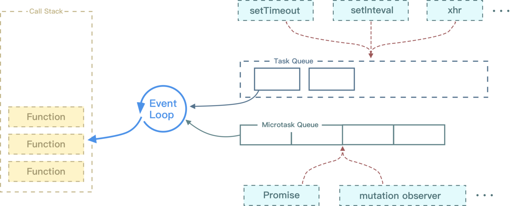

<!-- TOC -->

- [Premise](#premise)
- [async](#async)
- [定时器](#%e5%ae%9a%e6%97%b6%e5%99%a8)
  - [setTimeout](#settimeout)
  - [setInterval](#setinterval)
  - [requestAnimationFrame](#requestanimationframe)
- [浏览器的 Event Loop](#%e6%b5%8f%e8%a7%88%e5%99%a8%e7%9a%84-event-loop)

<!-- /TOC -->

# Premise

`Promise` 是异步编程的一种解决方案，所谓`Promise`，简单说就是一个容器，里面保存着某个未来才会结束的事件（通常是一个异步操作）的结果。
从语法上说，`Promise` 是一个对象，从它可以获取异步操作的消息。`Promise` 提供统一的 API，各种异步操作都可以用同样的方法进行处理。

- 对象的状态不受外界影响。`Promise`对象代表一个异步操作，有三种状态：pending（进行中）、fulfilled（已成功）和 rejected（已失败）。只有异步操作的结果，可以决定当前是哪一种状态，任何其他操作都无法改变这个状态。
- 一旦状态改变，就不会再变，任何时候都可以得到这个结果。`Pomise`对象的状态改变，只有两种可能：从 pending 变为 fulfilled 和从 pending 变为 rejected。只要这两种情况发生，状态就凝固了，不会再变了，会一直保持这个结果，这时就称为 resolved（已定型）

```JS
new Promise((resolve, reject) => {
  resolve('success')
  // 无效
  reject('reject')
})

```

- 当我们在构造 Promise 的时候，构造函数内部的代码是立即执行的

```js
new Promise((resolve, reject) => {
  console.log('new Promise')
  resolve('success')
})
console.log('finifsh')
// new Promise -> finifsh
```

- `Promise` 实现了链式调用，也就是说每次调用 then 之后返回的都是一个 `Promise`，并且是一个全新的 `Promise`，原因也是因为状态不可变。如果你在 `then` 中 使用了 `return` ，那么 `return` 的值会被 `Promise.resolve()` 包装

```js
Promise.resolve(1)
  .then(res => {
    console.log(res) // => 1
    return 2 // 包装成 Promise.resolve(2)
  })
  .then(res => {
    console.log(res) // => 2
  })
```

**问题**

- 无法取消`Promise`，一旦新建它就会立即执行，无法中途取消。
- 如果不设置回调函数，`Promise`内部抛出的错误，不会反应到外部。
- 当处于 pending 状态时，无法得知目前进展到哪一个阶段（刚刚开始还是即将完成）。

# async

`async` 函数返回一个 `Promise` 对象，可以使用 `then` 方法添加回调函数。当函数执行的时候，一旦遇到 `await` 就会先返回，等到异步操作完成，再接着执行函数体内后面的语句。

```js
async function getStockPriceByName(name) {
  const symbol = await getStockSymbol(name)
  const stockPrice = await getStockPrice(symbol)
  return stockPrice
}

getStockPriceByName('goog').then(function(result) {
  console.log(result)
})
```

# 定时器

常见的定时器函数有 `setTimeout` 、 `setInterval` 、 `requestAnimationFrame`

## setTimeout

很多人认为 `setTimeout` 是延时多久，那就应该是多久后执行。

其实这个观点是错误的，因为 JS 是单线程执行的，如果前面的代码影响了性能，就会导致 `setTimeout` 不会按期执行。当然了，我们可以通过代码去修正 `setTimeout`，从而使定时器相对准确

## setInterval

接下来我们来看 `setInterval`，其实这个函数作用和 `setTimeout` 基本一致，只是该函数是每隔一段时间执行一次回调函数。

通常来说不建议使用 `setInterval`。第一，它和 `setTimeout` 一样，不能保证在预期的时间执行任务。第二，它存在执行累积的问题，请看以下伪代码

## requestAnimationFrame

首先 `requestAnimationFrame` 自带函数节流功能，基本可以保证在 16.6 毫秒内只执行一次（不掉帧的情况下），并且该函数的延时效果是精确的，没有其他定时器时间不准的问题，当然你也可以通过该函数来实现 setTimeout。

```JS
function setInterval(callback, interval) {
  let timer
  const now = Date.now
  let startTime = now()
  let endTime = startTime
  const loop = () => {
    timer = window.requestAnimationFrame(loop)
    endTime = now()
    if (endTime - startTime >= interval) {
      startTime = endTime = now()
      callback(timer)
    }
  }
  timer = window.requestAnimationFrame(loop)
  return timer
}

let a = 0
setInterval(timer => {
  console.log(1)
  a++
  if (a === 3) cancelAnimationFrame(timer)
}, 1000)
```

# 浏览器的 Event Loop

当我们执行 JS 代码的时候其实就是往执行栈中放入函数，当遇到异步的代码时，会被挂起并在需要执行的时候加入到 `Task`（有多种 Task） 队列中。一旦执行栈为空，`Event Loop` 就会从 `Task` 队列中拿出需要执行的代码并放入执行栈中执行。



不同的任务源会被分配到不同的 Task 队列中，任务源可以分为 微任务（microtask） 和 宏任务（macrotask）。在 ES6 规范中，microtask 称为 jobs，macrotask 称为 task。

```JS

console.log('script start')

async function async1() {
  await async2()
  console.log('async1 end')
}
async function async2() {
  console.log('async2 end')
}
async1()

setTimeout(function() {
  console.log('setTimeout')
}, 0)

new Promise(resolve => {
  console.log('Promise')
  resolve()
})
  .then(function() {
    console.log('promise1')
  })
  .then(function() {
    console.log('promise2')
  })

console.log('script end')
// script start => async2 end => Promise => script end => promise1 => promise2 => async1 end => setTimeout

```

Event Loop 执行顺序如下所示：

1. 首先执行同步代码，这属于宏任务
2. 当执行完所有同步代码后，执行栈为空，查询是否有异步代码需要执行
3. 执行所有微任务
4. 当执行完所有微任务后，如有必要会渲染页面
5. 然后开始下一轮 Event Loop，执行宏任务中的异步代码，也就是 setTimeout 中的回调函数
