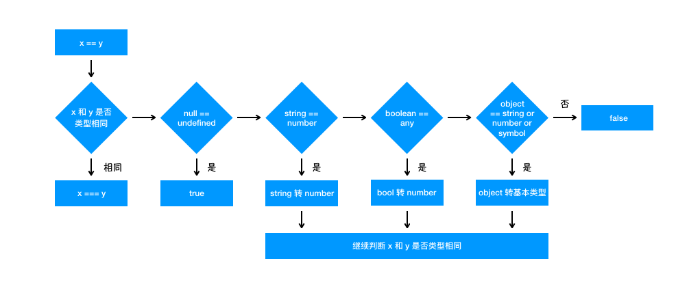
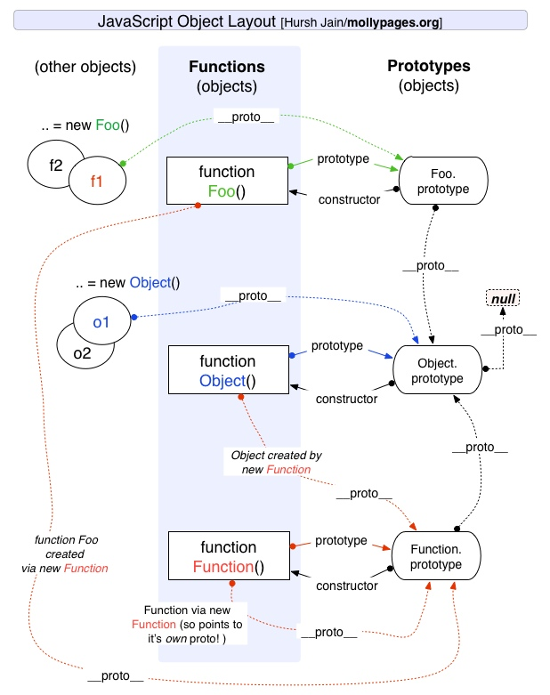

<!-- TOC -->

- [1. 数据类型](#1-%e6%95%b0%e6%8d%ae%e7%b1%bb%e5%9e%8b)
  - [1.1. 原始类型](#11-%e5%8e%9f%e5%a7%8b%e7%b1%bb%e5%9e%8b)
  - [1.2. 对象类型](#12-%e5%af%b9%e8%b1%a1%e7%b1%bb%e5%9e%8b)
  - [1.3. 检测](#13-%e6%a3%80%e6%b5%8b)
    - [1.3.1. typeof](#131-typeof)
    - [1.3.2. instanceof](#132-instanceof)
      - [1.3.2.1. 手工打造](#1321-%e6%89%8b%e5%b7%a5%e6%89%93%e9%80%a0)
    - [1.3.3. Object.prototype.toString.call()](#133-objectprototypetostringcall)
  - [1.4. 类型转换](#14-%e7%b1%bb%e5%9e%8b%e8%bd%ac%e6%8d%a2)
    - [1.4.1. 强制转换](#141-%e5%bc%ba%e5%88%b6%e8%bd%ac%e6%8d%a2)
      - [1.4.1.1. Boolean](#1411-boolean)
    - [1.4.2. 隐式转换](#142-%e9%9a%90%e5%bc%8f%e8%bd%ac%e6%8d%a2)
      - [1.4.2.1. 四则运算](#1421-%e5%9b%9b%e5%88%99%e8%bf%90%e7%ae%97)
      - [1.4.2.2. == 和 ===](#1422--%e5%92%8c)
- [2. 执行上下文/执行栈](#2-%e6%89%a7%e8%a1%8c%e4%b8%8a%e4%b8%8b%e6%96%87%e6%89%a7%e8%a1%8c%e6%a0%88)
  - [2.1. 执行上下文](#21-%e6%89%a7%e8%a1%8c%e4%b8%8a%e4%b8%8b%e6%96%87)
  - [2.2. 执行栈](#22-%e6%89%a7%e8%a1%8c%e6%a0%88)
  - [2.3. 创建执行上下文](#23-%e5%88%9b%e5%bb%ba%e6%89%a7%e8%a1%8c%e4%b8%8a%e4%b8%8b%e6%96%87)
- [3. 闭包](#3-%e9%97%ad%e5%8c%85)
  - [3.1. 什么是闭包](#31-%e4%bb%80%e4%b9%88%e6%98%af%e9%97%ad%e5%8c%85)
  - [3.2. 闭包产生的原因](#32-%e9%97%ad%e5%8c%85%e4%ba%a7%e7%94%9f%e7%9a%84%e5%8e%9f%e5%9b%a0)
  - [3.3. 表现形式](#33-%e8%a1%a8%e7%8e%b0%e5%bd%a2%e5%bc%8f)
  - [3.4. 意义](#34-%e6%84%8f%e4%b9%89)
- [4. 原型](#4-%e5%8e%9f%e5%9e%8b)
  - [4.1. 原型](#41-%e5%8e%9f%e5%9e%8b)
  - [4.2. 原型链](#42-%e5%8e%9f%e5%9e%8b%e9%93%be)
- [5. 继承](#5-%e7%bb%a7%e6%89%bf)
  - [5.1. 原型链继承](#51-%e5%8e%9f%e5%9e%8b%e9%93%be%e7%bb%a7%e6%89%bf)
  - [5.2. 构造函数继承](#52-%e6%9e%84%e9%80%a0%e5%87%bd%e6%95%b0%e7%bb%a7%e6%89%bf)
  - [5.3. 组合继承](#53-%e7%bb%84%e5%90%88%e7%bb%a7%e6%89%bf)
  - [5.4. 原型式继承](#54-%e5%8e%9f%e5%9e%8b%e5%bc%8f%e7%bb%a7%e6%89%bf)
  - [5.5. 寄生式继承](#55-%e5%af%84%e7%94%9f%e5%bc%8f%e7%bb%a7%e6%89%bf)
  - [5.6. 寄生组合式继承](#56-%e5%af%84%e7%94%9f%e7%bb%84%e5%90%88%e5%bc%8f%e7%bb%a7%e6%89%bf)
  - [5.7. ES6 类继承 extends](#57-es6-%e7%b1%bb%e7%bb%a7%e6%89%bf-extends)
  - [5.8. ES5 继承和 ES6 继承的区别](#58-es5-%e7%bb%a7%e6%89%bf%e5%92%8c-es6-%e7%bb%a7%e6%89%bf%e7%9a%84%e5%8c%ba%e5%88%ab)
- [6. this](#6-this)
- [7. new](#7-new)
  - [7.1. 手工实现](#71-%e6%89%8b%e5%b7%a5%e5%ae%9e%e7%8e%b0)
- [8. call/apply/bind](#8-callapplybind)
  - [8.1. call](#81-call)
  - [8.2. apply](#82-apply)
  - [8.3. bind](#83-bind)

<!-- /TOC -->

**本章节记录 JavaScript 中部分常用基础概念，仅用于整理记录**
**基础内容可以参考[MDN](https://developer.mozilla.org)和阮一峰老师的[网道](https://wangdoc.com/)**

# 1. 数据类型

JS 有七种内置类型，六种原始类型和一种对象类型`Object`

## 1.1. 原始类型

原始类型：`null`，`undefined`，`boolean`，`string`，`number`，`symbol`

1. `null`不是对象，`typeof null`输出`object`是 js 历史版本中造成的错误判断
2. `NaN`也属于`number`，`NaN`和`NaN`不相等
3. 直接对原始类型进行操作，会先被转换为对应的对象类型进行操作，最后销毁生成的实例
4. `number`类型是浮点型，浮点计算会出现不精确的情况，`0.1+0.2!=0.3`

## 1.2. 对象类型

- 除了原始类型都是对象类型
- 原始类型存储的是值，对象类型存储的是地址（指针）。当你创建了一个对象类型的时候，计算机会在内存中帮我们开辟一个空间来存放值，但是我们需要找到这个空间，这个空间会拥有一个地址（指针）。
- 原始类型是值传递，直接复制在堆中的值。对象类型是引用传递，复制对象在堆中的内存地址值，指向在栈中的同一内容

## 1.3. 检测

### 1.3.1. typeof

- `typeof` 对于原始类型，除了 `null` 都可以显示正确的类型
- `typeof null`会显示`object`
- `typeof`对于对象，除了函数都会显示`object`
- `typeof`对于函数，显示`function`

### 1.3.2. instanceof

instanceof 可以正确的判断对象的类型，因为内部机制是通过判断对象的原型链中是不是能找到类型的 prototype，只要处于原型链中，就判断为`true`

```JS
const Person = function() {}
const p1 = new Person()
p1 instanceof Person // true
```

对于原始类型来说，你想直接通过 `instanceof` 来判断类型是不行的，当然我们还是有办法让 `instanceof` 判断原始类型的

```JS
class PrimitiveString {
  static [Symbol.hasInstance](x) {
    return typeof x === 'string'
  }
}
console.log('hello world' instanceof PrimitiveString) // true
```

#### 1.3.2.1. 手工打造

```JS
    function myInstanceof(ex, obj) {
      // 基本类型直接返回false
      if (typeof ex === 'null' || typeof ex !== 'object') {
        return false
      }
      let exProto = Object.getPrototypeOf(ex)
      while (true) {
        // 原型链尽头
        if (exProto === null) {
          return false
        }
        // 找到相同原型
        if (exProto === obj.prototype) {
          return true
        }
        // 上溯原型
        exProto = Object.getPrototypeOf(exProto)
      }
    }
```

### 1.3.3. Object.prototype.toString.call()

使用`Object.prototype.toString.call()`方法可以返回字符串`[object 对象类型\]`，可以检测所有内置对象的类型。

**无法判断自定义对象的类型。**

## 1.4. 类型转换

### 1.4.1. 强制转换

- 转换为布尔值：`Boolean`
- 转换为数字：`Number`、`ParseInt`和`ParseFloat`
- 转换为字符串：调用`String`时，如果有`toString`方法则会调用该方法

| 原始值                                 | 转换目标 | 结果                                               |
| -------------------------------------- | -------- | -------------------------------------------------- |
| number                                 | 布尔值   | 除了 0,-0,NaN 都为 true                            |
| string                                 | 布尔值   | 除了空字符串都为 true                              |
| null、undefined                        | 布尔值   | false                                              |
| 引用类型                               | 布尔值   | true                                               |
| number                                 | 字符串   | 5=>"5"                                             |
| boolean、函数、Symbol、null、undefined | 字符串   | true=>"true"                                       |
| 数组                                   | 字符串   | [1,2]=>"1,2"                                       |
| 对象                                   | 字符串   | "[object Object]"                                  |
| string                                 | 数字     | "1"=>1 "a"=>NaN                                    |
| 数组                                   | 数字     | 空数组为 0,只有一个元素且为数值转为数值,其他为 NaN |
| null                                   | 数字     | 0                                                  |
| 除数组的引用类型、undefined            | 数字     | NaN                                                |
| Symbol                                 | 数字     | 抛错                                               |

#### 1.4.1.1. Boolean

在条件判断时，除了 `undefined` ， `null` ， `false` ， `NaN` ， `''` ， `0` ， `-0` ，其他所有值都转为 `true` ，包括所有对象。

### 1.4.2. 隐式转换

#### 1.4.2.1. 四则运算

加法运算符

- 运算中其中一方为字符串，那么就会把另一方也转换为字符串
- 如果其中一方是字符串或数字，会将另一方转换为字符串或数字（与预期类型相同）
- 如果双方都不是字符串或数字，会默认转为数字

除了加法的运算符，只要其中一方是数字，那么另一方就会被转为数字

#### 1.4.2.2. == 和 ===

`==`对比，如果类型不同，会先进行类型转换，在进行对比

1. 两种类型相同，比值
2. 是否在对比`null`和`undefined`，是则返回`true`
3. `string`和`number`比较，会将`string`转为`number`
4. 其中一方为`boolean`，会将`boolean`转为`number`
5. 引用类型和值类型比较，会先将引用类型转换为值类型，都转换为值类型之后，`Number(值类型)==Number(值类型)`进行比较



`===`对比，直接对比类型和值

**对象转值类型流程**
对象转原始类型，会调用内置的`[[ToPrimitive]]`函数，该函数逻辑为

1. 如果有`Symbol.toPrimitive`方法，优先调用返回
2. 调用`valueOf`，如果转换为原始类型，则返回
3. 调用`toString`，如果转换为原始类型，则返回
4. 都没有返回原始类型，报错

# 2. 执行上下文/执行栈

## 2.1. 执行上下文

执行上下文是评估和执行 `JavaScript` 代码的环境的抽象概念。每当 `Javascript` 代码在运行的时候，它都是在执行上下文中运行。

`JavaScript` 中有三种执行上下文类型。

- 全局执行上下文 — 这是默认或者说基础的上下文，任何不在函数内部的代码都在全局上下文中。它会执行两件事：创建一个全局的 window 对象（浏览器的情况下），并且设置 this 的值等于这个全局对象。一个程序中只会有一个全局执行上下文。
- 函数执行上下文 — 每当一个函数被调用时, 都会为该函数创建一个新的上下文。每个函数都有它自己的执行上下文，不过是在函数被调用时创建的。函数上下文可以有任意多个。每当一个新的执行上下文被创建，它会按定义的顺序（将在后文讨论）执行一系列步骤。
- Eval 函数执行上下文 — 执行在 eval 函数内部的代码也会有它属于自己的执行上下文，但由于 JavaScript 开发者并不经常使用 eval，所以在这里我不会讨论它。

## 2.2. 执行栈

执行栈，也就是在其它编程语言中所说的“调用栈”，是一种拥有 LIFO（后进先出）数据结构的栈，被用来存储代码运行时创建的所有执行上下文。
当 `JavaScript` 引擎第一次遇到你的脚本时，它会创建一个全局的执行上下文并且压入当前执行栈。每当引擎遇到一个函数调用，它会为该函数创建一个新的执行上下文并压入栈的顶部。
引擎会执行那些执行上下文位于栈顶的函数。当该函数执行结束时，执行上下文从栈中弹出，控制流程到达当前栈中的下一个上下文。

## 2.3. 创建执行上下文

在 JavaScript 代码执行前，执行上下文将经历创建阶段。在创建阶段会发生三件事：

1. this 值的决定，即我们所熟知的 This 绑定。
2. 创建词法环境组件。
3. 创建变量环境组件。

# 3. 闭包

## 3.1. 什么是闭包

**[MDN](https://developer.mozilla.org/zh-CN/docs/Web/JavaScript/Closures)**：函数与对其状态即词法环境的引用共同构成闭包。也就是说，闭包可以让你从内部函数访问外部函数作用域。在 JavaScript，函数在每次创建时生成闭包。

**JavaScript 高级程序设计**：闭包是指有权访问另外一个函数作用域中的变量的函数

```JS
// 函数 A 内部有一个函数 B，函数 B 可以访问到函数 A 中的变量，那么函数 B 就是闭包。
function A() {
  let a = 1
  window.B = function () {
      console.log(a)
  }
}
A()
B() // 1
```

## 3.2. 闭包产生的原因

在 ES5 中只存在两种作用域：函数作用域和全局作用域。**当访问一个变量时，解释器会先在当前作用域下查找，如果没有找到就去父作用域链，就再往上级作用域（最外层作用域为全局作用域）查找，直到找到该变量或者直到全局作用域都没有找到报错，这就是作用域链**

闭包产生的本质就是：**当前环境中存在指向父级作用域的引用**

## 3.3. 表现形式

1. 返回函数
2. 函数传参

```JS
var a = 1;
function foo(){
  var a = 2;
  function baz(){
    console.log(a);
  }
  bar(baz);
}
function bar(fn){
  // 这就是闭包
  fn();
}
// 输出2，而不是1
foo();

```

3. 回调函数
4. IIFE（立即执行函数）

## 3.4. 意义

**作用**

1. 闭包可以暂存函数执行时的数据状态（如解决循环输出问题）
   - 利用 IIFE，函数作用域相互独立
   - 利用定时器的第三参数
   - 利用`let`

```JS

for (var i = 1; i <= 5; i++) {
  ;(function(j) {
    setTimeout(function timer() {
      console.log(j)
    }, j * 1000)
  })(i)
} // 闭包

for (var i = 1; i <= 5; i++) {
  setTimeout(
    function timer(j) {
      console.log(j)
    },
    i * 1000,
    i
  )
}  // setTimeout 第三个参数

for (let i = 1; i <= 5; i++) {
  setTimeout(function timer() {
    console.log(i)
  }, i * 1000)
}  // let

```

2. 实现封装和管理私有变量和方法

**缺点**
闭包会在内存中保留函数的执行环境，过度使用会造成内存泄漏

# 4. 原型

## 4.1. 原型

每定义一个函数类型数据时，都会自带一个`prototype`属性，这个属性指向该函数的原型对象
函数通过`new`调用时，该函数为构造函数，生成一个实例对象，实例可以通过`_proto_`属性访问对应构造函数的原型对象

原型的`constructor`属性指向其构造函数
实例可以通过 `__proto__` 这个非标准属性找到其原型

## 4.2. 原型链

每个实例都有其对应的原型，原型本身也有其对应的原型，直到最后指向`null`，这个指向过程就是原型链



# 5. 继承

## 5.1. 原型链继承

继承的本质就是复制，即重写原型对象，代之以一个新类型的实例。

```JS
function SuperType() {
    this.property = true;
}

SuperType.prototype.getSuperValue = function() {
    return this.property;
}

function SubType() {
    this.subproperty = false;
}

// 这里是关键，创建SuperType的实例，并将该实例赋值给SubType.prototype
SubType.prototype = new SuperType();

SubType.prototype.getSubValue = function() {
    return this.subproperty;
}

var instance = new SubType();
console.log(instance.getSuperValue()); // true

```

**问题**

- 子类的多个实例会对同一个原型进行操作

## 5.2. 构造函数继承

使用父类的构造函数来增强子类实例，等同于复制父类的实例给子类（不使用原型）

```JS
function  SuperType(){
    this.color=["red","green","blue"];
}
function  SubType(){
    //继承自SuperType
    SuperType.call(this);
}
var instance1 = new SubType();
instance1.color.push("black");
alert(instance1.color);//"red,green,blue,black"

var instance2 = new SubType();
alert(instance2.color);//"red,green,blue"

```

**问题**

- 只能继承父类的属性和方法，不能继承原型的属性和方法
- 每个子类都独立复制了父类属性和方法，影响性能

## 5.3. 组合继承

原型链继承和构造函数继承的结合就是组合继承

```JS
function SuperType(name){
  this.name = name;
  this.colors = ["red", "blue", "green"];
}
SuperType.prototype.sayName = function(){
  alert(this.name);
};

function SubType(name, age){
  // 继承属性
  // 第二次调用SuperType()
  SuperType.call(this, name);
  this.age = age;
}

// 继承方法
// 构建原型链
// 第一次调用SuperType()
SubType.prototype = new SuperType();
// 重写SubType.prototype的constructor属性，指向自己的构造函数SubType
SubType.prototype.constructor = SubType;
SubType.prototype.sayAge = function(){
    alert(this.age);
};

var instance1 = new SubType("Nicholas", 29);
instance1.colors.push("black");
alert(instance1.colors); //"red,blue,green,black"
instance1.sayName(); //"Nicholas";
instance1.sayAge(); //29

var instance2 = new SubType("Greg", 27);
alert(instance2.colors); //"red,blue,green"
instance2.sayName(); //"Greg";
instance2.sayAge(); //27

```

**问题**

- 父类构造函数会多次执行，产生冗余数据

## 5.4. 原型式继承

利用一个空对象作为中介，将某个对象直接赋值给空对象构造函数的原型。

```JS
function object(obj){
  function F(){}
  F.prototype = obj;
  return new F();
}
var person = {
  name: "Nicholas",
  friends: ["Shelby", "Court", "Van"]
};

var anotherPerson = object(person);
anotherPerson.name = "Greg";
anotherPerson.friends.push("Rob");

var yetAnotherPerson = object(person);
yetAnotherPerson.name = "Linda";
yetAnotherPerson.friends.push("Barbie");

alert(person.friends);   //"Shelby,Court,Van,Rob,Barbie"

```

**问题**

- 原型链继承多个实例的引用类型属性指向相同，存在篡改的可能。
- 无法传递参数

## 5.5. 寄生式继承

在原型式继承的基础上，增强对象，返回构造函数

```JS
function createAnother(original){
  var clone = object(original); // 通过调用 object() 函数创建一个新对象
  clone.sayHi = function(){  // 以某种方式来增强对象
    alert("hi");
  };
  return clone; // 返回这个对象
}
var person = {
  name: "Nicholas",
  friends: ["Shelby", "Court", "Van"]
};
var anotherPerson = createAnother(person);
anotherPerson.sayHi(); //"hi"

```

**问题**

- 原型链继承多个实例的引用类型属性指向相同，存在篡改的可能。
- 无法传递参数

## 5.6. 寄生组合式继承

结合借用构造函数传递参数和寄生模式实现继承，**目前的成熟方案**

```JS
function inheritPrototype(subType, superType){
  var prototype = Object.create(superType.prototype); // 创建对象，创建父类原型的一个副本
  prototype.constructor = subType;                    // 增强对象，弥补因重写原型而失去的默认的constructor 属性
  subType.prototype = prototype;                      // 指定对象，将新创建的对象赋值给子类的原型
}

// 父类初始化实例属性和原型属性
function SuperType(name){
  this.name = name;
  this.colors = ["red", "blue", "green"];
}
SuperType.prototype.sayName = function(){
  alert(this.name);
};

// 借用构造函数传递增强子类实例属性（支持传参和避免篡改）
function SubType(name, age){
  SuperType.call(this, name);
  this.age = age;
}

// 将父类原型指向子类
inheritPrototype(SubType, SuperType);

// 新增子类原型属性
SubType.prototype.sayAge = function(){
  alert(this.age);
}

var instance1 = new SubType("xyc", 23);
var instance2 = new SubType("lxy", 23);

instance1.colors.push("2"); // ["red", "blue", "green", "2"]
instance1.colors.push("3"); // ["red", "blue", "green", "3"]


```

## 5.7. ES6 类继承 extends

`extends` 关键字主要用于类声明或者类表达式中，以创建一个类，该类是另一个类的子类。其中 `constructor` 表示构造函数，一个类中只能有一个构造函数,如果没有显式指定构造方法，则会添加默认的 `constructor` 方法

```js
class Rectangle {
  // constructor
  constructor(height, width) {
    this.height = height
    this.width = width
  }

  // Getter
  get area() {
    return this.calcArea()
  }

  // Method
  calcArea() {
    return this.height * this.width
  }
}

const rectangle = new Rectangle(10, 20)
console.log(rectangle.area)
// 输出 200

// 继承
class Square extends Rectangle {
  constructor(length) {
    super(length, length)

    // 如果子类中存在构造函数，则需要在使用“this”之前首先调用 super()。
    this.name = 'Square'
  }

  get area() {
    return this.height * this.width
  }
}

const square = new Square(10)
console.log(square.area)
// 输出 100
```

`extends` 继承的核心代码如下，其实现和上述的寄生组合式继承方式一样

```JS
function _inherits(subType, superType) {

    // 创建对象，创建父类原型的一个副本
    // 增强对象，弥补因重写原型而失去的默认的constructor 属性
    // 指定对象，将新创建的对象赋值给子类的原型
    subType.prototype = Object.create(superType && superType.prototype, {
        constructor: {
            value: subType,
            enumerable: false,
            writable: true,
            configurable: true
        }
    });

    if (superType) {
        Object.setPrototypeOf
            ? Object.setPrototypeOf(subType, superType)
            : subType.__proto__ = superType;
    }
}

```

## 5.8. ES5 继承和 ES6 继承的区别

- ES5 的继承实质上是先创建子类的实例对象，然后再将父类的方法添加到 this 上（Parent.call(this)）.
- ES6 的继承有所不同，实质上是先创建父类的实例对象 this，然后再用子类的构造函数修改 this。因为子类没有自己的 this 对象，所以必须先调用父类的 super()方法，否则新建实例报错。

# 6. this

this 只与调用场景有关

1. 全局上下文默认指向 window，严格模式下指向 undefined
2. 直接调用：this 指向 window
3. 对象调用：this 指向调用对象
4. new 构造：指向构造出来的对象
5. bind|call|apply：指向方法的第一个参数
6. 箭头函数：没有 this，取决于包裹箭头函数的第一个普通函数的 this

**无论给函数 bind 几次，fn 中的 this 永远由第一次 bind 决定**

多种场景混合

1. new 优先级最高
2. bind|call|apply 其次
3. 对象调用
4. 直接调用

**箭头函数 this 一旦被绑定就不会改变**

# 7. new

> new 的原理？和字面量有什么区别？

调用 new

1. 创建一个空对象
2. this 指向对象
3. 对象链接到函数原型
4. 返回对象

使用字面量的方式创建对象（无论性能上还是可读性）。使用 `new Object()` 的方式创建对象需要通过作用域链一层层找到 `Object`

## 7.1. 手工实现

```JS
function newOperator(ctor, ...args) {
    if(typeof ctor !== 'function'){
      throw 'newOperator function the first param must be a function';
    }
    let obj = Object.create(ctor.prototype);
    let res = ctor.apply(obj, args);

    let isObject = typeof res === 'object' && res !== null;
    let isFunction = typoof res === 'function';
    return isObect || isFunction ? res : obj;
};

```

# 8. call/apply/bind

`call` 和 `apply` 都是为了解决改变 `this` 的指向。作用都是相同的，只是传参的方式不同。

除了第一个参数外， `call` 可以接收一个参数列表， `apply` 只接受一个参数数组。

## 8.1. call

- 不传入第一个参数，那么默认为 window
- 改变了 this 指向，让新的对象可以执行该函数。那么思路是否可以变成给新的对象添加一个函数，然后在执行完以后删除？

```JS
Function.prototype.myCall = function (context) {
  var context = context || window
  // 给 context 添加一个属性
  // getValue.call(a, 'yck', '24') => a.fn = getValue
  context.fn = this
  // 将 context 后面的参数取出来
  var args = [...arguments].slice(1)
  // getValue.call(a, 'yck', '24') => a.fn('yck', '24')
  var result = context.fn(...args)
  // 删除 fn
  delete context.fn
  return result
}

```

## 8.2. apply

```JS
Function.prototype.myApply = function (context) {
  var context = context || window
  context.fn = this

  var result
  // 需要判断是否存储第二个参数
  // 如果存在，就将第二个参数展开
  if (arguments[1]) {
    result = context.fn(...arguments[1])
  } else {
    result = context.fn()
  }

  delete context.fn
  return result
}
```

## 8.3. bind

`bind` 和其他两个方法作用也是一致的，只是该方法会返回一个函数。并且我们可以通过 `bind` 实现柯里化。

```JS
Function.prototype.myBind = function (context) {
  if (typeof this !== 'function') {
    throw new TypeError('Error')
  }
  var _this = this
  var args = [...arguments].slice(1)
  // 返回一个函数
  return function F() {
    // 因为返回了一个函数，我们可以 new F()，所以需要判断
    if (this instanceof F) {
      return new _this(...args, ...arguments)
    }
    return _this.apply(context, args.concat(...arguments))
  }
}

```
