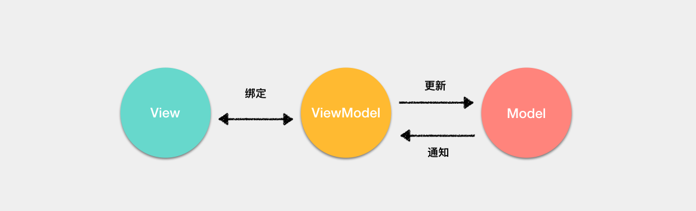

<!-- TOC -->

- [MVVM](#mvvm)
- [Virtual DOM](#virtual-dom)
- [响应式原理](#%e5%93%8d%e5%ba%94%e5%bc%8f%e5%8e%9f%e7%90%86)
  - [Object.defineProperty 的缺陷](#objectdefineproperty-%e7%9a%84%e7%bc%ba%e9%99%b7)
  - [proxy](#proxy)
  - [编译过程](#%e7%bc%96%e8%af%91%e8%bf%87%e7%a8%8b)
- [Route](#route)
  - [Hash 模式](#hash-%e6%a8%a1%e5%bc%8f)
  - [History 模式](#history-%e6%a8%a1%e5%bc%8f)
  - [对比](#%e5%af%b9%e6%af%94)
- [生命周期](#%e7%94%9f%e5%91%bd%e5%91%a8%e6%9c%9f)
- [组件通信](#%e7%bb%84%e4%bb%b6%e9%80%9a%e4%bf%a1)
  - [父子通信](#%e7%88%b6%e5%ad%90%e9%80%9a%e4%bf%a1)
  - [兄弟通信](#%e5%85%84%e5%bc%9f%e9%80%9a%e4%bf%a1)
  - [跨多层通信](#%e8%b7%a8%e5%a4%9a%e5%b1%82%e9%80%9a%e4%bf%a1)
  - [Event Bus](#event-bus)
  - [Vuex](#vuex)
- [computed 和 watch](#computed-%e5%92%8c-watch)
  - [computed 的实现原理](#computed-%e7%9a%84%e5%ae%9e%e7%8e%b0%e5%8e%9f%e7%90%86)
- [keep-alive](#keep-alive)
- [v-show 与 v-if](#v-show-%e4%b8%8e-v-if)
- [组件中 data 使用函数](#%e7%bb%84%e4%bb%b6%e4%b8%ad-data-%e4%bd%bf%e7%94%a8%e5%87%bd%e6%95%b0)
- [nextTick](#nexttick)

<!-- /TOC -->

> [Vue 原理](https://juejin.im/post/5e04411f6fb9a0166049a073)

# MVVM

传统的 `MVC` 架构通常是使用控制器更新模型，视图从模型中获取数据去渲染。当用户有输入时，会通过控制器去更新模型，并且通知视图进行更新。


在 `MVVM` 架构中，引入了 `ViewModel` 的概念。ViewModel 只关心数据和业务的处理，不关心 `View` 如何处理数据，在这种情况下，`View` 和 `Model` 都可以独立出来，任何一方改变了也不一定需要改变另一方，并且可以将一些可复用的逻辑放在一个 `ViewModel` 中，让多个 View 复用这个 `ViewModel`。
对于 MVVM 来说，最重要的并不是通过双向绑定或者其他的方式将 View 与 ViewModel 绑定起来，而是通过 ViewModel 将视图中的状态和用户的行为分离出一个抽象，这才是 MVVM 的精髓。



以 Vue 框架来举例，ViewModel 就是组件的实例。View 就是模板，Model 的话在引入 Vuex 的情况下是完全可以和组件分离的。

# Virtual DOM

# 响应式原理

Vue 内部使用了 `Object.defineProperty()` 来实现数据响应式，通过这个函数可以监听到 `set` 和 `get` 的事件。

当创建 Vue 实例时,Vue 会遍历 data 选项的属性,利用 `Object.defineProperty` 为属性添加 `getter` 和 `setter` 对数据的读取进行劫持（`getter` 用来依赖收集,`setter` 用来派发更新）,并且在内部追踪依赖,在属性被访问和修改时通知变化。
每个组件实例会有相应的 `watcher` 实例,会在组件渲染的过程中记录依赖的所有数据属性（进行依赖收集,还有 computed watcher,user watcher 实例）,之后依赖项被改动时,`setter` 方法会通知依赖与此 `data` 的 `watcher` 实例重新计算（派发更新）,从而使它关联的组件重新渲染。

```JS
var data = { name: 'yck' }
observe(data)
let name = data.name // -> get value
data.name = 'yyy' // -> change value

function observe(obj) {
  // 判断类型
  if (!obj || typeof obj !== 'object') {
    return
  }
  Object.keys(obj).forEach(key => {
    defineReactive(obj, key, obj[key])
  })
}

function defineReactive(obj, key, val) {
  // 递归子属性
  observe(val)
  let dp = new Dep()
  Object.defineProperty(obj, key, {
    enumerable: true,
    configurable: true,
    get: function reactiveGetter() {
      console.log('get value')
      // 将 Watcher 添加到订阅
      if (Dep.target) {
        dp.addSub(Dep.target)
      }
      return val
    },
    set: function reactiveSetter(newVal) {
      console.log('change value')
      val = newVal
      // 执行 watcher 的 update 方法
      dp.notify()
    }
  })
}

// 实现一个 Dep 类，用于解耦属性的依赖收集和派发更新操作。
// 通过 Dep 解耦属性的依赖和更新操作
class Dep {
  constructor() {
    this.subs = []
  }
  // 添加依赖
  addSub(sub) {
    this.subs.push(sub)
  }
  // 更新
  notify() {
    this.subs.forEach(sub => {
      sub.update()
    })
  }
}
// 全局属性，通过该属性配置 Watcher
Dep.target = null

// 在组件挂载时，会先对所有需要的属性调用 Object.defineProperty()，然后实例化 Watcher，传入组件更新的回调。在实例化过程中，会对模板中的属性进行求值，触发依赖收集。
class Watcher {
  constructor(obj, key, cb) {
    // 将 Dep.target 指向自己
    // 然后触发属性的 getter 添加监听
    // 最后将 Dep.target 置空
    Dep.target = this
    this.cb = cb
    this.obj = obj
    this.key = key
    this.value = obj[key]
    Dep.target = null
  }
  update() {
    // 获得新值
    this.value = this.obj[this.key]
    // 调用 update 方法更新 Dom
    this.cb(this.value)
  }
}
```

## Object.defineProperty 的缺陷

如果通过下标方式修改数组数据或者给对象新增属性并不会触发组件的重新渲染，因为 `Object.defineProperty`不能拦截到这些操作，更精确的来说，对于数组而言，大部分操作都是拦截不到的，只是 Vue 内部通过重写函数的方式解决了这个问题。

## proxy

`Object.defineProperty` 是通过 递归 + 遍历 `data` 对象来实现对数据的监控的,如果属性值也是对象那么需要深度遍历
`Object.defineProperty` 拦截不到数组的一些操作

`Proxy` 可以劫持整个对象,并返回一个新的对象。`Proxy` 不仅可以代理对象,还可以代理数组。还可以代理动态增加的属性。

## 编译过程

Vue 会通过编译器将模板通过几个阶段最终编译为 `render` 函数，然后通过执行 `render` 函数生成 `Virtual DOM` 最终映射为真实 `DOM`。
这个过程其中又分为三个阶段，分别为：

- 将模板解析为 AST
- 优化 AST
- 将 AST 转换为 render 函数

在第一个阶段中，最主要的事情还是通过各种各样的正则表达式去匹配模板中的内容，然后将内容提取出来做各种逻辑操作，接下来会生成一个最基本的 AST 对象

```JS
{
    // 类型
    type: 1,
    // 标签
    tag,
    // 属性列表
    attrsList: attrs,
    // 属性映射
    attrsMap: makeAttrsMap(attrs),
    // 父节点
    parent,
    // 子节点
    children: []
}
```

然后会根据这个最基本的 AST 对象中的属性，进一步扩展 AST。

当然在这一阶段中，还会进行其他的一些判断逻辑。比如说对比前后开闭标签是否一致，判断根组件是否只存在一个，判断是否符合 `HTML5 Content Model` 规范等等问题。

接下来就是优化 AST 的阶段。在当前版本下，Vue 进行的优化内容其实还是不多的。只是对节点进行了静态内容提取，也就是将永远不会变动的节点提取了出来，实现复用 Virtual DOM，跳过对比算法的功能。在下一个大版本中，Vue 会在优化 AST 的阶段继续发力，实现更多的优化功能，尽可能的在编译阶段压榨更多的性能，比如说提取静态的属性等等优化行为。

最后一个阶段就是通过 AST 生成 render 函数了。其实这一阶段虽然分支有很多，但是最主要的目的就是遍历整个 AST，根据不同的条件生成不同的代码罢了。

# Route

前端路由实现起来其实很简单，本质就是监听 URL 的变化，然后匹配路由规则，显示相应的页面，并且无须刷新页面。目前前端使用的路由就只有两种实现方式

- Hash 模式
- History 模式

## Hash 模式

`www.test.com/#/` 就是 `Hash URL`，当`#`后面的哈希值发生变化时，可以通过 `hashchange` 事件来监听到 URL 的变化，从而进行跳转页面，并且无论哈希值如何变化，服务端接收到的 `URL` 请求永远是 `www.test.com`。

## History 模式

`History` 模式是 HTML5 新推出的功能，主要使用 `history.pushState` 和 `history.replaceState` 改变 `URL`。

通过 `History` 模式改变 `URL` 同样不会引起页面的刷新，只会更新浏览器的历史记录。

```JS
// 新增历史记录
history.pushState(stateObject, title, URL)
// 替换当前历史记录
history.replaceState(stateObject, title, URL)
```

## 对比

- Hash 模式只可以更改 # 后面的内容，History 模式可以通过 API 设置任意的同源 URL
- History 模式可以通过 API 添加任意类型的数据到历史记录中，Hash 模式只能更改哈希值，也就是字符串
- Hash 模式无需后端配置，并且兼容性好。History 模式在用户手动输入地址或者刷新页面的时候会发起 URL 请求，后端需要配置 index.html 页面用于匹配不到静态资源的时候

# 生命周期

每个 Vue 实例在被创建时都要经过一系列的初始化过程——例如，需要设置数据监听、编译模板、将实例挂载到 DOM 并在数据变化时更新 DOM 等。同时在这个过程中也会运行一些叫做生命周期钩子的函数，这给了用户在不同阶段添加自己的代码的机会。


| 阶段          | 描述                                                                                                                                  |
| ------------- | ------------------------------------------------------------------------------------------------------------------------------------- |
| beforeCreate  | 组件实例刚被创建，获取不到 props 或者 data 中的数据                                                                                   |
| created       | 组件实例创建完成，属性已经绑定，可以访问到数据， 组件还没被挂载，DOM 没有生成                                                         |
| beforeMount   | 开始创建 VDOM                                                                                                                         |
| mounted       | 将 VDOM 渲染为真实 DOM 并且渲染数据。组件中如果有子组件的话，会递归挂载子组件，只有当所有子组件全部挂载完毕，才会执行根组件的挂载钩子 |
| beforeUpdate  | 数据更新前                                                                                                                            |
| updated       | 数据更新后                                                                                                                            |
| beforeDestroy | 组件销毁前，移除事件、定时器等                                                                                                        |
| activated     | keep-alive 组件被激活                                                                                                                 |
| deactivated   | keep-alive 组件被移除                                                                                                                 |

# 组件通信

组件通信一般分为以下几种情况：

- 父子组件通信
- 兄弟组件通信
- 跨多层级组件通信
- 任意组件

## 父子通信

父组件通过 `props` 传递数据给子组件，子组件通过 `emit` 发送事件传递数据给父组件，这种方式是最常用的父子通信实现办法。

`.sync` 属性是个语法糖，可以很简单的实现子组件与父组件通信

```html
<!--父组件中-->
<input :value.sync="value" />
<!--以上写法等同于-->
<input :value="value" @update:value="v => value = v"></comp>
<!--子组件中-->
<script>
  this.$emit('update:value', 1)
</script>
```

## 兄弟通信

通过查找父组件中的子组件实现，也就是 `this.$parent.$children`，在 `$children` 中可以通过组件 `name` 查询到需要的组件实例，然后进行通信。

## 跨多层通信

使用 `provide / inject` 为后代组件注入

```JS
// 父组件 A
export default {
  provide: {
    data: 1
  }
}
// 子组件 B
export default {
  inject: ['data'],
  mounted() {
    // 无论跨几层都能获得父组件的 data 属性
    console.log(this.data) // => 1
  }
}
```

## Event Bus

小型项目可以通过`Event Bus`解决

首先初始化事件总线

```JS
// event-bus.js
import Vue from 'vue'
export const EventBus = new Vue()

// 也可以直接在 main 中初始化EventBus
// main.js
Vue.prototype.$EventBus = new Vue()
```

在需要使用通信的组件引入并触发/监听对应事件

```JS
// child a
import Bus from 'event-bus.js';
methods: {
   addCart(event) {
   Bus.$emit('getTarget', event.target);
   }
}
// child b
import Bus from 'event-bus.js';

created() {
    Bus.$on('getTarget', target => {
        console.log(target);
    });
}
```

## Vuex

`Vuex` 可以完美处理数据管理等需求，在中大型项目中可以引入

# computed 和 watch

computed 是计算属性，依赖其他属性计算值，并且 computed 的值有缓存，只有当计算值变化才会返回内容。

watch 监听到值的变化就会执行回调，在回调中可以进行一些逻辑操作。

所以一般来说需要依赖别的属性来动态获得值的时候可以使用 computed，对于监听到值的变化需要做一些复杂业务逻辑的情况可以使用 watch。

## computed 的实现原理

`computed` 本质是一个惰性求值的观察者。
`computed` 内部实现了一个惰性的 `watcher`,也就是 `computed watcher`,`computed watcher` 不会立刻求值,同时持有一个 `dep` 实例。
其内部通过 `this.dirty` 属性标记计算属性是否需要重新求值。
当 `computed` 的依赖状态发生改变时,就会通知这个惰性的 `watcher`,
`computed watcher` 通过 `this.dep.subs.length` 判断有没有订阅者,
有的话,会重新计算,然后对比新旧值,如果变化了,会重新渲染。 (Vue 想确保不仅仅是计算属性依赖的值发生变化，而是当计算属性最终计算的值发生变化时才会触发渲染 `watcher` 重新渲染，本质上是一种优化。)
没有的话,仅仅把 `this.dirty = true`。 (当计算属性依赖于其他数据时，属性并不会立即重新计算，只有之后其他地方需要读取属性的时候，它才会真正计算，即具备 lazy（懒计算）特性。)

# keep-alive

如果你需要在组件切换的时候，保存一些组件的状态防止多次渲染，就可以使用 keep-alive 组件包裹需要保存的组件。

# v-show 与 v-if

v-show 只是在 `display: none` 和 `display: block` 之间切换。无论初始条件是什么都会被渲染出来，后面只需要切换 CSS，DOM 还是一直保留着的。所以总的来说 v-show 在初始渲染时有更高的开销，但是切换开销很小，更适合于频繁切换的场景。

v-if 当属性初始为 false 时，组件就不会被渲染，直到条件为 true，并且切换条件时会触发销毁 / 挂载组件，所以总的来说在切换时开销更高，更适合不经常切换的场景。

# 组件中 data 使用函数

组件复用时所有组件实例都会共享 data，如果 data 是对象的话，就会造成一个组件修改 data 以后会**影响到其他所有组件**，所以需要将 data 写成函数，每次用到就调用一次函数获得新的数据。

# nextTick

`Vue` 在更新 DOM 时是异步执行的。只要侦听到数据变化，`Vue` 将开启一个队列，并缓冲在同一事件循环中发生的所有数据变更。
如果同一个 `watcher` 被多次触发，只会被推入到队列中一次。这种在缓冲时去除重复数据对于避免不必要的计算和 DOM 操作是非常重要的。
`nextTick`  会在 DOM 更新完毕后出发


vue 的 `nextTick` 方法的实现原理:

- vue 用异步队列的方式来控制 DOM 更新和 `nextTick` 回调先后执行
- microtask 因为其高优先级特性，能确保队列中的微任务在一次事件循环前被执行完毕
- 考虑兼容问题,vue 做了 microtask 向 macrotask 的降级方案
