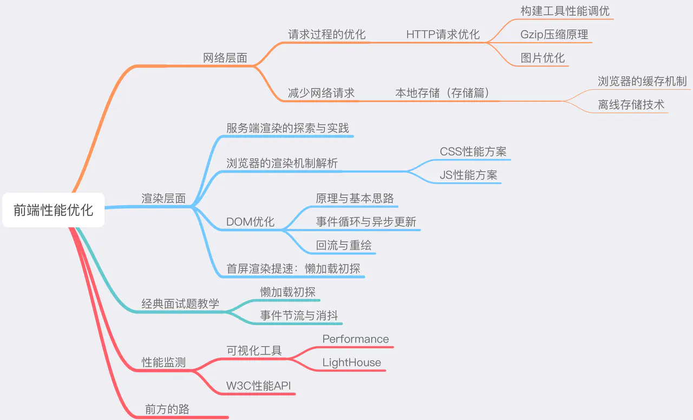
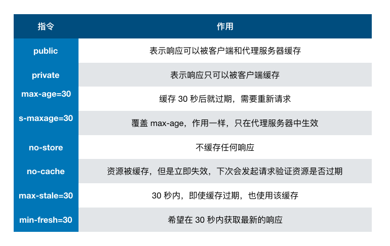

<!-- TOC -->

- [网络层](#网络层)
  - [静态文件](#静态文件)
  - [图片](#图片)
  - [缓存](#缓存)
    - [缓存位置](#缓存位置)
    - [缓存策略](#缓存策略)
      - [强缓存](#强缓存)
      - [协商缓存](#协商缓存)
        - [Last-Modified 和 If-Modified-Since](#last-modified-和-if-modified-since)
        - [ETag 和 If-None-Match](#etag-和-if-none-match)
        - [默认策略](#默认策略)
    - [决策指南](#决策指南)
      - [频繁变动的资源](#频繁变动的资源)
      - [代码文件](#代码文件)
  - [DNS 预解析](#dns-预解析)
  - [CDN](#cdn)
  - [按需加载/懒加载](#按需加载懒加载)
- [渲染层](#渲染层)
- [性能监测](#性能监测)

<!-- /TOC -->

一个 url 从输入到页面加载完成经历：

1. DNS 解析
2. TCP 链接
3. HTTP 请求
4. 服务端接收请求，处理返回
5. 浏览器获取数据，解析响应内容，渲染内容

性能的的优化也就在是在这些过程中，逐个分解，各个击破。

# 网络层

网络层面主要分为 3 个过程

- DNS 解析
- TCP 链接
- HTTP 请求/响应

HTTP 是前端在网络层优化的主要核心：

- 减少请求次数
- 减少单次请求所需时间

这两个优化点直直地指向了我们日常开发中非常常见的操作——资源的压缩与合并。

## 静态文件

- 第三方库使用 min 版本
- 压缩静态 js,css
- 提取合并公共资源

## 图片

- 不用图片。很多时候会使用到很多修饰类图片，其实这类修饰图片完全可以用 CSS 去代替。
- 对于移动端来说，屏幕宽度就那么点，完全没有必要去加载原图浪费带宽。一般图片都用 CDN 加载，可以计算出适配屏幕的宽度，然后去请求相应裁剪好的图片。
- 小图使用 base64 格式
- 将多个图标文件整合到一张图片中（雪碧图）
- 压缩图片

## 缓存

缓存可以说是性能优化中简单高效的一种优化方式了，它可以显著减少网络传输所带来的损耗。

对于一个数据请求来说，可以分为发起网络请求、后端处理、浏览器响应三个步骤。浏览器缓存可以帮助我们在第一和第三步骤中优化性能。比如说直接使用缓存而不发起请求，或者发起了请求但后端存储的数据和前端一致，那么就没有必要再将数据回传回来，这样就减少了响应数据。

### 缓存位置

从缓存位置上来说分为四种，并且各自有优先级，当依次查找缓存且都没有命中的时候，才会去请求网络

- Memory Cache
- Service Worker
- Disk Cache
- Push Cache

1. Memory Cache：内存中的缓存，读取内存中的数据肯定比磁盘快。但是内存缓存虽然读取高效，可是缓存持续性很短，会随着进程的释放而释放。 一旦我们关闭 Tab 页面，内存中的缓存也就被释放了。
2. Disk Cache： 也就是存储在硬盘中的缓存，读取速度慢点，但是什么都能存储到磁盘中，比之 Memory Cache 胜在容量和存储时效性上。在所有浏览器缓存中，Disk Cache 覆盖面基本是最大的。它会根据 HTTP Herder 中的字段判断哪些资源需要缓存，哪些资源可以不请求直接使用，哪些资源已经过期需要重新请求。并且即使在跨站点的情况下，相同地址的资源一旦被硬盘缓存下来，就不会再次去请求数据。
3. 网络请求

如果所有缓存都没有命中的话，那么只能发起请求来获取资源了。

### 缓存策略

通常浏览器缓存策略分为两种：强缓存和协商缓存，并且缓存策略都是通过设置 `HTTP Header` 来实现的。

#### 强缓存

强缓存可以通过设置两种 `HTTP Header` 实现：`Expires`和 `Cache-Control` 。强缓存表示在缓存期间不需要请求，`state code` 为 200。

1. Expires

`Expires: Wed, 22 Oct 2018 08:41:00 GMT`

`Expires` 是 `HTTP/1` 的产物，表示资源会在 `Wed, 22 Oct 2018 08:41:00 GMT` 后过期，需要再次请求。并且 `Expires` 受限于本地时间，如果修改了本地时间，可能会造成缓存失效。

2. Cache-control

`Cache-Control` 出现于 `HTTP/1.1`，优先级高于 `Expires` 。

`Cache-control: max-age=30, s-maxage=31536000`

- `max-age`：控制缓存的有效期
- `no-cache`：不再命中强缓存，直接走协商缓存
- `no-store`：不使用任何缓存策略，直接向服务器发起资源请求

#### 协商缓存

协商缓存依赖于服务端与浏览器之间的通信。

协商缓存机制下，浏览器需要向服务器去询问缓存的相关信息，进而判断是重新发起请求、下载完整的响应，还是从本地获取缓存的资源。

如果缓存过期了，就需要发起请求验证资源是否有更新。协商缓存可以通过设置两种 `HTTP Header` 实现：`Last-Modified`和 `ETag` 。

当浏览器发起请求验证资源时，如果资源没有做改变，那么服务端就会返回 `304` 状态码，并且更新浏览器缓存有效期。

##### Last-Modified 和 If-Modified-Since

`Last-Modified` 是一个时间戳，如果我们启用了协商缓存，它会在首次请求时随着 `Response Headers` 返回：

`Last-Modified: Fri, 27 Oct 2017 06:35:57 GMT`

随后我们每次请求时，会带上一个叫 `If-Modified-Sinc`e 的时间戳字段，它的值正是上一次 `response` 返回给它的 `last-modified` 值：

`If-Modified-Since: Fri, 27 Oct 2017 06:35:57 GMT`

服务器接收到这个时间戳后，会比对该时间戳和资源在服务器上的最后修改时间是否一致，从而判断资源是否发生了变化。如果发生了变化，就会返回一个完整的响应内容，并在 `Response Headers` 中添加新的 `Last-Modified` 值；否则，返回如上图的 `304` 响应，`Response Headers` 不会再添加 `Last-Modified` 字段。

**Last-Modified 存在一些弊端**：

- 如果本地打开缓存文件，即使没有对文件进行修改，但还是会造成 `Last-Modified`被修改
- 当我们修改文件的速度过快时（比如花了 `100ms` 完成了改动），由于 `If-Modified-Since` 只能检查到以秒为最小计量单位的时间差，所以它是感知不到这个改动的——该重新请求的时候，反而没有重新请求了。

##### ETag 和 If-None-Match

`Etag` 是由服务器为每个资源生成的唯一的标识字符串，这个标识字符串是基于文件内容编码的，只要文件内容不同，它们对应的 `Etag` 就是不同的，反之亦然。因此 `Etag` 能够精准地感知文件的变化。 `Etag` 和 `Last-Modified` 类似，当首次请求时，我们会在响应头里获取到一个最初的标识符字符串：

`ETag: W/"af85-g9aQBXnMbirQuH0OsPN2wnB6Dzo"`

那么下一次请求时，请求头里就会带上一个值相同的、名为 `if-None-Match` 的字符串供服务端比对了：

`If-None-Match: W/"af85-g9aQBXnMbirQuH0OsPN2wnB6Dzo"`

##### 默认策略

浏览器会采用一个启发式的算法，通常会取响应头中的 `Date` 减去 `Last-Modified` 值的 `10%` 作为缓存时间。

### 决策指南

1. 当我们的资源内容不可复用时，直接为 `Cache-Control` 设置 `no-store`，拒绝一切形式的缓存；
2. 否则考虑是否每次都需要向服务器进行缓存有效确认，如果需要，那么设 `Cache-Control` 的值为 `no-cache`；
3. 否则考虑该资源是否可以被代理服务器缓存，根据其结果决定是设置为 `private` 还是 `public`；
4. 然后考虑该资源的过期时间，设置对应的 `max-age` 和 `s-maxage` 值；
5. 最后，配置协商缓存需要用到的 `Etag`、`Last-Modified` 等参数。

#### 频繁变动的资源

对于频繁变动的资源，首先需要使用 `Cache-Control: no-cache` 使浏览器每次都请求服务器，然后配合 `ETag` 或者 `Last-Modified` 来验证资源是否有效。这样的做法虽然不能节省请求数量，但是能显著减少响应数据大小。

#### 代码文件

这里特指除了 `HTML` 外的代码文件，因为 `HTML` 文件一般不缓存或者缓存时间很短。

一般来说，现在都会使用工具来打包代码，那么我们就可以对文件名进行哈希处理，只有当代码修改后才会生成新的文件名。基于此，我们就可以给代码文件设置缓存有效期一年 `Cache-Control: max-age=31536000`，这样只有当 `HTML` 文件中引入的文件名发生了改变才会去下载最新的代码文件，否则就一直使用缓存。

## DNS 预解析

DNS 解析也是需要时间的，可以通过预解析的方式来预先获得域名所对应的 IP。

## CDN

CDN （Content Delivery Network，即内容分发网络）指的是一组分布在各个地区的服务器。这些服务器存储着数据的副本，因此服务器可以根据哪些服务器与用户距离最近，来满足数据的请求。 CDN 提供快速服务，较少受高流量影响。

- 可以将静态资源尽量使用 CDN 加载，可以快速响应服务返回资源
- 使用多个 CDN 域名，突破浏览器对于单个域名并发请求上限。注意 CDN 域名要与主站不同，避免每次请求都会带上主站的 Cookie，浪费资源

## 按需加载/懒加载

按需加载/懒加载就是将不关键的资源延后加载。

如路由模块可以做成异步路由，待跳转时再进行加载  
懒加载的原理就是只加载自定义区域（通常是可视区域，但也可以是即将进入可视区域）内需要加载的东西。对于图片来说，先设置图片标签的 src 属性为一张占位图，将真实的图片资源放入一个自定义属性中，当进入自定义区域时，就将自定义属性替换为 src 属性，这样图片就会去下载资源，实现了图片懒加载。

# 渲染层

# 性能监测
